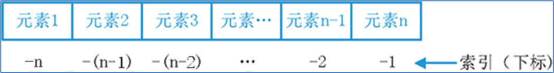
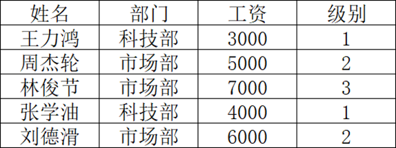
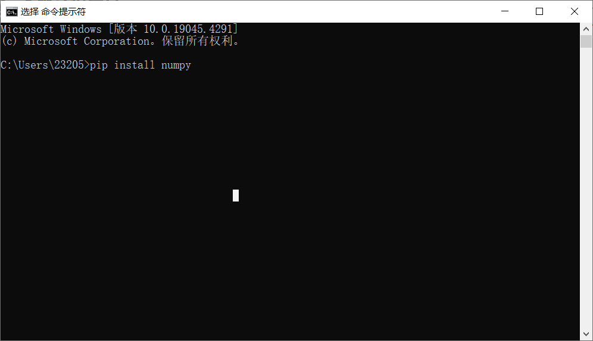
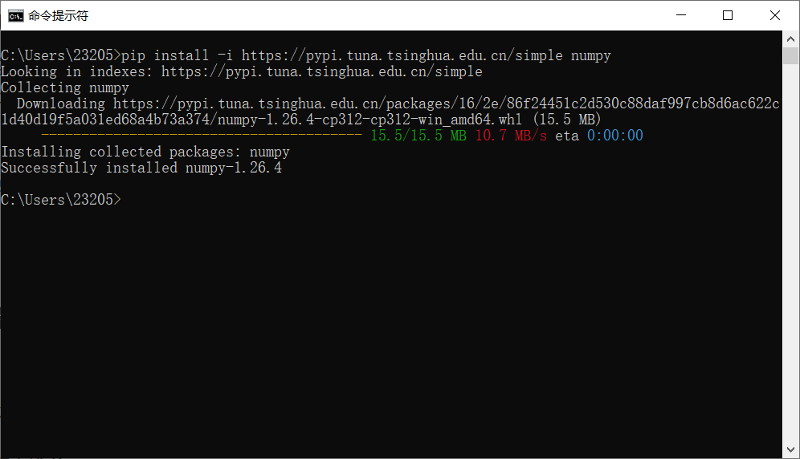

# Python学习笔记

参考视频：B站黑马程序员python教程（【黑马程序员python教程，8天python从入门到精通，学python看这套就够了】 https://www.bilibili.com/video/BV1qW4y1a7fU/?share_source=copy_web&vd_source=769ad23db0f196e2d0701d2edd5e74a2）


## 第一阶段

### 第一章 你好Python

#### 1、初识Python

python特点：优雅、简单、易学、开发效率高

#### 2、Python安装

Python官网：https://www.python.org/（官网下载速度过慢）

Python的集成开发工具（IDE）：PyCharm（专业版收费，免试用30天；社区版免费）

python下载后，安装时需要勾选"Add Python to PATH"中，否则需要手动将python添加到环境变量中。安装最后需要点击“Disable path length limit”来取消长度限制。

开始菜单打开cmd，输入"python"来验证是否安装完成并正常使用，出现python版本号和">>>"时就表示安装成功。

PyCharm常用快捷键：

- ctrl + alt + s : 打开软件设置
- ctrl + d ：复制当前行代码
- shift + alt + 上\下 ： 将当前行代码上移或下移
- crtl + shift + f10 : 运行当前代码文件
- shift + f6 ：重命名文件
- ctrl + a : 全选
- ctrl + c\v\x : 复制、粘贴、剪切
- ctrl + f : 搜索

---

### 第二章 Python基础语法

#### 1、字面量

写在代码中的固定的值

在python中，字符串需要用双引号包围起来

Python中常用的有6种数据类型

<table>
    <tr>
    	<th>类型</th>
        <th>描述</th>
        <th>说明</th>
    </tr>
    <tr>
    	<td rowspan='4'>数字（Number）</td>
        <td rowspan='4'>支持<br><b>·</b> 整数<br><b>·</b> 浮点数<br><b>·</b> 复数<br><b>·</b> 布尔</td>
        <td><font color='red'>整数（int）</font></td>
    </tr>
    <tr>
        <td><font color='red'>浮点数（float）</font></td>
    </tr>
    <tr>
        <td>复数（complex），如：4+3j，以j结尾表示复数</td>
    </tr>
    <tr>
        <td>布尔（bool）</td>
    </tr>
    <tr>
    	<td>字符串（String）</td>
        <td>描述文本的一种数据类型</td>
        <td><font color='red'>字符串由任意数量的字符组成</font></td>
    </tr>
    <tr>
    	<td>列表（List）</td>
        <td>有序的可变序列</td>
        <td>Python中使用最频繁的数据类型，可有序记录一堆数据</td>
    </tr>
    <tr>
    	<td>元组（Tuple）</td>
        <td>有序的不可变序列</td>
        <td>可有序记录一堆不可变的Python数据集合</td>
    </tr>
    <tr>
    	<td>集合（Set）</td>
        <td>无序不重复集合</td>
        <td>可无序记录一堆不重复的Python数据集合</td>
    </tr>
    <tr>
    	<td>字典（Dictionary）</td>
        <td>无序Key-Value集合</td>
        <td>可无序记录一堆Key-Value型的Python数据集合</td>
    </tr>
</table>

常见的字面量类型：整数、浮点数、字符串三类

#### 2、注释

单行注释：以 #开头，#右边 的所有文字当作说明，不执行，起辅助说明作用。#和注释内容建议以一个空格隔开

多行注释：以 一对三个双引号 引起来（"""注释内容"""）来解释说明一段代码的作用使用方法

#### 3、变量

变量：**$\color{red}{在程序运行时}$**，能$\color{red}{储存}$计算结果或能$\color{red}{表示值}$得抽象概念（记录数据用得）

定义格式：变量名称 = 变量值

```
# print语句如何输出多份内容?
# print(内容1,内容2, ....内容N)
```

案例-求钱包余额

```python
# 练习案例：求钱包余额
money = 50
print("钱包还有：", money)
money = money - 10
print("买了冰淇淋花费10元，还剩余：", money, "元")
money -= 5
print("买了可乐花费5元，还剩余：", money, "元")
```

#### 4、数据类型

可以通过type()语句来得到数据的类型

语法：type(被查看类型的数据)

#### 5、数据类型转换

常见的转换语句

| 语句（函数） |          说明           |
| :----------: | :---------------------: |
|    int(x)    |  将对象x转换为一个整数  |
|   float(x)   | 将对象x转换为一个浮点数 |
|    str(x)    |   将对象x转换为字符串   |

#### 6、标识符

定义：用户在编程的时候所使用的一系列名字，用于给变量、类、方法等命名。

在Python中，标识符命名规则有三类：

- 内容限定
- 大小写敏感
- 不可使用关键字

标识符命名规则-内容限定：只允许出现英文、中文、数字、下划线(_)，且不可以以数字开头

标识符命名规范：

- 变量名：
  - 见名知意
  - 下划线命名法
  - 英文字母全小写
- 类名
- 方法名

#### 7、运算符

算术运算符(a=10 , b=20)

| 运算符 | 描述   | 实例                                                         |
| ------ | ------ | ------------------------------------------------------------ |
| +      | 加     | 两个对象相加 a + b 输出结果30                                |
| -      | 减     | 得到负数或是一个数减去另一个数 a - b 输出结果-10             |
| *      | 乘     | 两个数相乘或是返回一个被重复若干次的字符串 a * b 输出结果200 |
| /      | 除     | b/a 输出结果2，9/4 输出结果2.25                              |
| //     | 取整除 | 返回商的整数部分 9//2 输出结果4，9.0//2.0 输出结果4.0        |
| %      | 取余   | 返回除法的余数 b % a 输出结果0                               |
| **     | 指数   | a**b 为10的20次方，输出结果 100000000000000000000            |

赋值运算符

| 运算符 | 描述       | 实例                                                         |
| ------ | ---------- | ------------------------------------------------------------ |
| =      | 赋值运算符 | 把 = 号右边的结果 赋给 左边的变量，如 num = 1 + 2 * 3，结果num的值为7 |

复合赋值运算符

| 运算符 | 描述             | 实例                       |
| ------ | ---------------- | -------------------------- |
| +=     | 加法赋值运算符   | c += a 等效于 c = c + a    |
| -=     | 减法赋值运算符   | c -= a 等效于 c = c - a    |
| *=     | 乘法赋值运算符   | c *= a 等效于 c = c * a    |
| /=     | 除法赋值运算符   | c /= a 等效于 c = c / a    |
| %=     | 取模赋值运算符   | c %= a 等效于 c = c % a    |
| **=    | 幂赋值运算符     | c \**= a 等效于 c = c ** a |
| //=    | 取整除赋值运算符 | c //= a 等效于 c = c // a  |

#### 8、字符串扩展

##### 8.1 字符串的三种定义方式

1. 单引号定义法：name = 'Python'
2. 双引号定义法：name = "Python"
3. 三引号定义法：name = """Python"""

引号嵌套：单引号定义法，可以内含双引号；双引号定义法，可以内含单引号。

可以使用转义字符(\\)来将引号变成普通字符串

##### 8.2 字符串拼接

可以通过+号拼接字符串

字符串无法和非字符串类型进行拼接

##### 8.3 字符串格式化

Python中常用的三类数据类型占位

| 格式符号 | 转换                             |
| -------- | -------------------------------- |
| %s       | 将内容转换成字符串，放入占位位置 |
| %d       | 将内容转换成整数，放入占位位置   |
| %f       | 将内容转换成浮点数，放入占位位置 |

$\color{red}{多个变量占位，变量要用括号括起来，并按照占位的顺序填入}$

```python
# 字符串格式化
class_num = '山河大学2022届'
avg_salary = 16781
message = "计算机科学与技术，%s毕业生，毕业平均工资：%d" % (class_num, avg_salary)
print(message)
```

##### 8.4 格式化的精度控制

可以使用辅助符号"m.n"来控制数据的宽度和精度（小数点和小数部分也算入宽度计算）

- m，控制宽度，要求是数字（很少使用）；设置的宽度小于数字自身，不生效

- .n，控制小数点精度，要求是数字，会进行小数的四舍五入

```python
# 示例
num1 = 11
num2 = 11.345
print("数字11宽度限制5，结果：%5d" % num1)	# 结果：   11
# 宽度5，补了3个空格
print("数字11宽度限制1，结果：%1d" % num1)	# 结果：11
# 宽度小于数字本身，无影响
print("数字11.345宽度限制7，小数精度2，结果：%7.2f" % num2)	# 结果：  11.35
# 宽度7，补了2个空格，小数精度2，四舍五入后为.35
print("数字11.345不限制宽度，小数精度2，结果：%.2f" % num2)		# 结果：11.35
# 不限制宽度，小数点后四舍五入后为.35
```

##### 8.5 字符串格式化方式2

字符串格式化 - 快速写法

通过语法：$\color{red}{f"内容{变量}"}$的格式来快速格式化（这种写法不做精度控制，不考虑类型，适用于快速格式化字符串）

```python
# 示例
name = "lawliet"
birthday_year = 1979
stock_price = 19.99
print(f"我是{name}，我出生于：{birthday_year}年，我的收入是：{stock_price}")
```

##### 8.6 对表达式进行格式化

在无需使用变量进行数据存储的时候，可以直接格式化表达式，简化代码

```python
# 示例
print("1 * 1的结果是：%d" % (1 * 1))
print(f"1 * 1的结果是：{1 * 1}")
print("字符串在Python中的类型是：%s" % type('字符串'))
```

如何格式化表达式

- f"{表达式}"
- "%s\%d\%f" % (表达式、表达式、表达式）

#### 9、数据输入

数据输出：print

数据输入：input

使用input()语句可以从键盘获取输入

使用一个变量接收（存储）input语句获取的键盘输入数据即可

要注意，无论键盘输入什么类型的数据，获取到的数据永远都是字符串类型

```python
# 示例
name = input("告诉我你是谁？")
print("Get！！！你是：%s" % name)
```

```python
# 练习-欢迎登录小程序
user_name = input("用户名称：")
user_type = input("用户类型：")  # 可以输入VIP
print("您好：%s，您是尊贵的：%s用户，欢迎您的光临。" % (user_name, user_type))
print(f"您好：{user_name}，您是尊贵的：{user_type}用户，欢迎您的光临。")
```

---

### 第三章 Python判断语句

#### 1、布尔类型和比较运算符

布尔类型，字面量True表示真，字面量False表示假

比较运算符：==、!=、>、<、>=、<=

#### 2、if语句的基本格式

基本格式

> if 要判断的条件:
> 	条件成立时，要做的事情

if语句的注意事项：

- 判断条件的结果一定要是布尔类型
- 不要忘记判断条件后的：引号
- 归属于if语句的代码块，需在前方填充4个空格缩进

$\color{red}{python通过缩进判断代码块的归属关系}$

#### 3、if-else语句

基本格式

> if 条件:
> 	满足条件时要做的事情1
> 	满足条件时要做的事情2
> 	满足条件时要做的事情3
> 	...（省略）...
> else:
> 	不满足条件时要做的事情1
> 	不满足条件时要做的事情2
> 	不满足条件时要做的事情3
> 	...（省略）...

#### 4、if-elif-else

基本格式

> if 条件1:
> 	条件1满足应做的事情
> 	条件1满足应做的事情
> 	……
> elif 条件2:
> 	条件2满足应做的事情
> 	条件2满足应做的事情
> 	……
> elif 条件N:
> 	条件2满足应做的事情
> 	条件2满足应做的事情
> 	……
> else:
> 	所有条件都不满足应做的事情
> 	所有条件都不满足应做的事情
> 	……

可以将input输入语句直接写入判断条件中，节省代码量（如下所示）

```python
print("欢迎来到动物园")
if int(input("请输入你的身高（cm）：")) < 120:
    print("您的身高小于120CM，可以免费游玩。")
elif int(input("请输入你的vip级别(1~5)：")) > 3:
    print("您的vip级别大于3，可以免费游玩。")
elif int(input("请输入今天的日期(1~30)：")) == 1:
    print("今天是1号免费，可以免费游玩。")
else:
    print("不好意思，所有条件都不满足，需要购票10元。")
print("祝您游玩愉快。")
```

#### 5、判断语句的嵌套

嵌套的关键点，在于：空格缩进

通过空格缩进，来决定语句之间的：层次关系

#### 6、实战案例

通过逻辑判断语句，完成猜数字的案例代码编写

案例需求：定义一个数字（1~10，随机产生），通过3次判断来猜出来数字

案例要求：

1. 数字随机产生，范围1-10
2. 有3次机会猜测数字，通过3层嵌套判断实现
3. 每次猜不中，会提示大了或小了

```python
import random
num = random.randint(1,10)

guess = int(input("请输入你要猜测的数字："))
if guess == num:
    print("第一次猜对了")
else:
    if guess > num:
        print("大了")
    else:
        print("小了")
    guess = int(input("请输入你要猜测的数字："))
    if guess == num:
        print("第二次猜对了")
    else:
        if guess > num:
            print("大了")
        else:
            print("小了")
        guess = int(input("请输入你要猜测的数字："))
        if guess == num:
            print("第三次猜对了")
        else:
            print("三次机会用完了，没有猜中")
```

---

### 第四章 Python循环语句

#### 1、while循环的基础语法

while循环语法格式

> while 条件:
> 	条件满足时，做的事情1
> 	条件满足时，做的事情2
> 	条件满足时，做的事情3
> 	……（省略）……

while循环的注意事项

- 条件需提供布尔类型结果，True继续，False停止
- 空格缩进不能忘
- 规划好循环终止条件，否则将无限循环

```python
# 案例
sum = 0
i = 0
while i < 100:
    i += 1
    sum += i
print("sum=%d" % sum)
```

#### 2、while循环的基础案例

设置一个范围1-100的随机整数变量，通过while循环，配合input语句，判断输入的数字是否等于随机数

- 无限次机会，直到猜中为止
- 每一次猜不中，会提示大了或小了
- 猜完数字后，提示猜了几次

```python
# 猜数字案例：设置一个范围1-100的随机整数变量，通过while循环，配合input语句，判断输入的数字是否等于随机数
# 随机函数
import random
num = random.randint(1, 100)    # 随机生成一个1-100的数字
print(f'-----{num}-----')   # 把数字打印出来，方便测试
i = 0   # 记录猜了几次
flag = True
while flag:
    guess = int(input("请输入数字："))
    i += 1
    if guess == num:
        print("猜对了，猜了%d次" % i)
        flag = False
    elif guess > num:
        print("大了")
    else:
        print("小了")
```

#### 3、while循环的嵌套应用

while循环语法格式

> while 条件1:
> 	条件1满足时，做的事情1
> 	条件1满足时，做的事情2
> 	条件1满足时，做的事情3
> 	……（省略）……

> ​	while 条件2:
> ​		条件2满足时，做的事情1
> ​		条件2满足时，做的事情2
> ​		条件2满足时，做的事情3
> ​		……（省略）……

#### 4、while循环的嵌套案例

补充：在print语句中，加上end=''，即可输出不换行了

```python
print("Hello", end='')
print("World", end='')
```

掌握使用while循环嵌套，打印九九乘法表

```python
# 案例-打印九九乘法表
i = 1
j = 1
while i <= 9:
    while j <= i:
        print("%d * %d = %d\t" % (j, i, i*j), end='')
        j += 1
    print("")
    i += 1
    j = 1
```

#### 5、for循环的基础语法

##### 5.1 基础语法

 while循环和for循环区别：

- while循环的循环条件是自定义的，$\color{red}{自行控制循环条件}$
- for循环是一种”$\color{red}{轮询}$”机制，是对一批内容进行”$\color{red}{逐个处理}$​”

for循环语法格式

> for 临时变量 in 待处理数据集（可迭代对象）：
> 	循环满足条件时执行的代码

从待处理数据集中：逐个取出数据赋值给临时变量

for循环的注意点：

- 无法定义循环条件，只能被动取出数据处理
- 要注意，循环内的语句，需要有空格缩进

```python
# 定义字符串name
name = "lawliet"
# for循环处理字符串
for x in name:
    print(x)
```

##### 5.2 range语句

语法中的：待处理数据集，严格来说，称之为：$\color{red}{可迭代类型}$​

可迭代类型指，其内容可以一次次依次取出的一种类型，包括

- 字符串
- 列表
- 元组
- 等

range语句的功能是：获得一个数字序列（可迭代类型的一种）

> 语法1： range(num)

获取一个从0开始，到num结束的数字序列（不含num本身）

如，range(5)取得的数据是：[0, 1, 2, 3, 4]

> 语法2： range(num1, num2)

获得一个从num1开始，到num2结束的数字序列（不含num2本身）

如，range(5, 10)取得的数据是：[5, 6, 7, 8, 9]

> 语法3： range(num1, num2, step)

获得一个从num1开始，到num2结束的数字序列（不含num2本身）

数字之间得步长，以step为准（step默认为1）

如，range(5, 10, 2)取得的数据是：[5, 7, 9]

```python
for i in range(5):
    print("%d  " % i,end='')
```

##### 5.3 变量作用域

```python
for i in range(5):
    print(i)
print(i)
```

循环外的print语句，能否访问到变量i？

- 规范上：不允许
- 实际上：可以

临时变量，在编程规范上，作用范围（作用域），只限定在for循环内部

如果在for循环外部访问临时变量：

- 实际上是可以访问到的
- 在编程规范上，是不允许、不建议这么做的

1、for循环中的临时变量，其作用域限定为：循环内

2、这种限定：

- 是编程规范的限定，而非强制限定
- 不遵守也能正常运行，但是不建议这样做
- 如需访问临时变量，可以预先在循环外定义它

#### 6、for循环的嵌套应用

通过for循环，输入九九乘法表内容

```python
for i in range(1,10):
    for j in range(1,i+1):
        print("%d * %d = %d\t" % (j,i,i*j),end='')
    print()
```

#### 7、循环中断：break和continue

continue：用以对循环进行临时跳过；中断本次循环，直接进入下一次循环

break：用以对循环进行直接结束；用于for循环和while循环，效果一致

#### 8、综合案例

练习案例：发工资

某公司，账户余额有1W元，给20名员工发工资。

- 员工编号从1到20，从编号1开始，依次领取工资，每人可领取1000元
- 领工资时，财务判断员工的绩效分（1-10）（随机生成），如果低于5，不发工资，换下一位
- 如果工资发完了，结束发工资。

```python
# 案例（发工资）
import random
account = 10000
for i in range(1,21):
    num = random.randint(1, 10)
    if num < 5:
        print("员工%d，绩效分%d，低于5，不发工资，下一位" % (i,num))
    else:
        account -= 1000
        print("向员工%d发放工资1000元，账户余额还剩余%d元" % (i,account))
    if account <= 0:
        print("工资发完了，下个月领取吧。")
        break
```

---

### 第五章 Python函数

#### 1、函数介绍

函数：是组织好的，可重复使用的，用来实现特定功能的代码段

使用函数的好处是：

- 将功能封装在函数内，可供随时随地重复利用
- 提高代码的复用性，减少重复代码，提高开发效率

#### 2、函数的定义

函数的定义：

> def  $\color{blue}{函数名}$(传入参数):
> 	函数体
> 	return 返回值

函数的调用：

> 函数名(参数)

注意事项：

- 参数如不需要，可以省略
- 返回值如不需要，可以省略
- 函数必须先定义后使用

#### 3、函数的参数

传入参数的功能是：在函数进行计算的时候，接受外部（调用时）提供的数据

```python
# 定义函数
def add(x, y):
    result = x + y
    print(f"{x} + {y}的结果是:{result}")


# 调用函数
add(5, 6)
```

注意事项：

- 函数定义中的参数，称之为形式参数（简称 形参）
- 函数调用中的参数，称之为实际参数（简称 实参）
- 函数的参数数量不限，使用逗号分隔
- 传入参数的时候，要和形式参数一一对应，逗号隔开

#### 4、函数的返回值

通过return关键字，就能向调用者返回数据

Python中有一个特殊的字面量：None，其类型是：<class 'NoneType'>

无返回值的函数，实际上就是返回了：None这个字面量

None表示：空的、无实际意义的意思

函数返回的None，就表示，这个函数没有返回什么有意义的内容，也就是返回了空的意思。

None类型的应用场景：

- 用在函数无返回值上
- 在if判断中，None等同于False。用在函数中主动返回None，配合if判断做相关处理
- 用于声明无内容的变量上。定义变量，但暂时不需要变量有具体值，可以用None来代替

```python
def check_age(age):
    if age >= 18:
        return "SUCCESS"
    return None

result = check_age(5)
if not result:
    print("未成年，不可进入")
    
# 暂不赋予变量具体值
name = None
```

#### 5、函数说明文档

作用：对函数进行说明解释，帮助更好理解函数的功能

定义语法：

```
def func(x, y):
    """
    函数说明
    :param x: 参数x的说明
    :param y: 参数y的说明
    :return:  返回值的说明
    """
    函数体
    return 返回值
```

- :param 用于解释参数
- :return 用于解释返回值

#### 6、函数的嵌套调用

在一个函数中，调用另外一个函数

#### 7、变量的作用域

变量作用域指的是变量的作用范围（变量在哪里可用，在哪里不可用）

- 局部变量：定义在函数体内，即只在函数体内部生效。在函数体内部，临时保存数据，即当函数调用完成后，则销毁局部变量。
- 全局变量：在函数体内、外都能生效的变量

**global关键字**

☆ 使用 global关键字 可以将函数内定义的变量声明为全局变量, 如下所示

```python
# 变量的作用域
num = 100


def test_a():
    num = 200
    print(num)


def test_b():
    # global 关键字声明num是全局变量
    global num  # 如果不声明global，则num为局部变量，不会影响最外层的num变量的值，此时等同test_a()
    num = 200
    print(num)


test_a()
print(f"全局变量num = {num}")   # 结果：全局变量num = 100
test_b()
print(f"全局变量num = {num}")   # 结果：全局变量num = 200
```

#### 8、综合案例

定义一个全局变量：money，用来记录银行卡余额（默认5000000）

定义一个全局变量：name，用来记录客户姓名（启动程序时输入）

定义如下的函数：

- **查询余额函数**

- **存款函数**

- **取款函数**

- **主菜单函数**

要求：

- 程序启动后要求输入客户姓名

- 查询余额、存款、取款后都会返回主菜单

- 存款、取款后，都应显示一下当前余额

- 客户选择退出或输入错误，程序会退出，否则一直运行

```python
# 案例 将存款余额默认为5000元，存取款都设置为每次1000元
money = 5000
name = None


def menu():
    """
    主菜单函数
    """
    print("----------------主菜单----------------")
    print("lawliet，您好，欢迎来到秋水银行ATM。请选择操作：")
    print("查询余额\t[输入1]")
    print("存款\t\t[输入2]")
    print("存款\t\t[输入3]")
    print("退出\t\t[输入4]")
    return int(input("请输入您的选择："))


def balance():
    """
    查询余额函数
    """
    print("----------------查询余额----------------")
    print(f"lawliet，您好，您的余额剩余：{money}元")


def deposit(amount):
    """
    存款函数
    :param amount:
    :return:
    """
    print("----------------存款----------------")
    global money
    money += amount
    print(f"lawliet，您好，您存款{amount}元成功")
    print(f"lawliet，您好，您的余额剩余：{money}")


def withdraw(amount):
    """
    取款函数
    :param amount:
    :return:
    """
    print("----------------取款----------------")
    global money
    if money >= amount:
        money -= amount
        print(f"lawliet，您好，您取款{amount}元成功")
    else:
        print("您好，余额不足")
    print(f"lawliet，您好，您的余额剩余：{money}")


name = input("请输入您的姓名：")
while True:
    select = menu()
    if select == 1:
        balance()
    elif select == 2:
        deposit(1000)
    elif select == 3:
        withdraw(1000)
    elif select == 4:
        break
```

---

### 第六章 Python数据容器

#### 1、数据容器入门

Python中的数据容器：
一种可以存储多个元素的Python数据类型，每一个元素，可以是任意类型的数据，如字符串、数字、布尔等。

数据容器根据特点的不同，如：

- 是否支持重复元素
- 是否可以修改
- 是否有序，等

分为5类，分别是：列表（list）、元组（tuple）、字符串（str）、集合（set）、字典（dict）

#### 2、数据容器：list（列表）

##### 2.1 列表的定义

基本语法：

```python
# 字面量
[元素1, 元素2, 元素3, 元素4, ...]

# 定义变量
变量名称 = [元素1, 元素2, 元素3, 元素4, ...]

# 定义空列表
变量名称 = []
变量名称 = list()
```

列表内的每一个数据，称之为元素

- 以[]作为标识
- 列表内每一个元素之间用,逗号隔开

注意：列表可以一次存储多个数据，且**可以为不同的数据类型，支持嵌套**（列表的元素也可以是列表）

##### 2.2 列表的下标索引

列表中的每一个元素，都有其位置下标索引，从前向后的方向，从0开始，依次递增
或者，可以反向索引，也就是从后向前：从-1开始，依次递减（-1、-2、-3......）

格式：列表[下标]，即可取出

要注意下标索引的取值范围，超出范围无法取出元素，并且会报错

##### 2.3 列表的常用操作

回忆：函数是一个封装的代码单元，可以提供特定的功能。
在Python中，如果将函数定义为class（类）的成员，那么函数会称之为：方法

列表的方法：

- 查询元素：index

- 插入元素：insert、append、extend
- 删除元素：del、pop、remove
- 清空列表：clear
- 修改元素：通过下标索引进行修改
- 统计元素个数：count，len

| 编号 | **使用方式**            | **作用**                                       |
| ---- | ----------------------- | ---------------------------------------------- |
| 1    | 列表.index(元素)        | 查找指定元素在列表的下标  找不到报错ValueError |
| 2    | 列表.insert(下标, 元素) | 在指定下标处，插入指定的元素                   |
| 3    | 列表.append(元素)       | 向列表中追加一个元素                           |
| 4    | 列表.extend(容器)       | 将数据容器的内容依次取出，追加到列表尾部       |
| 5    | del 列表[下标]          | 删除列表指定下标元素                           |
| 6    | 列表.pop(下标)          | 删除列表指定下标元素                           |
| 7    | 列表.remove(元素)       | 从前向后，删除此元素第一个匹配项               |
| 8    | 列表.clear()            | 清空列表                                       |
| 9    | 列表.count(元素)        | 统计此元素在列表中出现的次数                   |
| 10   | len(列表)               | 统计容器内有多少元素                           |

列表特点：

- 可以容纳多个元素（上限为2**63-1、9223372036854775807个）

- 可以容纳不同类型的元素（混装）
- 数据是有序存储的（有下标序号）
- 允许重复数据存在
- 可以修改（增加或删除元素等）

##### 2.4 练习案例:常用功能练习

有一个列表，内容是：[21, 25, 21, 23, 22, 20]，记录的是一批学生的年龄

请通过列表的功能（方法），对其进行

1.定义这个列表，并用变量接收它

2.追加一个数字31，到列表的尾部

3.追加一个新列表[29, 33, 30]，到列表的尾部

4.取出第一个元素（应是：21）

5.取出最后一个元素（应是：30）

6.查找元素31，在列表中的下标位置

```python
# 练习
# 1.定义这个列表，并用变量接收它
nums = [21, 25, 21, 23, 22, 20]
print(nums)
# 2.追加一个数字31，到列表的尾部
nums.append(31)
print(nums)
# 3.追加一个新列表[29, 33, 30]，到列表的尾部
nums.extend([29,33,30])
print(nums)
# 4.取出第一个元素（应是：21）
print(f"{nums[0]},{nums[-len(nums)]}")
# 5.取出最后一个元素（应是：30）
print(nums[-1])
# 6.查找元素31，在列表中的下标位置
print(nums.index(31))
```

#### 3、list（列表）的遍历

可以使用while或for循环进行遍历

**while循环和for循环的对比**

while循环和for循环，都是循环语句，但细节不同：

- 在循环控制上：
  - while循环**可以自定循环条件**，并自行控制
  - for循环**不可以自定循环条件**，只可以一个个从容器内取出数据

- 在无限循环上：
  - while循环**可以**通过条件控制做到无限循环
  - for循环理论上**不可以**，因为被遍历的容器容量不是无限的

- 在使用场景上：
  - while循环适用于任何想要**循环的场景**
  - for循环适用于，遍历数据容器的场景或简单的**固定次数循环场景**

#### 4、数据容器：tuple（元组）

##### 4.1 元组的定义

当我们需要在程序内封装数据，又不希望封装的数据被篡改，那么元组就非常合适了

元组定义：定义元组使用$\color{red}{小括号}$，且使用$\color{red}{逗号}$隔开各个数据，$\color{red}{数据可以是不同的数据类型}$。元组也支持嵌套。

基本语法：

```python
# 定义元组字面量
(元素, 元素, ......, 元素)
# 定义元组变量
变量名称 = (元素, 元素, ......, 元素)
# 定义空元组
变量名称 = ()
变量名称 = tuple()
```

注意：元组只有一个数据，这个数据后面也要添加逗号，如：

```python
t1 = ('Hello',) # 注意，必须带有逗号，否则不是元组类型
```

##### 4.2 元组的操作

| **编号** | **方法**  | **作用**                                           |
| -------- | --------- | -------------------------------------------------- |
| 1        | index()   | 查找某个数据，如果数据存在返回对应的下标，否则报错 |
| 2        | count()   | 统计某个数据在当前元组出现的次数                   |
| 3        | len(元组) | 统计元组内的元素个数                               |

注意事项：

- 不可以修改元组的内容，否则会直接报错
- 可以修改元组内的list的内容（修改元素、增加、删除、反转等）
- 不可以替换list为其它list或其它类型

同列表一样，元组也可以使用while循环和for循环进行遍历

##### 4.3 元组的特点

- 可以容纳多个数据

- 可以容纳不同类型的数据（混装）

- 数据是有序存储的（下标索引）

- 允许重复数据存在

- 不可以修改（增加或删除元素等，但可以修改内部list的内部元素）

- 支持for循环

##### 4.4 元组的基本操作-案例

定义一个元组，内容是：（'周杰轮', 11, ['football', 'music']），记录的是一个学生的信息（姓名、年龄、爱好）

请通过元组的功能（方法），对其进行

1.查询其年龄所在的下标位置

2.查询学生的姓名

3.删除学生爱好中的football

4.增加爱好：coding到爱好list内

```python
# 定义一个元组，内容是：（'周杰轮', 11, ['football', 'music']），记录的是一个学生的信息（姓名、年龄、爱好）
t2 = ('周杰轮', 11, ['football', 'music'])
print(t2)
# 1.查询其年龄所在的下标位置
print(t2.index(11))
# 2.查询学生的姓名
print(t2[0])
# 3.删除学生爱好中的football
# del t2[2][0]
t2[2].remove('football')
print(t2)
# 4.增加爱好：coding到爱好list内
t2[2].append('coding')
print(t2)
```

#### 5、数据容器：str（字符串）

##### 5.1 字符串介绍

字符串是字符的容器，一个字符串可以存放任意数量的字符。

和其它容器如：列表、元组一样，字符串也可以通过下标进行访问

- 从前向后，下标从0开始

- 从后向前，下标从-1开始

同元组一样，字符串是一个：无法修改的数据容器。所以：

- 修改指定下标的字符 （如：字符串[0] = “a”）

- 移除特定下标的字符 （如：del 字符串[0]、字符串.remove()、字符串.pop()等）

- 追加字符等 （如：字符串.append()）

均无法完成。如果必须要做，只能得到一个新的字符串，旧的字符串是无法修改

##### 5.2 字符串常用操作

| 编号 | 操作                                    | 说明                                                         |
| :--: | --------------------------------------- | ------------------------------------------------------------ |
|  1   | 字符串[下标]                            | 根据下标索引取出特定位置字符                                 |
|  2   | 字符串.index(字符串）                   | 查找给定字符的第一个匹配项的下标                             |
|  3   | 字符串.replace(字符串1, 字符串2)        | 将字符串内的全部字符串1，替换为字符串2  不会修改原字符串，而是得到一个新的 |
|  4   | 字符串.split(字符串)                    | 按照给定字符串，对字符串进行分隔  不会修改原字符串，而是得到一个新的列表 |
|  5   | 字符串.strip()<br/>字符串.strip(字符串) | 移除首尾的空格和换行符或指定字符串（必须是首尾）             |
|  6   | 字符串.count(字符串)                    | 统计字符串内某字符串的出现次数                               |
|  7   | len(字符串)                             | 统计字符串的字符个数（数字、字母、符号、中文都算一个字符）   |

同列表、元组一样，字符串也支持while循环和for循环进行遍历

##### 5.3 字符串特点

作为数据容器，字符串有如下特点：

- 只可以存储字符串（字符的容器）

- 长度任意（取决于内存大小）

- 支持下标索引

- 允许重复字符串存在

- 不可以修改（增加或删除元素等）

- 支持for循环

##### 5.4 练习案例：分割字符串

给定一个字符串："itheima itcast boxuegu"

- 统计字符串内有多少个"it"字符

- 将字符串内的空格，全部替换为字符："|"

- 并按照"|"进行字符串分割，得到列表

```python
# 练习案例：分割字符串
# 给定一个字符串："itheima itcast boxuegu"
test = "itheima itcast boxuegu"
print(test)
# 统计字符串内有多少个"it"字符
print(test.count("it"))
# 将字符串内的空格，全部替换为字符："|"
new_test = test.replace(" ","|")
# print(test)
print(new_test)
# 并按照"|"进行字符串分割，得到列表
list_test = new_test.split("|")
print(list_test)
```

#### 6、数据容器（序列）的切片

##### 6.1 序列介绍

序列是指：内容连续、有序，可使用下标索引的一类数据容器，列表、元组、字符串，均可以可以视为序列。
如下图，序列的典型特征就是：有序并可用下标索引，字符串、元组、列表均满足这个要求




##### 6.2 序列常用操作-切片

序列支持切片，即：列表、元组、字符串，均支持进行切片操作
切片：从一个序列中，取出一个子序列

$\color{blue}{语法：序列[起始下标:结束下标:步长]}$

$\color{red}{表示从序列中，从指定位置开始，依次取出元素，到指定位置结束，得到一个新序列：}$

- 起始下标表示从何处开始，可以留空，留空视作从头开始
- 结束下标（不含）表示何处结束，可以留空，留空视作截取到结尾
- 步长表示，依次取元素的间隔
  - 步长1表示，一个个取元素
  - 步长2表示，每次跳过1个元素取
  - 步长N表示，每次跳过N-1个元素取
  - 步长为负数表示，反向取（注意，起始下标和结束下标也要反向标记）

注意，此操作$\color{red}{不会影响序列本身，而是会得到一个新的序列（列表、元组、字符串）}$

##### 6.3 练习实践：序列的切片实践

有字符串："万过薪月，员序程马黑来，nohtyP学"

- 请使用学过的任何方式，得到"黑马程序员"

可用方式参考：

- 倒序字符串，切片取出或切片取出，然后倒序

- split分隔"，" replace替换"来"为空，倒序字符串

```python
# 有字符串："万过薪月，员序程马黑来，nohtyP学"
# - 请使用学过的任何方式，得到"黑马程序员"

# 可用方式参考：
# - 倒序字符串，切片取出或切片取出，然后倒序
print("--------------------------------------------")
test_str_0 = "万过薪月，员序程马黑来，nohtyP学"
test_str_1 = test_str_0[::-1]
print(test_str_1)
test_str_2 = test_str_1[9:14:]
print(test_str_2)
# - split分隔"，" replace替换"来"为空，倒序字符串
print("--------------------------------------------")
test1 = test_str_0.split("，")[1]
print(test1)
test2 = test1.replace("来","")
print(test2)
test3 = test2[::-1]
print(test3)
```

#### 7、数据容器：set（集合）

列表可修改、支持重复元素且有序
元组、字符串不可修改、支持重复元素且有序
集合，最主要的特点就是：不支持元素的重复（自带去重功能）、并且内容无序

##### 7.1 集合的定义

基本语法：

```python
# 定义集合字面量
{元素, 元素, ......, 元素}
# 定义集合变量
变量名称 = {元素, 元素, ......, 元素}
# 定义空集合
变量名称 = set()
```

##### 7.2 集合的常见操作

| 编号 | 操作                           | 说明                                                         |
| ---- | ------------------------------ | ------------------------------------------------------------ |
| 1    | 集合.add(元素)                 | 集合内添加一个元素                                           |
| 2    | 集合.remove(元素)              | 移除集合内指定的元素                                         |
| 3    | 集合.pop()                     | 从集合中随机取出一个元素                                     |
| 4    | 集合.clear()                   | 将集合清空                                                   |
| 5    | 集合1.difference(集合2)        | 得到一个新集合，内含2个集合的差集，原有的2个集合内容不变。 <br />集合1有的而集合2没有的 |
| 6    | 集合1.difference_update(集合2) | 在集合1中，删除集合2中存在的元素  集合1被修改，集合2不变     |
| 7    | 集合1.union(集合2)             | 得到1个新集合，内含2个集合的全部元素  原有的2个集合内容不变  |
| 8    | len(集合)                      | 得到一个整数，记录了集合的元素数量                           |

##### 7.3 集合的特点

- 可以容纳多个数据
- 可以容纳不同类型的数据（混装）
- 数据是无序存储的（不支持下标索引）
- 不允许重复数据存在
- 可以修改（增加或删除元素等）
- 支持for循环，不支持while循环

集合去重且无序（因为要对元素做去重处理，所以无法保证顺序和创建的时候一致）

集合$\color{red}{不支持下标索引访问}$，所以也就不能使用while循环进行遍历

##### 7.4 练习：信息去重

有如下列表对象：my_list = ['黑马程序员', '传智播客', '黑马程序员', '传智播客', 'itheima', 'itcast', 'itheima', 'itcast', 'best']请：

•定义一个空集合

•通过for循环遍历列表

•在for循环中将列表的元素添加至集合

•最终得到元素去重后的集合对象，并打印输出

```python
# •定义一个空集合
my_list = ['黑马程序员', '传智播客', '黑马程序员', '传智播客', 'itheima', 'itcast', 'itheima', 'itcast', 'best']
my_set = set()
# •通过for循环遍历列表
# •在for循环中将列表的元素添加至集合
for ele in my_list:
    print(ele)
    my_set.add(ele)
# •最终得到元素去重后的集合对象，并打印输出
print(my_set)
```

#### 8、数据容器：dict（字典、映射）

Python中的字典
Key: Value
Key: Value
可以按【Key】找出对应的【Value】

##### 8.1 字典的定义

字典的定义，同样使用{}，不过存储的元素是一个个的：键值对，如下语法：

```python
# 定义字典字面量
{key: value, key:value, ......, key: value}
# 定义字典变量
my_dict = {key: value, key:value, ......, key: value}
# 定义空字典
my_dict = {}
my_dict = dict()
```

使用{}存储原始，每一个元素是一个键值对
每一个键值对包含Key和Value（用冒号分隔）
键值对之间使用逗号分隔
Key和Value可以是任意类型的数据（key不可为字典）
Key不可重复，重复会对原有数据覆盖

字典同集合一样，不可以使用下标索引，但是字典可以通过Key值来取得对应的Value。Key不可为字典，可以通过Value进行嵌套。

字典的注意事项：

- 键值对的Key和Value可以是任意类型（Key不可为字典）

- 字典内Key不允许重复，重复添加等同于覆盖原有数据

- 字典不可用下标索引，而是通过Key检索Value

##### 8.2 字典的常用操作

| 编号 | 操作              | 说明                                          |
| ---- | ----------------- | --------------------------------------------- |
| 1    | 字典[Key]         | 获取指定Key对应的Value值                      |
| 2    | 字典[Key] = Value | 添加或更新键值对                              |
| 3    | 字典.pop(Key)     | 取出Key对应的Value并在字典内删除此Key的键值对 |
| 4    | 字典.clear()      | 清空字典                                      |
| 5    | 字典.keys()       | 获取字典的全部Key，可用于for循环遍历字典      |
| 6    | len(字典)         | 计算字典内的元素数量                          |

遍历字典语法：for key in 字典.keys()

注意：字典不支持下标索引，所以同样不可以用while循环遍历

##### 8.3 字典的特点

- 可以容纳多个数据
- 可以容纳不同类型的数据
- 每一份数据是Key和Value键值对
- 可以通过Key获取到Value，Key不可重复（重复会覆盖）
- 不支持下标索引
- 可以修改（增加或删除更新元素等）
- 支持for循环，不支持while循环

##### 8.4 练习：升职加薪

有如下员工信息，请使用字典完成数据的记录。并通过for循环，对所有级别为1级的员工，级别上升1级，薪水增加1000元



```python
# 通过for循环，对所有级别为1级的员工，级别上升1级，薪水增加1000元
my_dict = {
    "王力鸿": {"部门": "科技部", "工资": 3000, "级别": 1},
    "周杰轮": {"部门": "市场部", "工资": 5000, "级别": 2},
    "林俊节": {"部门": "市场部", "工资": 7000, "级别": 3},
    "张学油": {"部门": "科技部", "工资": 4000, "级别": 1},
    "刘德滑": {"部门": "市场部", "工资": 6000, "级别": 2},
}
print("--------------加薪前--------------")
for ele in my_dict.keys():
    print(ele+"：",end="")
    print(my_dict[ele])
print("--------------加薪后--------------")
for ele in my_dict.keys():
    if my_dict[ele]["级别"] == 1:
        my_dict[ele]["级别"] += 1
        my_dict[ele]["工资"] += 1000
    print(my_dict)
    print(ele + "：", end="")
    print(my_dict[ele])
```

#### 9、拓展：数据容器对比总结

数据容器可以从以下视角进行简单的分类：

- 是否支持下标索引
  - 支持：列表、元组、字符串 - 序列类型
  - 不支持：集合、字典 - 非序列类型
- 是否支持重复元素
  - 支持：列表、元组、字符串 - 序列类型
  - 不支持：集合、字典 - 非序列类型

- 是否可以修改
  - 支持：列表、集合、字典
  - 不支持：元组、字符串

|          | **列表**                         | **元组**                           | **字符串**                      | **集合**                        | **字典**                                           |
| -------- | -------------------------------- | ---------------------------------- | ------------------------------- | ------------------------------- | -------------------------------------------------- |
| 元素数量 | 支持多个                         | 支持多个                           | 支持多个                        | 支持多个                        | 支持多个                                           |
| 元素类型 | 任意                             | 任意                               | <font color='red'>仅字符</font> | 任意                            | Key：Value  Key：除字典外任意类型  Value：任意类型 |
| 下标索引 | 支持                             | 支持                               | 支持                            | <font color='red'>不支持</font> | <font color='red'>不支持</font>                    |
| 重复元素 | 支持                             | 支持                               | 支持                            | <font color='red'>不支持</font> | <font color='red'>不支持</font>                    |
| 可修改性 | 支持                             | <font color='red'>不支持</font>    | <font color='red'>不支持</font> | 支持                            | 支持                                               |
| 数据有序 | 是                               | 是                                 | 是                              | <font color='red'>否</font>     | <font color='red'>否</font>                        |
| 使用场景 | 可修改、可重复的一批数据记录场景 | 不可修改、可重复的一批数据记录场景 | 一串字符的记录场景              | 不可重复的数据记录场景          | 以Key检索Value的数据记录场景                       |

基于各类数据容器的特点，它们的应用场景如下：

- 列表：一批数据，可修改、可重复的存储场景
- 元组：一批数据，不可修改、可重复的存储场景
- 字符串：一串字符串的存储场景
- 集合：一批数据，去重存储场景
- 字典：一批数据，可用Key检索Value的存储场景

#### 10、数据容器的通用操作

容器通用功能总览

| **功能**                     | **描述**                                         |
| ---------------------------- | ------------------------------------------------ |
| 通用for循环                  | 遍历容器（字典是遍历key）                        |
| max()                        | 容器内最大元素                                   |
| min()                        | 容器内最小元素                                   |
| len()                        | 容器元素个数                                     |
| list()                       | 转换为列表                                       |
| tuple()                      | 转换为元组                                       |
| str()                        | 转换为字符串                                     |
| set()                        | 转换为集合                                       |
| sorted(序列, [reverse=True]) | 排序，reverse=True表示降序  得到一个排好序的列表 |

注意，通过sorted()方法给容器排序后都会得到列表（list）对象。

#### 11、综合案例

1、幸运数字6：输入任意数字，如数字8，生成nums列表，元素值为1~8，从中选取幸运数字(能够被6整除)移动到新列表lucky，打印nums与lucky。

2、列表嵌套：有3个教室[[],[],[]]，8名讲师['A','B','C','D','E','F','G','H']，将8名讲师随机分配到3个教室中

---

### 第七章 Python函数进阶

#### 1、函数多返回值

如果一个函数要有多个返回值，如何书写？

- 按照返回值的顺序，写对应顺序的多个变量接收即可

- 变量之间用逗号隔开

- 支持不同类型的数据return

```
# 多返回值
def test_return():
    return 1, 2


x, y = test_return()
print(x)    # 结果1
print(y)    # 结果2
```

#### 2、函数多种传参方式

函数的参数种类，使用方式上的不同，函数有4中常见参数使用方式：

- 位置参数

- 关键字参数

- 缺省参数

- 不定长参数

##### 2.1 位置参数

位置参数：调用函数时根据函数定义的$\color{red}{参数位置来传递参数}$

```
# 位置参数
def user_info(name, age, gender):
    print(f"您的名字是{name}，年龄是{age}，性别是{gender}")


user_info('TOM', 20, '男')
```

注意：传递的参数和定义的参数的顺序及个数必须一致

##### 2.2 关键字参数

关键字参数：函数调用时通过“键=值”形式传递参数

作用：可以让函数更加清晰、容易使用，同时也清除了参数的顺序需求

```
# 关键字参数
def user_info(name, age, gender):
    print(f"您的名字是{name}，年龄是{age}，性别是{gender}")


# 关键字传参
user_info(name="小明", age=20, gender="男")
# 可以不按照固定顺序
user_info(age=20, gender="男", name="小明")
# 可以和位置参数混用，位置参数必须在前，且匹配参数顺序
user_info("小明", age=20, gender="男")
```

注意：函数调用时，如果有位置参数时，位置参数必须在关键字参数的前面，但关键字参数之间不存在先后顺序

##### 2.3 缺省参数

缺省参数：缺省参数也叫默认参数，用于定义函数，为参数提供默认值，调用函数时可不传该默认参数的值（注意：所有位置参数必须出现在默认参数前，包括函数定义和调用）

作用：当调用函数时没有传递参数, 就会使用默认是用缺省参数对应的值。

```
# 缺省参数
def user_info(name, age, gender = '男'):
    print(f"您的名字是{name}，年龄是{age}，性别是{gender}")


user_info('TOM', 20)
user_info('Rose', 18, '女')
```

注意：函数调用时，如果为缺省参数传值则修改默认参数值, 否则使用这个默认值

##### 2.4 不定长参数

不定长参数：不定长参数也叫可变参数. 用于不确定调用的时候会传递多少个参数(不传参也可以)的场景

作用：当调用函数时不确定参数个数时, 可以使用不定长参数

不定长参数的类型：

   ①位置传递

   ②关键字传递

```
# 不定长参数
#   1.位置传递
def user_info(*args):
    print(args)


# ('TOM',)
user_info('TOM')
# ('TOM', 18)
user_info('TOM', 18)


#   2.关键字传递
def user_info(**kwargs):
    print(kwargs)


# {'name': 'TOM', 'age': 18, 'id': 110}
user_info(name='TOM', age=18, id=110)
```

注意：传进的所有参数都会被args变量收集，它会根据传进参数的位置合并为一个元组(tuple)，args是元组类型，这就是位置传递

注意：参数是“键=值”形式的情况下, 所有的“键=值”都会被kwargs接受, 同时会根据“键=值”组成字典.

#### 3、匿名函数

##### 3.1 函数作为参数传递

函数本身是可以作为参数，传入另一个函数中进行使用的。
将函数传入的作用在于：传入计算逻辑，而非传入数据。

```
def test_func(compute):
    result = compute(1, 2)
    print(result)


def compute1(x, y):
    return x + y

def compute2(x, y):
    return x - y

def compute3(x, y):
    return x * y

def compute4(x, y):
    return x / y


test_func(compute1)  # 结果：3
test_func(compute2)  # 结果：-1
test_func(compute3)  # 结果：2
test_func(compute4)  # 结果：0.5
```

像上述代码一样，不仅仅是相加、相减、相乘、相除等，$\color{red}{任何逻辑都可以自行定义并作为函数传入。}$

##### 3.2 lambda匿名函数

函数的定义中

- def关键字，可以定义带有名称的函数
- lambda关键字，可以定义匿名函数（无名称）

有名称的函数，可以基于名称重复使用。
无名称的匿名函数，只可临时使用一次。

匿名函数定义语法：

> lambda  传入参数：函数体(一行代码)

- lambda 是关键字，表示定义匿名函数
- 传入参数表示匿名函数的形式参数，如：x, y 表示接收2个形式参数
- 函数体，就是函数的执行逻辑，要注意：只能写一行，无法写多行代码

通过def关键字，定义一个函数，并传入，如下

```
def test_func(compute):
    result = compute(1, 2)
    print(result)


def compute(x, y):
    return x + y


test_func(compute)  # 结果：3
```

也可以通过lambda关键字，传入一个一次性使用的lambda匿名函数

```python
def test_func(compute):
    result = compute(1, 2)
    print(result)


test_func(lambda x, y: x + y)   # 结果：3
```

使用def和使用lambda，定义的函数功能完全一致，只是lambda关键字定义的函数是匿名的，无法二次使用

---

### 第八章 Python文件操作

#### 1、文件的编码

什么是编码？

编码就是一种规则集合，记录了内容和二进制间进行相互转换的逻辑。编码有许多中，我们最常用的是UTF-8编码

为什么需要使用编码？

计算机只认识0和1，所以需要将内容翻译成0和1才能保存在计算机中。同时也需要编码， 将计算机保存的0和1，反向翻译回可以识别的内容。

#### 2、文件的读取

##### 2.1 文件的打开、读取、关闭

文件操作主要包括打开、关闭、读、写等操作。

open()打开函数
使用open函数，可以打开一个已经存在的文件，或者创建一个新文件，语法如下：
open(name, mode, encoding)
name：是要打开的目标文件名的字符串(可以包含文件所在的具体路径)。
mode：设置打开文件的模式(访问模式)：只读、写入、追加等。
encoding:编码格式（推荐使用UTF-8）
示例代码：

```python
f = open('python.txt', 'r', encoding=”UTF-8)
# encoding的顺序不是第三位，所以不能用位置参数，用关键字参数直接指定
```

mode常用的三种基础访问模式

| **模式** | **描述**                                                     |
| -------- | ------------------------------------------------------------ |
| r        | 以只读方式打开文件。文件的指针将会放在文件的开头。这是默认模式。 |
| w        | 打开一个文件只用于写入。如果该文件已存在则打开文件，并从开头开始编辑，<font color='red'>原有内容会被删除</font>。  如果该文件<font color='red'>不存在，创建新文件</font>。 |
| a        | 打开一个文件用于追加。如果该文件已存在，<font color='red'>新的内容将会被写入到已有内容之后</font>。  如果该文件<font color='red'>不存在，创建新文件</font>进行写入。 |

| 操作                                   | 功能                                     |
| -------------------------------------- | ---------------------------------------- |
| 文件对象  = open(file, mode, encoding) | 打开文件获得文件对象                     |
| 文件对象.read(num)                     | 读取指定长度字节  不指定num读取文件全部  |
| 文件对象.readline()                    | 读取一行                                 |
| 文件对象.readlines()                   | 读取全部行，得到列表                     |
| for line in 文件对象                   | for循环文件行，一次循环得到一行数据      |
| 文件对象.close()                       | 关闭文件对象                             |
| with open() as f                       | 通过with  open语法打开文件，可以自动关闭 |

##### 2.2 课后练习：单词计数

通过Windows的文本编辑器软件，将如下内容，复制并保存到：word.txt，文件可以存储在任意位置

itheima itcast python
itheima python itcast
beijing shanghai itheima
shenzhen guangzhou itheima
wuhan hangzhou itheima
zhengzhou bigdata itheima

通过文件读取操作，读取此文件，统计itheima单词出现的次数

```python
# 练习:单词计数
# f = open("E:\\python_workspace\\python-learn\\08_Python文件操作\\word.txt", 'r', encoding="UTF-8")
f = open("word.txt", 'r', encoding="UTF-8")
# num = 0
# for line in f:
#     num += line.count('itheima')
# print(num)
print(f.read().count('itheima'))	# 直接读取使用count方法统计即可，不需要像上述一样逐行统计
f.close()
# 不需要手动关闭文件的方式
with open("word.txt", 'r', encoding="UTF-8") as f:
    num = 0
    for line in f:
        num += line.count('itheima')
    print(num)
```

#### 3、文件的写入

写作快速入门 - 案例演示

```python
# 1. 打开文件
f = open('python.txt', 'w')
# 2.文件写入
f.write('hello world')
# 3. 内容刷新
f.flush()
```

注意：

- 直接调用write，内容并未真正写入文件，而是会积攒在程序的内存中，称之为缓冲区
- 当调用flush的时候，内容会真正写入文件
- 这样做是避免频繁的操作硬盘，导致效率下降（攒一堆，一次性写磁盘）

写操作注意：

- 文件如果不存在，使用”w”模式，会创建新文件
- 文件如果存在，使用”w”模式，会将原有内容清空
- close()方法，带有flush()方法的功能

#### 4、文件的追加

追加写入操作快速入门 - 案例演示

```python
# 1. 打开文件，通过a模式打开即可
f = open('python.txt', 'a')
# 2.文件写入
f.write('hello world')
# 3. 内容刷新
f.flush()
```

注意：

- a模式，文件不存在会创建文件
- a模式，文件存在会在最后，追加写入文件

#### 5、文件操作综合案例

**完成文件备份案例**

需求：有一份账单文件，记录了消费收入的具体记录，内容如下：

name,date,money,type,remarks
周杰轮,2022-01-01,100000,消费,正式
周杰轮,2022-01-02,300000,收入,正式
周杰轮,2022-01-03,100000,消费,测试
林俊节,2022-01-01,300000,收入,正式
林俊节,2022-01-02,100000,消费,测试
林俊节,2022-01-03,100000,消费,正式
林俊节,2022-01-04,100000,消费,测试
林俊节,2022-01-05,500000,收入,正式
张学油,2022-01-01,100000,消费,正式
张学油,2022-01-02,500000,收入,正式
张学油,2022-01-03,900000,收入,测试
王力鸿,2022-01-01,500000,消费,正式
王力鸿,2022-01-02,300000,消费,测试
王力鸿,2022-01-03,950000,收入,正式
刘德滑,2022-01-01,300000,消费,测试
刘德滑,2022-01-02,100000,消费,正式
刘德滑,2022-01-03,300000,消费,正式

同学们可以将内容复制并保存为 bill.txt文件

我们现在要做的就是：

- 读取文件

- 将文件写出到bill.txt.bak文件作为备份

- 同时，将文件内标记为测试的数据行丢弃

实现思路：

- open和r模式打开一个文件对象，并读取文件

- open和w模式打开另一个文件对象，用于文件写出
- for循环内容，判断是否是测试，不是测试就write写出，是测试就continue跳过
- 将2个文件对象均close()

```python
# encoding参数省略时默认为GBK
old = open('bill.txt', 'r', encoding='UTF-8')
new = open('bill.txt.bak', 'w', encoding='UTF-8')
for line in old:
    # print(line)
    # 是测试则继续读取下一行
    if line.count('测试') > 0:
        continue
    # 不是测试则 写 到 new对象的文件中
    new.write(line)
# 内容刷新，可省略，close()方法具有flush()功能
# new.flush()
new.close()
old.close()
```

---

### 第九章 Python异常模块与包

#### 1、了解异常

异常概念：当检测到一个错误时，Python解释器就无法继续执行了，反而出现了一些错误的提示，这就是所谓的“异常”, 也就是我们常说的BUG

异常就是程序运行的过程中出现了错误，bug代表软件出现错误

#### 2、异常的捕获方法

##### 2.1 为什么要捕获异常

在可能发生异常的地方，进行捕获。当异常出现的时候，提供解决方式，而不是任由其导致程序无法运行。

##### 2.2 捕获异常的语法格式

①**捕获常规异常**

基本语法：

> try:
>     可能发生错误的代码
> except:
>     如果出现异常执行的代码

快速入门 - 需求：尝试以`r`模式打开文件，如果文件不存在，则以`w`方式打开。

```python
try:
    f = open('linux.txt', 'r')
except:
    f = open('linux.txt', 'w')
```

②**捕获指定异常**

```python
try:
    print(name)
except NameError as e:
    print('name变量名称未定义错误')
```

注意事项：
① 如果尝试执行的代码的异常类型和要捕获的异常类型不一致，则无法捕获异常。
② 一般try下方只放一行尝试执行的代码。

③**捕获多个异常**

当捕获多个异常时，可以把要捕获的异常类型的名字，放到except 后，并使用元组的方式进行书写。

```python
try:
    print(1/0)
except (NameError, ZeroDivisionError):
    print('ZeroDivision错误...')
```

④**捕获异常并输出描述信息**

```python
try:
    print(num)
except (NameError, ZeroDivisionError) as e:
    print(e)
```

⑤**捕获所有异常**

```python
try:
    print(name)
except Exception as e:
    print(e)
```

⑥**异常else**

else表示的是如果没有异常要执行的代码。

```python
try:
    print(1)
except Exception as e:
    print(e)
else:
    print('我是else，是没有异常的时候执行的代码')
```

⑦**异常的finally**

finally表示的是无论是否异常都要执行的代码，例如关闭文件。

```python
try:
    f = open('test.txt', 'r')
except Exception as e:
    f = open('test.txt', 'w')
else:
    print('没有异常，真开心')
finally:
    f.close()
```

⑧**格式总结**

> try:
> 	可能要发生异常的语句
> except[异常 as 别名:]
> 	出现异常的准备手段
> [else:]
> 	未出现异常时应做的事情
> [finally:]
> 	不管是否出现异常都会做的事情

#### 3、异常的传递

异常具有传递性；当所有函数都没有捕获异常的时候, 程序就会报错

利用异常具有传递性的特点, 当我们想要保证程序不会因为异常崩溃的时候，就可以在main函数中设置异常捕获，由于无论在整个程序哪里发生异常, 最终都会传递到main函数中, 这样就可以确保所有的异常都会被捕获

```python
def fun01():
    print("这是func01的开始")
    num = 1/0
    print("这是func01的结束")


def fun02():
    print("这是func02的开始")
    fun01()
    print("这是func02的结束")


def main():
    try:
        fun02()
    except Exception as e:
        print(e)


# 异常在func01中没有被捕获
# 异常在func02中没有被捕获
# 异常在main中被捕获
main()
```

#### 4、Python模块

##### 4.1 模块的导入

Python模块(Module)，是一个Python文件，以 .py 结尾. 模块能定义函数，类和变量，模块里也能包含可执行的代码.

模块的作用： python中有很多各种不同的模块，每一个模块都可以帮助我们快速的实现一些功能，比如实现和时间相关的功能就可以使用time模块；我们可以认为一个模块就是一个工具包，每一个工具包中都有各种不同的工具供我们使用进而实现各种不同的功能。

模块的导入方式，语法如下：

> [from  模块名]  import  [模块  |  类  |  变量  |  函数  |  * ]  [as  别名]

常用的组合形式如：

- import  模块名
- from  模块名  import  类、变量、方法等
- from  模块名  import  *
- import  模块名  as  别名
- from  模块名  import  功能名  as  别名

```python
# import 模块名，通过 模块名.方法名() 进行调用
# 导入时间模块
import time
print("开始")
# 让程序睡眠1秒(阻塞)
time.sleep(1)
print("结束")
```

```python
# from 模块名 import 功能名
# 导入time模块中的sleep方法
from time import sleep
print("开始")
# 让程序睡眠1秒(阻塞)
sleep(1)
print("结束")
```

```python
# from 模块名 import *
# 导入时间模块中所有的方法
from time import *
print("开始")
# 让程序睡眠1秒(阻塞)
sleep(1)
print("结束")
```

```python
# as定义别名
# 模块别名
import time as tt
tt.sleep(2)
print("hello")

# 功能别名
from time import sleep as sl
sl(2)
# sleep(2)    	# 报错，只能使用方法名的别名进行调用
# time.sl(2)    # 报错，只能使用方法名的别名进行调用
print("hello")
```

注意：
模块和功能定义别名后只能通过别名进行调用
模块的导入一般写在代码文件的开头位置（代码规范，不遵守也不会有语法错误）

##### 4.2 自定义模块

 每个Python文件都可以作为一个模块，模块的名字就是文件的名字. 也就是说$\color{red}{自定义模块名必须要符合标识符命名规则}$

新建一个Python文件，命名为my_module1.py，并定义test函数(如果命名不规范，则无法导入)

```python
def test(a, b):
    print(a + b)


# 只在当前文件中调用该函数，其他导入的文件内不符合该条件，则不执行test函数调用
if __name__ == '__main__':
    test(1, 1)
```

新建一个Python文件，命名为my_module2.py，并定义test函数(如果命名不规范，则无法导入)

```python
def test(a, b):
    print(a - b)


# 只在当前文件中调用该函数，其他导入的文件内不符合该条件，则不执行test函数调用
if __name__ == '__main__':
    test(1, 1)
```

新建一个Python文件，命名为test_my_module.py

```python
# import my_module1
# import my_module2
# my_module1.test(10, 20)
# my_module2.test(10, 20)


from my_module1 import test
from my_module2 import test
test(10, 20)    # 执行的是my_module2中的test方法
```

注意事项：

- if \_\_main\_\_ == “\_\_main\_\_”表示，只有当程序是直接执行的才会进入if内部，如果是被导入的，则if无法进入

- \_\_all\_\_变量可以控制import *的时候哪些功能可以被导入
- 不同模块，同名的功能，如果都被导入，那么后导入的会覆盖先导入的（通过from 模块名 import 方法名会出现此问题，但如果使用 import 模块名，则在调用时使用  模块名.方法名()  就可以解决此问题）

#### 5、Python包

##### 5.1 自定义包

包就是一个文件夹，里面可以存放许多Python的模块（代码文件），通过包，在逻辑上将一批模块归为一类，方便使用。

包的作用：当我们的模块文件越来越多时,包可以帮助我们管理这些模块, 包的作用就是包含多个模块，但包的本质依然是模块

导入包的语法：

> import  包名.模块名
> 包名.模块名.目标

注意：

- \_\_init\_\_.py文件的作用？

  创建包会默认自动创建的文件，通过这个文件来表示一个文件夹是Python的包，而非普通的文件夹。这个文件控制着包的导入行为

- \_\_all\_\_变量的作用？

  同模块中学习到的是一个作用，控制 import * 能够导入的内容（针对的是 ’ from ... import * ‘ 这种方式，对 ‘ import xxx ’ 这种方式无效）

新建包'my_package'，新建包内模块：'my_module1.py'和'my_module2.py'

```python
# 在__init__.py中
__all__ = ["my_module2"]
```

```python
# 在my_module1模块中
print(1)


def info_print1():
    print('my_module1')
```

```python
# 在my_module2模块中
print(2)


def info_print2():
    print('my_module2')
```

在包外新建'05_Python包.py'（如果是导入包内同级别下文件，则不需要添加 '模块名.'）

```python
import my_package.my_module1
import my_package.my_module2

my_package.my_module1.info_print1()
my_package.my_module2.info_print2()


from my_package import *

# my_module1.info_print1()  # 报错
my_module2.info_print2()
```

##### 5.2 安装第三方包

**什么是第三方包**

在Python程序的生态中，有许多非常多的第三方包（非Python官方），可以极大的帮助我们提高开发效率，如：

- 科学计算中常用的：numpy包
- 数据分析中常用的：pandas包
- 大数据计算中常用的：pyspark、apache-flink包
- 图形可视化常用的：matplotlib、pyecharts
- 人工智能常用的：tensorflow
- 等

这些第三方的包，极大的丰富了Python的生态，提高了开发效率。但是由于是第三方，所以Python没有内置，所以我们需要安装它们才可以导入使用。

总结：第三方包就是非Python官方内置的包，可以安装它们扩展功能，提高开发效率。

**安装第三方包 - pip**

第三方包的安装非常简单，我们只需要使用Python内置的pip程序即可。

打开我们许久未见的：命令提示符程序，在里面输入：

> pip install 包名称

即可通过网络快速安装第三方包



**pip的网络优化**

由于pip是连接的国外的网站进行包的下载，所以有的时候会速度很慢。
我们可以通过如下命令，让其连接国内的网站进行包的安装：

> pip install -i https://pypi.tuna.tsinghua.edu.cn/simple 包名称

https://pypi.tuna.tsinghua.edu.cn/simple 是清华大学提供的一个网站，可供pip程序下载第三方包



**安装第三方包 - PyCharm**

PyCharm也提供了安装第三方包的功能

#### 6、综合案例

**练习案例：自定义工具包**

创建一个自定义包，名称为：my_utils (我的工具）

在包内提供2个模块

- str_util.py （字符串相关工具，内含：）
  - 函数：str_reverse(s)，接受传入字符串，将字符串反转返回
  - 函数：substr(s, x, y)，按照下标x和y**，**对字符串进行切片

- file_util.py（文件处理相关工具，内含：）
  - 函数：print_file_info(file_name)，接收传入文件的路径，打印文件的全部内容，如文件不存在则捕获异常，输出提示信息，通过finally关闭文件对象
  - 函数：append_to_file(file_name, data)，接收文件路径以及传入数据，将数据追加写入到文件中

构建出包后，尝试着用一用自己编写的工具包。

新建my_utils包，在包下新建'str_util.py'和'file_util.py'文件，新建'poem.txt'文件

str_util.py

```python
# 函数：str_reverse(s)，接受传入字符串，将字符串反转返回
def str_reverse(s):
    return str(s)[::-1]


# 函数：substr(s, x, y)，按照下标x和y，对字符串进行切片
def substr(s, x, y):
    return str(s)[x:y:1]
```

file_util.py

```python
# 函数：print_file_info(file_name)，
# 接收传入文件的路径，打印文件的全部内容，
# 如文件不存在则捕获异常，输出提示信息，
# 通过finally关闭文件对象
def print_file_info(file_name):
    f = None
    try:
        f = open(file_name, 'r', encoding="UTF-8")
        print(f.read())
    except Exception as e:
        # 如果文件不存在，r方式无法打开，可以采用w方式进行新建，但新建文件没有信息，所以对于输出来说没有意义
        # f = open(file_name, 'w', encoding="UTF-8")
        print(e)
        print("您要打印的文件不存在，请重新确认文件路径和文件名称")
    finally:
        # 文件存在时f不为None，需要关闭（不这么做程序会报错）
        if f:
            f.close()


# 函数：append_to_file(file_name, data)，
# 接收文件路径以及传入数据，将数据追加写入到文件中
def append_to_file(file_name, data):
    f = None
    try:
        f = open(file_name, 'a', encoding="UTF-8")
        f.write('\n'+data)
        f.flush()
    except Exception as e:
        print(e)
        print("要追加内容的目标文件不存在，请重新确认文件路径和文件名")
    finally:
        # 跟上述一样，如果文件存在，需要关闭；否则直接返回即可（不这么做程序会报错）
        if not f:
            return
        f.close()
```

poem.txt

```
《滕王阁》是唐代诗人王勃创作的一首七言古诗。这首诗附在作者的名篇《滕王阁序》后，与《滕王阁序》真可谓双璧同辉，相得益彰。
```

在包外新建'06_综合案例.py'

```python
from my_utils import str_util
from my_utils import file_util

s = "您好，我叫lawliet"
print("字符串反转：", end='')
print(str_util.str_reverse(s))
print("姓名：", end='')
print(str_util.substr(s, 5, 12))
print("---------------------------------------------------")

file_name = "my_utils\\poem.txt"
data = ("滕王高阁临江渚，佩玉鸣鸾罢歌舞。\n"
        "画栋朝飞南浦云，珠帘暮卷西山雨。\n"
        "闲云潭影日悠悠，物换星移几度秋。\n"
        "阁中帝子今何在？槛外长江空自流。\n"
        "——（唐）王勃《滕王阁诗》")
file_util.print_file_info(file_name)
file_util.append_to_file(file_name, data)
# 追加完可以再输出一遍
print("---------------------------------------------------")
file_util.print_file_info(file_name)
```

---

### 第十章 综合案例-数据可视化-折线图

通过第十章、第十一章、第十二章三个综合案例
第十章：2020年印美日新冠累计确诊人数——折线图
第十一章：全国疫情地图可视化——地图
第十二章：动态GDP增长图——柱状图

数据来源：本案例数据全部来自 <<百度疫情实时大数据报告>>，及公开的全球各国GDP数据
使用技术：Echarts 是个由百度开源的数据可视化，凭借着良好的交互性，精巧的图表设计，得到了众多开发者的认可. 而Python 是门富有表达力的语言，很适合用于数据处理. 当数据分析遇上数据可视化时pyecharts 诞生了.

镜像下载安装第三方包

```cmd
pip install -i https://pypi.tuna.tsinghua.edu.cn/simple 包名称
```

常用在线工具：bejson(在线JSON校验格式化工具)

#### 1、json数据格式

**json概念和作用**

json概念：是一种轻量级的数据交互格式, 采用完全独立于编程语言的文本格式来存储和表示数据（就是字符串）

json作用：json就是一种在各个编程语言中流通的数据格式，负责不同编程语言中的数据传递和交互

Python语言使用JSON有很大优势，因为：JSON无非就是一个单独的字典或一个内部元素都是字典的列表，所以JSON可以直接和Python的字典或列表进行无缝转换。

**json数据格式**

```python
# json数据的格式可以是：
{"name":"admin","age":18}
# 也可以是： 
[{"name":"admin","age":18},{"name":"root","age":16},{"name":"张三","age":20}]
```

**json格式数据转化——python数据和json数据的相互转化**
通过 json.dumps(data) 方法把python数据转化为 json数据时，如果有中文可以带上：ensure_ascii=False参数来确保中文正常转换
通过 json.loads(data) 方法把josn数据转化为了 python列表或字典

```python
# 导入json模块
import json

# 准备符合格式json格式要求的python数据，本质上是python数据
data = [{"name": "老王", "age": 16}, {"name": "张三", "age": 20}]

# 通过 json.dumps(data) 方法把python数据转化为了 json数据
json_data = json.dumps(data)
# 如果有中文可以带上：ensure_ascii=False参数来确保中文正常转换，如下
# json_data = json.dumps(data, ensure_ascii=False)

# 通过 json.loads(data) 方法把json数据转化为了 python数据
python_data = json.loads(json_data)

print(data)
print(json_data)
print(python_data)
```

#### 2、pyecharts模块介绍

开发可视化图表的技术栈
Echarts框架的Python版本：PyEcharts包

安装：PyEcharts包：pip install pyecharts

```cmd
pip install -i https://pypi.tuna.tsinghua.edu.cn/simple pyecharts
```

官方文档：https://pyecharts.org/#/

官方画廊：https://gallery.pyecharts.org/#/

#### 3、pyecharts快速入门

**基础折线图**

```python
"""
 演示pyecharts的基础入门
"""
# 导包，导入Line功能构建折线图对象
from pyecharts.charts import Line
from pyecharts.options import TitleOpts, LegendOpts, ToolboxOpts, VisualMapOpts, TooltipOpts

# 创建折线图对象
line = Line()
# 添加x轴数据
line.add_xaxis(["中国", "美国", "英国"])
# 添加y轴数据
line.add_yaxis("GDP", [30, 20, 10])
# 设置全局配置项
line.set_global_opts(
    title_opts=TitleOpts(title="GPD展示", pos_left="center", pos_bottom="1%"),
    legend_opts=LegendOpts(is_show=True),
    toolbox_opts=ToolboxOpts(is_show=True),
    visualmap_opts=VisualMapOpts(is_show=True),
    tooltip_opts=TooltipOpts(is_show=True)
)
# 生成图表
line.render()
```

运行后会生成html文件，用浏览器打开即可看到图表

**pyecharts有哪些配置选项**

pyecharts模块中有很多的配置选项, 常用到2个类别的选项：

- 全局配置选项：通过 set_global_opts 方法来进行配置
  - TitleOpts：标题配置项
  - LegendOpts：图例配置项
  - ToolboxOpts：工具箱配置项
  - VisualMapOpts：视觉映射配置项
  - TooltipOpts：提示框配置项
  - DataZoomOpts：区域缩放配置项

- 系列配置选项

#### 4、数据处理

```python
import json

# 处理数据
f_us = open("美国.txt", 'r', encoding='utf-8')
us_data = f_us.read()
# 去掉不合JSON规范的开头
us_data = us_data.replace("jsonp_1629344292311_69436(", "")
# 去掉不合JSON规范的结尾
us_data = us_data[:-2]    # 等价于us_data[0:-2:1]，从第一开始取到倒数第二个(不包含倒数第二个)
# JSON转Python字典
us_dict = json.loads(us_data)
print(type(us_dict))    # 确认转换后的数据类型是否为字典(dict)
print(us_dict)  # 打印数据
# 获取trend key
trend_data = us_dict['data'][0]['trend']
print(trend_data)    # 打印数据
# 获取日期数据，用于x轴，取2020年（到314下标结束）
x_data = trend_data['updateDate'][:314]
print(x_data)
# 获取确认数据，用于y轴，取2020年（到314下标结束）
y_data = trend_data['list'][0]['data'][:314]
print(y_data)
# TODO 生成图表
```

#### 5、创建折线图

折线图相关配置项

| **配置项** | **作用**               | **代码实例**                                             |
| ---------- | ---------------------- | -------------------------------------------------------- |
| init_opts  | 对折线图初始化设置宽高 | init_opts=opts.InitOpts(width="1600px",  height="800px") |
| .add_xaxis | 添加x轴数据            | .add_xaxis(列表)                                         |
| .add_yaxis | 添加y轴数据            |                                                          |

.add_yaxis相关配置选项：

| **配置项**     | **作用**               | **代码实例**                               |
| -------------- | ---------------------- | ------------------------------------------ |
| series_name    | 设置图例名称           | series_name="美国确诊人数"                 |
| y_axis         | 输入y轴数据            | y_axis=["列表"]                            |
| symbol_size    | 设置点的大小           | symbol_size=10                             |
| label_opts     | 标签设置项：不显示标签 | label_opts=opts.LabelOpts(is_show=False)   |
| linestyle_opts | 线条宽度和样式         | linestyle_opts=opts.LineStyleOpts(width=2) |

.set_global_opts全局配置选项:

| **配置项**  | **作用**         | **代码实例**                                                |
| ----------- | ---------------- | ----------------------------------------------------------- |
| title_opts  | 设置图标题和位置 | title_opts=opts.TitleOpts(title="标题",  pos_left="center") |
| yaxis_opts  | y轴配置项        | yaxis_opts=opts.AxisOpts(name="累计确诊人数")               |
| xaxis_opts  | x轴配置项        | xaxis_opts=opts.AxisOpts(name="时间")                       |
| legend_opts | 图例配置项       | legend_opts=opts.LegendOpts(pos_left='70%')                 |

```python
.set_global_opts(
	# 设置图标题和位置 
	title_opts=opts.TitleOpts(title="2020年 印🇮🇳美🇺🇸日🇯🇵 累计确诊人数对比图",pos_left="center"), 
	# x轴配置项 
	xaxis_opts=opts.AxisOpts(name=“时间”),    # 轴标题 
	# y轴配置项 
	yaxis_opts=opts.AxisOpts(name=“累计确诊人数”),    # 轴标题 
	# 图例配置项 
	legend_opts=opts.LegendOpts(pos_left=‘70%‘),    # 图例的位置 
)
```

**综合案例代码**

```python
"""
演示可视化需求1：折线图开发
"""
import json
from pyecharts.charts import Line
from pyecharts.options import TitleOpts, LabelOpts

# 处理数据
f_us = open("美国.txt", 'r', encoding='utf-8')
f_jp = open("日本.txt", 'r', encoding='utf-8')
f_in = open("印度.txt", 'r', encoding='utf-8')
us_data = f_us.read()
jp_data = f_jp.read()
in_data = f_in.read()
# 去掉不合JSON规范的开头
us_data = us_data.replace("jsonp_1629344292311_69436(", "")
jp_data = jp_data.replace("jsonp_1629350871167_29498(", "")
in_data = in_data.replace("jsonp_1629350745930_63180(", "")
# 去掉不合JSON规范的结尾
us_data = us_data[:-2]    # 等价于us_data[0:-2:1]，从第一开始取到倒数第二个(不包含倒数第二个)
jp_data = jp_data[:-2]
in_data = in_data[:-2]
# JSON转Python字典
us_dict = json.loads(us_data)
jp_dict = json.loads(jp_data)
in_dict = json.loads(in_data)
# 获取trend key
us_trend_data = us_dict['data'][0]['trend']
jp_trend_data = jp_dict['data'][0]['trend']
in_trend_data = in_dict['data'][0]['trend']
print(us_trend_data)    # 打印数据
print(jp_trend_data)    # 打印数据
print(in_trend_data)    # 打印数据
# 获取日期数据，用于x轴，取2020年（到314下标结束）
us_x_data = us_trend_data['updateDate'][:314]
jp_x_data = jp_trend_data['updateDate'][:314]
in_x_data = in_trend_data['updateDate'][:314]
print(us_x_data)
print(jp_x_data)
print(in_x_data)
# 获取确认数据，用于y轴，取2020年（到314下标结束）
us_y_data = us_trend_data['list'][0]['data'][:314]
jp_y_data = jp_trend_data['list'][0]['data'][:314]
in_y_data = in_trend_data['list'][0]['data'][:314]
print(us_y_data)
print(jp_y_data)
print(in_y_data)

# 生成图表
line = Line()
# 添加x轴数据
line.add_xaxis(us_x_data)   # x轴是公用的，所以使用一个国家的数据即可
# 添加y轴数据
line.add_yaxis("美国确诊人数", us_y_data, label_opts=LabelOpts(is_show=False))     # 添加美国的y轴数据
line.add_yaxis("日本确诊人数", jp_y_data, label_opts=LabelOpts(is_show=False))     # 添加日本的y轴数据
line.add_yaxis("印度确诊人数", in_y_data, label_opts=LabelOpts(is_show=False))     # 添加印度的y轴数据
# 设置全局选项
line.set_global_opts(
    title_opts=TitleOpts(title="2020年美日印三国确诊人数对比折线图", pos_left="center", pos_bottom="1%")
)
# 调用render方法，生成图表
line.render()
# 关闭文件对象
f_us.close()
f_jp.close()
f_in.close()
```

---

### 第十一章 综合案例-数据可视化-地图

#### 1、基础地图使用

```python
"""
演示地图可视化的基本使用
"""
from pyecharts.charts import Map
from pyecharts.options import VisualMapOpts

# 准备地图对象
map = Map()
# 准备数据
data = [
    ("北京市", 99),
    ('上海市', 199),
    ('湖南省', 299),
    ('台湾省', 399),
    ('湖北省', 499),
    ('新疆维吾尔自治区', 5)
]
# 添加数据
map.add("测试地图", data, "china")
# 设置全局选项
map.set_global_opts(
    visualmap_opts=VisualMapOpts(
        is_show=True,
        is_piecewise=True,
        pieces=[
            {"min": 1, "max": 9, "label": "1-9", "color": "#CCFFFF"},
            {"min": 10, "max": 99, "label": "10-99", "color": "#FF6666"},
            {"min": 100, "max": 500, "label": "100-500", "color": "#990033"}
        ]
    )
)
# 绘图
map.render()
```

#### 2、疫情地图-国内疫情地图

```python
"""
国内疫情地图
将各省级疫情信息展示出来
"""
import json
from pyecharts.charts import Map
from pyecharts.options import *
from my_utils.province_name_deal import name_deal

# 打开疫情文件读取数据，关闭文件
with open("地图数据\\疫情.txt", 'r', encoding='UTF-8') as f:
    data = f.read()
# 将疫情数据转化为python对象
data = json.loads(data)
# json数据处理,取出每个省份和对应的确诊人数
nation_data = data['areaTree'][0]['children']
# 准备国内各省份数据列表
data_list = list()
# 遍历各省份，将省份名称和确诊人数组装成元组，添加到列表中
for province_data in nation_data:
    province_name = province_data['name']                   # 省份名称
    province_confirm = province_data['total']['confirm']    # 确诊人数
    # 省份名称不够规范，需要处理成完整的省份名称(name_deal()方法为自定义处理方法)
    data_list.append((name_deal(province_name), province_confirm))
# print(data_list)

# 创建地图对象
map = Map()
# 添加数据
map.add("国内疫情地图", data_list, "china")
# 设置全局配置，定制分段的视觉映射
map.set_global_opts(
    title_opts=TitleOpts(title="全国疫情地图"),
    visualmap_opts=VisualMapOpts(
        is_show=True,       # 是否显示
        is_piecewise=True,  # 是否分段
        pieces=[
            {"min": 1, "max": 9, "label": "1~9人", "color": "#CCFFFF"},
            {"min": 10, "max": 99, "label": "10~99人", "color": "#FFFF99"},
            {"min": 100, "max": 499, "label": "100~499", "color": "#FF9966"},
            {"min": 500, "max": 999, "label": "500~999人", "color": "#FF6666"},
            {"min": 1000, "max": 9999, "label": "1000~9999人", "color": "#CC3333"},
            {"min": 10000, "label": "10000人+", "color": "#990033"},
        ]
    )
)
# 绘图
map.render("全国疫情地图.html")
```

新建'my_utils'包，包下新建'province_name_deal.py'文件，'province_name_deal.py'文件内容如下

```python
def name_deal(name):
    """
    将省份名称简写映射为全写
    :param name: 省份名称简写
    :return: 省份名称全写，不存在返回空字符串
    """
    name = str(name)
    if name.startswith('台湾'):
        return '台湾省'
    elif name.startswith('江苏'):
        return '江苏省'
    elif name.startswith('云南'):
        return '云南省'
    elif name.startswith('河南'):
        return '河南省'
    elif name.startswith('上海'):
        return '上海市'
    elif name.startswith('湖南'):
        return '湖南省'
    elif name.startswith('湖北'):
        return '湖北省'
    elif name.startswith('广东'):
        return '广东省'
    elif name.startswith('香港'):
        return '香港特别行政区'
    elif name.startswith('福建'):
        return '福建省'
    elif name.startswith('浙江'):
        return '浙江省'
    elif name.startswith('山东'):
        return '山东省'
    elif name.startswith('四川'):
        return '四川省'
    elif name.startswith('天津'):
        return '天津市'
    elif name.startswith('北京'):
        return '北京市'
    elif name.startswith('陕西'):
        return '陕西省'
    elif name.startswith('广西'):
        return '广西壮族自治区'
    elif name.startswith('辽宁'):
        return '辽宁省'
    elif name.startswith('重庆'):
        return '重庆市'
    elif name.startswith('澳门'):
        return '澳门特别行政区'
    elif name.startswith('甘肃'):
        return '甘肃省'
    elif name.startswith('山西'):
        return '山西省'
    elif name.startswith('海南'):
        return '海南省'
    elif name.startswith('内蒙古'):
        return '内蒙古自治区'
    elif name.startswith('吉林'):
        return '吉林省'
    elif name.startswith('黑龙江'):
        return '黑龙江省'
    elif name.startswith('宁夏'):
        return '宁夏回族自治区'
    elif name.startswith('青海'):
        return '青海省'
    elif name.startswith('江西'):
        return '江西省'
    elif name.startswith('贵州'):
        return '贵州省'
    elif name.startswith('西藏'):
        return '西藏自治区'
    elif name.startswith('安徽'):
        return '安徽省'
    elif name.startswith('河北'):
        return '河北省'
    elif name.startswith('新疆'):
        return '新疆维吾尔自治区'
    else:
        return ''
```

#### 3、疫情地图-省级疫情地图

```python
"""
省级疫情地图
以河北省为例，将河北省疫情信息展示出来
"""
import json
from pyecharts.charts import Map
from pyecharts.options import *

# 打开疫情文件读取数据，关闭文件
with open("地图数据\\疫情.txt", 'r', encoding='UTF-8') as f:
    data = f.read()
# 将疫情数据转化为python对象
data = json.loads(data)
# json数据处理,取出每个省份数据
data = data['areaTree'][0]['children']
# 取出河北省疫情数据(也可以通过索引下标的方式进行获取，例如河北省的数据索引下标为32)
for province_data in data:
    if province_data['name'] == '河北':
        data = province_data
# print(data)
# 河北省各市级数据列表
city_list = list()
# 遍历各地级市，将地级市名称和确诊人数组装成元组，添加到列表中
for city_data in data['children']:
    city_name = city_data['name']+'市'
    city_confirm = city_data['total']['confirm']
    city_list.append((city_name, city_confirm))
print(city_list)

# 创建地图对象
map = Map()
# 添加数据
map.add("河北省疫情数据", city_list, "河北")
# 设置全局配置，定制分段的视觉映射
map.set_global_opts(
    title_opts=TitleOpts(title="河北省疫情地图"),
    visualmap_opts=VisualMapOpts(
        is_show=True,       # 是否显示
        is_piecewise=True,  # 是否分段
        pieces=[
            {"min": 1, "max": 9, "label": "1~9人", "color": "#CCFFFF"},
            {"min": 10, "max": 99, "label": "10~99人", "color": "#FFFF99"},
            {"min": 100, "max": 499, "label": "100~499", "color": "#FF9966"},
            {"min": 500, "max": 999, "label": "500~999人", "color": "#FF6666"},
            {"min": 1000, "max": 9999, "label": "1000~9999人", "color": "#CC3333"},
            {"min": 10000, "label": "10000人+", "color": "#990033"},
        ]
    )
)
# 绘图
map.render("河北省疫情地图.html")
```

---

### 第十二章 综合案例-数据可视化-动态展示柱状图

#### 1、基础柱状图

```python
"""
 演示基础柱状图的开发
"""
from pyecharts.charts import Bar
from pyecharts.options import *

# 构建基础柱状图对象
bar = Bar()
# 添加x轴数据
bar.add_xaxis(['中国', '美国', '英国'])
# 添加y轴数据
# label_opts=LabelOpts(position='right')设置数值标签在右侧显示
bar.add_yaxis("GDP", [30, 20, 10], label_opts=LabelOpts(
    position='right'
))
# 反转xy轴
bar.reversal_axis()
# 绘图
bar.render("基础柱状图.html")
```

#### 2、基础时间线柱状图

```python
"""
 演示带有时间线的柱状图的开发
"""
from pyecharts.charts import Bar, Timeline
from pyecharts.options import *
from pyecharts.globals import ThemeType

bar1 = Bar()
bar1.add_xaxis(['中国', '美国', '英国'])
bar1.add_yaxis("GDP", [30, 20, 10], label_opts=LabelOpts(position='right'))
bar1.reversal_axis()

bar2 = Bar()
bar2.add_xaxis(['中国', '美国', '英国'])
bar2.add_yaxis("GDP", [50, 30, 20], label_opts=LabelOpts(position='right'))
bar2.reversal_axis()

bar3 = Bar()
bar3.add_xaxis(['中国', '美国', '英国'])
bar3.add_yaxis("GDP", [85, 60, 50], label_opts=LabelOpts(position='right'))
bar3.reversal_axis()

# 创建时间线对象（theme设置主题）
timeline = Timeline({"theme": ThemeType.LIGHT})
# timeline对象添加bar柱状图
timeline.add(bar1, "2021年GDP")
timeline.add(bar2, "2022年GDP")
timeline.add(bar3, "2023年GDP")
# 设置自动播放
timeline.add_schema(
    play_interval=1000,         # 自动播放的时间间隔，单位毫秒
    is_timeline_show=True,      # 是否在自动播放的时候，显示时间线
    is_auto_play=True,          # 是否自动播放
    is_loop_play=True           # 是否循环自动播放
)
# 通过时间线绘图
timeline.render("基础时间线柱状图.html")
```

#### 3、GDP动态柱状图绘制

> 本案例比较困难，需要细细琢磨和学习

在前面我们学习过sorted函数，可以对数据容器进行排序。在后面的数据处理中，我们需要对列表进行排序，并指定排序规则，sorted函数就无法完成了。我们补充学习列表的sort方法。
使用方式：
列表.sort(key=选择排序依据的函数, reverse=True|False)

- 参数key，是要求传入一个函数，表示将列表的每一个元素都传入函数中，返回排序的依据
- 参数reverse，是否反转排序结果，True表示降序，False表示升序

带名函数形式

```python
# 如下嵌套列表，要求对外层列表进行排序，排序的依据是内层列表的第二个元素数字
# 以前学习的sorted函数就无法适用了。可以使用列表的sort方法
my_list = [['a', 33], ['b', 55], ['c', 11]]


# 定义排序方法
# element是将列表的每一个元素传入，函数体再决定由元素中的哪一个元素进行排序
def choose_sort_key(element):
    return element[1]


my_list.sort(key=choose_sort_key, reverse=True)
print(my_list)
```

匿名lambda形式（lambda自带return功能，不需要写return）

```python
# 如下嵌套列表，要求对外层列表进行排序，排序的依据是内层列表的第二个元素数字
# 以前学习的sorted函数就无法适用了。可以使用列表的sort方法
my_list = [['a', 33], ['b', 55], ['c', 11]]
my_list.sort(key=lambda element: element[1], reverse=True)
print(my_list)
```

**综合案例**

```python
"""
 演示第三个图表：GDP动态柱状图开发
"""
from pyecharts.charts import Bar, Timeline
from pyecharts.options import *
from pyecharts.globals import ThemeType

# 读取数据，删除第一行(标题)
f = open('动态柱状图数据/1960-2019全球GDP数据.csv', 'r')
lines = f.readlines()
lines.pop(0)
f.close()
# 将数据转换为字典存储
# 构建字典数据，格式为
# { 1960:[["美国", 123], ["中国", 123], ......], 1961: [[], [], ......] }
"""
格式结构如下：
{
   年份:[
        [国家, gdp],
        [国家, gdp],
        ...
   ],
   年份:[
        [国家, gdp],
        [国家, gdp],
        ...
   ],
   ......
}
"""
data_dict = {}
for line in lines:
    year = int(line.split(',')[0])          # 年份
    country = line.split(',')[1]            # 国家
    gdp = float(line.split(',')[2])         # GDP
    # 将每一年每一个国家的GDP数据添加到字典中
    # 如何判断字典里面有没有指定的key
    try:
        data_dict[year].append((country, gdp))
    except KeyError:
        data_dict[year] = []
        data_dict[year].append((country, gdp))
# print(data_dict)

# 创建时间线对象（theme设置主题）
timeline = Timeline({"theme": ThemeType.LIGHT})
# 将年份升序排序（字典无序）
sorted_year_list = sorted(data_dict.keys())
# print(sorted_year_list)
for year in sorted_year_list:
    data_dict[year].sort(key=lambda element: element[1], reverse=True)  # 按GDP数据降序排序
    year_data = data_dict[year][0:8]     # 取出GDP前八的数据
    # print(year_data)
    countrys = []
    gdps = []
    for country_data in year_data:
        countrys.append(country_data[0])                 # 取出国家名
        gdps.append(int(country_data[1] / 100000000))    # 取出GDP，单位：亿
    # print(country)
    # print(gdp)
    bar = Bar()             # 创建柱状图
    countrys.reverse()      # 反转国家，让GDP最高的排在上面
    gdps.reverse()          # 同步反转GDP数据
    # 设置标题
    bar.set_global_opts(title_opts=TitleOpts(title=f"{year}年全球GDP前8国家"))
    bar.add_xaxis(countrys)     # 添加x轴数据
    bar.add_yaxis("GDP(亿)", gdps, label_opts=LabelOpts(position='right'))   # 添加y轴数据
    bar.reversal_axis()     # 反转x和y轴
    timeline.add(bar, str(year))    # timeline对象添加bar柱状图，即时间线添加一个点(对象)
# 设置自动播放
timeline.add_schema(
    play_interval=1000,         # 自动播放的时间间隔，单位毫秒
    is_timeline_show=True,      # 是否在自动播放的时候，显示时间线
    is_auto_play=True,          # 是否自动播放
    is_loop_play=False          # 是否循环自动播放
)
timeline.render("1960-2019全球GDP前8国家.html")  # 通过时间线绘图
```

注意（困难）：

- 读取文件时的编码为GB2312，即默认编码，不能用UTF-8读取
- 按行取数据时GDP的数据较大，需要进行强制类型转换为float，不能将包含了科学计数法表示的浮点数直接转为int整数
- 将每一年每一个国家的GDP数据添加到字典中时可以采用try的方式，当某一个年份数据存在时直接添加即可，某一个年份的数据不存在时，需要初始化（即通过置空添加该数据的对应key，再append添加数据，此时添加的是该年份的第一个数据）；字典的key不存在的异常为KeyError
- 因为字典无序，所以需要对年份进行排序后再for循环处理，此时能够保证是按照年份递增的方式处理数据
- 按GDP数据降序排序时涉及到了lambda匿名函数和列表的sort方法，需要进行学习；排序完成后通过序列的切片方式取出前8名的数据
- 柱状图添加数据时，注意数据的单位，例如GDP的单位为亿

总结：整个案例比较困难，需要跟随教程一步一步学习，然后理清楚里面的逻辑和顺序


## 第二阶段

### 第十三章 面向对象

#### 1、初识对象

生活中或是程序中，我们都可以使用设计表格、生产表格、填写表格的形式组织数据

进行对比，在程序中：

- 设计表格，称之为：设计类（class）

- 打印表格，称之为：创建对象
- 填写表格，称之为：对象属性赋值

#### 2、成员方法

类的定义和使用

> class  类名称：
> 	类的属性(成员变量)
> 	
> 	类的行为(成员方法)

创建类的语法：`对象 = 类名称()`

成员方法的定义语法：

> def  方法名(self,  形参1,  ......,  形参N)：
> 	方法体

self关键字是成员方法定义的时候，必须填写的。

- 它用来表示类对象自身的意思
- 当我们使用类对象调用方法的时候，self会自动被python传入
- 在方法内部，想要访问类的成员变量，必须使用self
- self出现在形参列表中，但是不占用参数位置，无需理会

#### 3、类和对象

类只是一种程序内的“设计图纸”，需要基于图纸生产实体（对象），才能正常工作，这种套路，称之为：面向对象编程

面向对象编程：设计类，基于类创建对象，由对象做具体的工作

#### 4、构造方法

Python类可以使用：\__init__()方法，称之为构造方法。

可以实现：

- 在创建类对象（构造类）的时候，会自动执行。
- 在创建类对象（构造类）的时候，将传入参数自动传递给\__init__方法使用。

```python
class Student:
    # name = None   # 可以省略
    # age = None    # 可以省略
    # tel = None    # 可以省略

    def __init__(self, name, age, tel):
        self.name = name
        self.age = age
        self.tel = tel


stu = Student("周杰轮", 31, '18500006666')
```

注意：构造方法也是成员方法，不要忘记在参数列表中提供：self，在方法内使用成员变量也需要self关键字

**练习：学生信息录入**

```python
# 练习：学生信息录入
# 开学了有一批学生信息需要录入系统，请设计一个类，记录学生的：姓名、年龄、地址，这3类信息
# 请实现：
#   - 通过for循环，配合input输入语句，并使用构造方法，完成学生信息的键盘录入
#   - 输入完成后，使用print语句，完成信息的输出
class Student:
    def __init__(self, name, age, address):
        self.name = name
        self.age = age
        self.address = address


for i in range(3):
    print(f"当前录入第{i+1}位学生信息，总共需录入3位学生信息")
    name = input("请输入学生姓名：")
    age = int(input("请输入学生年龄："))
    address = input("请输入学生地址：")
    stu = Student(name, age, address)
    print(f"学生{i+1}信息录入完成，信息为【学生姓名：{stu.name}，年龄：{stu.age}，地址：{stu.address}】")
```

#### 5、其他内置方法

上文学习的\__init__ 构造方法，是Python类内置的方法之一。

这些内置的类方法，各自有各自特殊的功能，这些内置方法我们称之为：魔术方法

| 方法      | 功能                                           |
| --------- | ---------------------------------------------- |
| \__init__ | 构造方法，可用于创建类对象的时候设置初始化行为 |
| \__str__  | 用于实现类对象转字符串的行为                   |
| \__lt__   | 用于2个类对象进行小于或大于比较                |
| \__le__   | 用于2个类对象进行小于等于或大于等于比较        |
| \__eq__   | 用于2个类对象进行相等比较                      |

除了\_\_lt\_\_，\_\_le\_\_之外，还有\_\_gt\_\_，\_\_ge\_\_

不实现\_\_eq\_\_方法，对象之间比较的是内存地址，实现了\_\_eq\_\_方法，就可以按照自己的想法来决定2个对象是否相等了

#### 6、封装

面向对象编程，是许多编程语言都支持的一种编程思想。简单理解是：基于模板（类）去创建实体（对象），使用对象完成功能开发。

面向对象包含3大主要特性：

- 封装
- 继承
- 多态

**封装：**封装表示的是，将现实世界事物的：<font color='red'>属性</font>、<font color='red'>行为</font>封装到类中，描述为：<font color='red'>成员变量</font>、<font color='red'>成员方法</font>，从而完成程序对现实世界事物的描述

**私有成员**，类中提供了私有成员的形式来支持。

- 私有成员变量
- 私有成员方法

定义私有成员的方式非常简单，只需要：

- 私有成员变量：变量名以__开头（2个下划线）

- 私有成员方法：方法名以__开头（2个下划线）

即可完成私有成员的设置

私有成员的访问限制：

- 类对象无法访问私有成员
- 类中的其它成员可以访问私有成员

私有成员的实际意义：在类中提供仅供内部使用的属性和方法，而不对外开放（类对象无法使用）

**练习：设计带有私有成员的手机**

```python
# 练习-设计带有私有成员的手机
# 设计一个手机类，内部包含：
#     - 私有成员变量：__is_5g_enable，类型bool，True表示开启5g，False表示关闭5g
#     - 私有成员方法：__check_5g()，会判断私有成员__is_5g_enable的值
#         - 若为True，打印输出：5g开启
#         - 若为False，打印输出：5g关闭，使用4g网络
#     - 公开成员方法：call_by_5g()，调用它会执行
#         - 调用私有成员方法：__check_5g()，判断5g网络状态
#         - 打印输出：正在通话中
# 通过完成这个类的设计和使用，体会封装中私有成员的作用
#     - 对用户公开的，call_by_5g()方法
#     - 对用户隐藏的，__is_5g_enable私有变量和__check_5g私有成员
class Phone:
    __is_5g_enable = True   # 布尔型，True或False

    def __check_5g(self):
        if self.__is_5g_enable:
            print("5g开启")
        else:
            print("5g关闭，使用4g网络")

    def call_by_5g(self):
        self.__check_5g()
        print("正在通话中")


phone = Phone()
phone.call_by_5g()
```

#### 7、继承

##### 7.1 继承的基础语法

继承分为单继承和多继承，继承表示：将从父类那里继承（复制）来成员变量和成员方法（不含私有）

单继承

> class  类名(父类名)：
> 	类内容体

多继承

> class  类名(父类1，父类2，......，父类N)：
> 	类内容体

多继承注意：多个父类中，如果有同名的成员，那么默认以继承顺序（从左到右）为优先级。
即：先继承的保留，后继承的被覆盖

pass关键字：用来补全语法，让语法不产生错误

```python
# 继承
class Phone:
    IMEI = None         # 序列号
    producer = None     # 厂商

    def call_by_5g(self):
        print("5g通话")


class NFCReader:
    nfc_type = "第五代"
    producer = "HM"

    def read_card(self):
        print("读取NFC卡")

    def write_card(self):
        print("写入NFC卡")


class RemoteControl:
    rc_type = "红外遥控"

    def control(self):
        print("红外遥控开启")


class MyPhone(Phone, NFCReader, RemoteControl):     # 多继承
    pass


phone = MyPhone()
phone.call_by_5g()
phone.read_card()
phone.write_card()
phone.control()
# 输出同名成员属性
print(phone.producer)   # 优先级从左到右，所以是Phone类中的producer，不是NFCReader类中的producer
```

##### 7.2 复写和使用父类成员

**复写**

子类继承父类的成员属性和成员方法后，如果对其“不满意”，那么可以进行复写。
即：在子类中重新定义同名的属性或方法即可。

**调用父类同名成员**

一旦复写父类成员，那么类对象调用成员的时候，就会调用复写后的新成员
如果需要使用被复写的父类的成员，需要特殊的调用方式：

方式1：使用类名调用父类成员

- 使用成员变量：父类名.成员变量
- 使用成员方法：父类名.成员方法(self)

方式2：使用super()调用父类成员

- 使用成员变量：super().成员变量
- 使用成员方法：super().成员方法()

注意：只能在子类内调用父类的同名成员；子类的类对象直接调用会调用子类复写的成员

```python
# 复写和使用父类成员
class Phone:
    IMEI = None             # 序列号
    producer = "ITCAST"     # 厂商

    def call_by_5g(self):
        print("父类的5g通话")


class MyPhone(Phone):     	# 单继承
    producer = "ITHEIMA"    # 复写父类属性

    def call_by_5g(self):   # 复写父类方法
        # 方式1调用父类成员
        print(f"父类的品牌是：{Phone.producer}")
        Phone.call_by_5g(self)

        # 方式2调用父类成员
        print(f"父类的品牌是：{super().producer}")
        super().call_by_5g()

        print("子类的5g通话")


phone = MyPhone()
print(phone.producer)
phone.call_by_5g()
```

#### 8、类型注解

##### 8.1 变量的类型注解

**类型注解**

Python在3.5版本的时候引入了类型注解，以方便静态类型检查工具，IDE等第三方工具。

类型注解：在代码中涉及数据交互的地方，提供数据类型的注解（显式的说明）。

主要功能：

- 帮助第三方IDE工具（如PyCharm）对代码进行类型推断，协助做代码提示
- 帮助开发者自身对变量进行类型注释

支持：

- 变量的类型注解

- 函数（方法）形参列表和返回值的类型注解

**类型注解的语法**

为变量设置类型注解的基础语法： `变量: 类型`

除了使用`变量: 类型`，这种语法做注解外，也可以在注释中进行类型注解。语法：`# type: 类型`

注意：类型注解仅仅是提示性的，不是决定性的，并不会真正的对类型做验证和判断。

##### 8.2 函数（方法）的类型注解

掌握为函数（方法）形参和返回值进行类型注解

形参类型注解语法：

```python
def 函数方法名(形参名: 类型, 形参名: 类型, ......):
    pass
```

返回值注解语法：

```python
def 函数方法名(形参: 类型, ......, 形参: 类型) -> 返回值类型:
    pass
```

##### 8.3 Union类型

Union联合类型注解，在变量注解、函数（方法）形参和返回值注解中，均可使用。

什么是Union类型？使用Union可以定义联合类型注解

Union的使用方式

- 导包：from typing import Union
- 使用：Union[类型, ......, 类型]

```python
# Union类型
my_list: list[int] = {1, 2, 3}                      # √
my_dict: dict[str, int] = {"age": 11, "num": 3}     # √

my_list = [1, 2, "itcast", "itheima"]               # ?
my_dict = {"name": "周杰轮", "age": 31}              # ?

from typing import Union
my_list: list[Union[str, int]] = [1, 2, "itcast", "itheima"]
my_dict: dict[str, Union[str, int]] = {"name": "周杰轮", "age": 31}


def func(data: Union[int, str]) -> Union[int, str]:
    pass
```

#### 9、多态

理解多态的概念，抽象类（接口）的编程思想

**多态**

多态，指的是：多种状态，即完成某个行为时，使用不同的对象会得到不同的状态。

<font color='red'>同样的行为（函数），传入不同的对象，得到不同的状态</font>

多态常作用在继承关系上

比如

- 函数(方法)形参声明接收父类对象
- 实际传入父类的子类对象进行工作

即:

- 以父类做定义声明
- 以子类做实际工作
- 用以获得同一行为, 不同状态

```python
# 多态
class Animal:
    def speak(self):
        pass

class Dog(Animal):
    def speak(self):
        print("汪汪汪")

class Cat(Animal):
    def speak(self):
        print("喵喵喵")

def make_noise(animal: Animal):
    animal.speak()

dog = Dog()
cat = Cat()
make_noise(dog)     # 输出：汪汪汪
make_noise(cat)     # 输出：喵喵喵
```

**抽象类（接口）**

父类的方法通过pass关键字空实现

这种设计的含义是：

- 父类用来确定有哪些方法

- 具体的方法实现，由子类自行决定

这种写法，就叫做抽象类（也可以称之为接口）
抽象类：含有抽象方法的类称之为抽象类
抽象方法：方法体是空实现的（pass）称之为抽象方法

```python
# 抽象类（接口）
class AC:
    def cool_wind(self):
        """制冷"""
        pass

    def hot_wind(self):
        """制热"""
        pass

    def swing_l_r(self):
        """左右摆风"""
        pass

class Midea_AC(AC):
    def cool_wind(self):
        print("美的空调核心制冷科技")

    def hot_wind(self):
        print("美的空调电热丝加热")

    def swing_l_r(self):
        print("美的空调无风感左右摆风")

class GREE_AC(AC):
    def cool_wind(self):
        print("格力空调变频省电制冷")

    def hot_wind(self):
        print("格力空调电热丝加热")

    def swing_l_r(self):
        print("格力空调静音左右摆风")
```

**总结**

1.什么是多态？

多态指的是，同一个行为，使用不同的对象获得不同的状态。

如，定义函数（方法），通过类型注解声明需要父类对象，实际传入子类对象进行工作，从而获得不同的工作状态

2.什么是抽象类（接口）

包含抽象方法的类，称之为抽象类。抽象方法是指：没有具体实现的方法（pass）称之为抽象方法

3.抽象类的作用

多用于做顶层设计（设计标准），以便子类做具体实现。

也是对子类的一种软性约束，要求子类必须复写（实现）父类的一些方法

并配合多态使用，获得不同的工作状态。

#### 10、综合案例

**数据分析案例**

某公司，有2份数据文件，现需要对其进行分析处理，计算<font color='red'>每日的销售额</font>并以柱状图表的形式进行展示。

1月份数据是普通文本，使用逗号分割数据记录，从前到后分别是（日期，订单id，销售额，销售省份）

2月份数据是JSON数据，同样包含（日期，订单id，销售额，销售省份）

**需求分析**

- 读取数据：设计FileReader类
- 封装数据对象：设计数据封装类
- 计算数据对象：对对象进行逻辑计算
- pyecharts绘图：以面向对象思想重新认识pyecharts

使用面向对象的思想进行开发

---

### 第十四章 SQL

详细SQL可参考：https://www.bilibili.com/video/BV1iF411z7Pu

#### 1、数据库介绍

Q：数据库是什么？有什么作用呢？

A：数据库就是指数据存储的库，作用就是组织数据并存储数据。

Q：数据库和SQL的关系是？

A：数据库（软件）提供数据组织存储的能力；SQL语句则是操作数据、数据库的工具语言

#### 2、MySQL的安装

MySQL安装，下载地址：https://downloads.mysql.com/archives/installer

安装完需要配置环境变量，将MySQL安装目录的bin文件夹的路径，复制进入“Path”即可

通过cmd命令提示符，输入：mysql -uroot -p 回车后输入密码即可

#### 3、MySQL的入门使用

使用命令提示符进行MySQL的操作，不是太方便，一般开发者都会使用第三方的图形化工具进行使用。

可用于MySQL的图形化工具非常多，课程使用跨平台、开源、免费的图形化工具：DBeaver

下载地址：https://dbeaver.io/download

选择免费的社区版（DBeaver Community），选择适用自己电脑系统的安装包下载即可。

#### 4、SQL基础与DDL

简单来说，SQL语言就是操作数据库的专用工具

操作数据库的SQL语言，也基于功能，可以划分为4类：

- 数据定义：DDL（Data Definition Language）：库的创建删除、表的创建删除等

- 数据操纵：DML（Data Manipulation Language）：新增数据、删除数据、修改数据等

- 数据控制：DCL（Data Control Language）：新增用户、删除用户、密码修改、权限管理等

- 数据查询：DQL（Data Query Language）：基于需求查询和计算数据

SQL的语法特征：

- SQL语言，大小写不敏感

- SQL可以单行或多行书写，最后以;号结束

- SQL支持注释：
  - 单行注释： -- 注释内容（--后面一定要有一个空格）
  - 单行注释：# 注释内容（# 后面可以不加空格，推荐加上）
  - 多行注释：/* 注释内容 */

**DDL - 库管理**

```sql
# 查看数据库
SHOW DATABASES;
# 使用数据库
USE 数据库名称;
# 创建数据库
CREATE DATABASE 数据库名称 [CHARSET UTF8];
# 删除数据库
DROP DATABASE 数据库名称;
# 查看当前使用的数据库
SELECT DATABASE();
```

**DDL - 表管理**

```sql
# 查看有哪些表
SHOW TABLES;	# 需要先选择数据库
# 删除表
DROP TABLE 表名称;
DROP TABLE IF EXISTS 表名称;
# 创建表
CREATE TABLE 表名称(
	列名称 列类型,
    列名称 列类型,
    ......
);
-- 列类型有
int				-- 整数
float			-- 浮点数
varchar(长度)   -- 文本，长度为数字，做最大长度限制
date			-- 日期类型
timestamp		-- 时间戳类型
```

#### 5、SQL - DML

DML是指数据操作语言，英文全称是Data Manipulation Language，用来对数据库中表的数据记录进行更新。

关键字：插入INSERT、删除DELETE、更新UPDATE

注意：字符串的值，出现在SQL语句中，必须要用单引号包围起来

#### 6、SQL - DQL

##### 6.1 基础查询

```sql
# 1.基础查询的语法
SELECT 字段列表|* FROM 表
# 2.过滤查询的语法
SELECT 字段列表|* FROM 表 WHERE 条件判断
```

##### 6.2 分组聚合

```sql
SELECT 字段|聚合函数 FROM 表 [WHERE 条件] GROUP BY 列
聚合函数有：
- SUM(列) 求和
- AVG(列) 求平均值
- MIN(列) 求最小值
- MAX(列) 求最大值
- COUNT(列|*) 求数量
```

注意：SELECT中，除了聚合函数外，GROUP BY 了哪个列，哪个列在能出现在SELECT中。

##### 6.3 排序分页

```sql
SELECT 列|聚合函数|* FROM 表
WHERE ...
GROUP BY ...
ORDER BY ... [ASC | DESC]
LIMIT n[, m]	-- 取n条数据，或者从第n条开始取m条数据
```

#### 7、Python & MySQL

##### 7.1 基础使用

除了使用图形化工具以外，我们也可以使用编程语言来执行SQL从而操作数据库。

在Python中，使用第三方库：pymysql 来完成对MySQL数据库的操作。

安装：`pip install pymysql`

**创建到MySQL的数据库链接**

```python
# 创建到MySQL的数据库链接
from pymysql import Connection
# 获取到MySQL数据库的链接对象
conn = Connection(
    host='localhost',   # 主机名（或IP地址）
    port=3306,          # 端口，默认3306
    user='root',        # 用户名
    password='123456'   # 密码
)
# 打印MySQL数据库软件信息
print(conn.get_server_info())
# 关闭到数据库的链接
conn.close()
```

**执行非查询性质的SQL语句**

```python
# 执行非查询性质SQL
from pymysql import Connection
# 获取到MySQL数据库的链接对象
conn = Connection(
    host='localhost',   # 主机名（或IP地址）
    port=3306,          # 端口，默认3306
    user='root',        # 用户名
    password='123456'   # 密码
)
# 获取游标对象
cursor = conn.cursor()
conn.select_db("test")  # 选择数据库
# 使用游标对象，执行sql语句
cursor.execute("CREATE TABLE test_pymysql(id INT, info VARCHAR(255))")
# 关闭到数据库的链接
conn.close()
```

**执行查询性质的SQL语句**

```python
# 执行查询性质SQL
from pymysql import Connection
# 获取到MySQL数据库的链接对象
conn = Connection(
    host='localhost',   # 主机名（或IP地址）
    port=3306,          # 端口，默认3306
    user='root',        # 用户名
    password='123456'   # 密码
)
# 获取游标对象
cursor = conn.cursor()
conn.select_db("test")  # 选择数据库
# 使用游标对象，执行sql语句
cursor.execute("SELECT * FROM team")
# 获取查询结果
results: tuple = cursor.fetchall()
for res in results:
    print(res)
# 关闭到数据库的链接
conn.close()
```

游标对象使用fetchall()方法，得到的是全部的查询结果，是一个元组

这个元组内部嵌套了元组，嵌套的元组就是一行查询结果

##### 7.2 数据插入

```python
# commit提交
from pymysql import Connection
# 获取到MySQL数据库的链接对象
conn = Connection(
    host='localhost',    # 主机名（或IP地址）
    port=3306,           # 端口，默认3306
    user='root',         # 用户名
    password='123456'    # 密码
    # autocommit=True     # 设置自动提交
)
# 获取游标对象
cursor = conn.cursor()
# 选择数据库
conn.select_db("test")
# 使用游标对象，执行sql语句
cursor.execute("insert into team values(8, 'AS仙阁')")
# 通过链接对象的commit()方法进行提交，否则不会插入数据
conn.commit()
# 关闭到数据库的链接
conn.close()
```

#### 8、综合案例

案例需求：我们使用《面向对象》章节案例中的数据集，完成使用Python语言，读取数据，并将数据写入MySQL的功能。

本次需求开发我们需要新建一个数据库来使用，数据库名称：py_sql

基于数据结构，可以得到建表语句：

```sql
CREATE TABLE orders(
	order_date DATE,
    order_id VARCHAR(255),
    money INT,
    province VARCHAR(10)
);
```

代码执行完成后，可将所有数据插入到数据库的表中，可通过以下查询语句查询相应数据

```sql
select count(*) from orders;
select order_date, sum(money) from orders group by order_date ;
```


## 第三阶段

### 第十五章 PySpark（未完成，暂时跳过）

Q：什么是Spark、什么是PySpark

- Spark是Apache基金会旗下的顶级开源项目，用于对海量数据进行大规模分布式计算。

- PySpark是Spark的Python实现，是Spark为Python开发者提供的编程入口，用于以Python代码完成Spark任务的开发

- PySpark不仅可以作为Python第三方库使用，也可以将程序提交的Spark集群环境中，调度大规模集群进行执行。

Q：为什么要学习PySpark？

A：大数据开发是Python众多就业方向中的明星赛道，薪资高岗位多，Spark（PySpark）又是大数据开发中的核心技术

#### 1、基础准备

PySpark库的安装
在”CMD”命令提示符程序内，输入：`pip install pyspark`
或使用国内代理镜像网站（清华大学源）

```cmd
pip install -i https://pypi.tuna.tsinghua.edu.cn/simple pyspark
```

PySpark的编程模型是？

- 数据输入：通过SparkContext完成数据读取

- 数据计算：读取到的数据转换为RDD对象，调用RDD的成员方法完成计算

- 数据输出：调用RDD的数据输出相关成员方法，将结果输出到list、元组、字典、文本文件、数据库等

```python
# 导包
from pyspark import SparkConf, SparkContext

# 创建SparkConf类对象
conf = SparkConf().setMaster("local[*]").setAppName("test_spark_app")
# 基于SparkConf类对象创建SparkContext类对象
sc = SparkContext(conf=conf)

# 打印PySpark的运行版本
print(sc.version)

# 停止SparkContext对象的运行（停止PySpark程序）
sc.stop()
```

#### 2、数据输入

PySpark支持多种数据的输入，在输入完成后，都会得到一个：RDD类的对象
RDD全称为：弹性分布式数据集（Resilient Distributed Datasets）

PySpark针对数据的处理，都是以RDD对象作为载体，即：

- 数据存储在RDD内

- 各类数据的计算方法，也都是RDD的成员方法

- RDD的数据计算方法，返回值依旧是RDD对象

**Python数据容器转RDD对象**

PySpark支持通过SparkContext对象的parallelize成员方法，将：list、tuple、set、dict、str 转换为PySpark的RDD对象

注意：

- 字符串会被拆分出1个个的字符，存入RDD对象

- 字典仅有key会被存入RDD对象

PySpark也支持通过SparkContext入口对象，来读取文件，来构建出RDD对象。

```python
from pyspark import SparkConf, SparkContext

conf = SparkConf().setMaster("local[*]").setAppName("test_spark_app")
sc = SparkContext(conf=conf)

list = [1, 2, 3, 4, 5]
tuple = (5, 4, 3, 2, 1)
set = {'s', 'e', 't', 's'}
dict = {"name": 'lawliet', "gender": "male"}
str = "lawliet"
# parallelize(数据容器对象)
rdd = sc.parallelize(dict)
# PySpark也支持通过SparkContext入口对象，来读取文件，来构建出RDD对象。
# textFile(文件路径)
# sc.textFile()
# 输出RDD的内容
print(rdd.collect())
```

总结：

1.RDD对象是什么？为什么要使用它？

RDD对象称之为分布式弹性数据集，是PySpark中数据计算的载体，它可以：

•提供数据存储

•提供数据计算的各类方法

•数据计算的方法，返回值依旧是RDD（RDD迭代计算）

后续对数据进行各类计算，都是基于RDD对象进行

2.如何输入数据到Spark（即得到RDD对象）

•通过SparkContext的parallelize成员方法，将Python数据容器转换为RDD对象

•通过SparkContext的textFile成员方法，读取文本文件得到RDD对象

#### 3、数据计算

PySpark的数据计算，都是基于RDD对象来进行的，那么如何进行呢？

自然是依赖，RDD对象内置丰富的：成员方法（算子）

##### 3.1 map方法

map算子

功能：map算子，是将RDD的数据一条条处理（处理的逻辑基于map算子中接收的处理函数），返回新的RDD

总结：

1.map算子（成员方法）

•接受一个处理函数，可用lambda表达式快速编写

•对RDD内的元素逐个处理，并返回一个新的RDD

2.链式调用

•对于返回值是新RDD的算子，可以通过链式调用的方式多次调用算子。

注意：python解释器版本3.12似乎比较高，不能够兼容pyspark，降低版本至3.10

##### 3.2 flatMap方法

flatMap算子

•计算逻辑和map一样

•可以比map多出，解除一层嵌套的功能

##### 3.3 reduceByKey方法

功能：针对KV型RDD，自动按照key分组，然后根据提供的聚合逻辑，完成组内数据(value)的聚合操作

##### 3.4 练习案例1


##### 3.5 filter方法


##### 3.6 distinct方法


##### 3.7 sortBy方法


##### 3.8 练习案例2


#### 4、数据输出


#### 5、综合案例


#### 6、分布式集群运行

---

### 第十六章 Python高阶技巧（拓展）

#### 1、闭包

在函数嵌套的前提下，内部函数使用了外部函数的变量，并且外部函数返回了内部函数，我们把这个使用外部函数变量的内部函数称为闭包。

```python
# 通过全局变量account_amount来记录余额
account_amount = 0      # 账户余额
def atm(num, deposit=True):
    global account_amount
    if deposit:
        account_amount += num
        print(f"存款：+{num}，账户余额：{account_amount}")
    else:
        account_amount -= num
        print(f"取款：-{num}，账户余额：{account_amount}")

atm(300)
atm(300)
atm(100, False)
print("===========================================================")


# 闭包
def account_create(initial_amount=0):
    def atm(num, deposit=True):
        nonlocal initial_amount		#需要使用nonlocal关键字修饰外部函数的变量才可在内部函数中修改它
        if deposit:
            initial_amount += num
            print(f"存款：+{num}，账户余额：{initial_amount}")
        else:
            initial_amount -= num
            print(f"取款：-{num}，账户余额：{initial_amount}")
    return atm

ac = account_create()
ac(300)
ac(300)
ac(100, False)
```

总结

1.什么是闭包

定义双层嵌套函数， 内层函数可以访问外层函数的变量

将内存函数作为外层函数的返回，此内层函数就是闭包函数

2.闭包的好处和缺点

•优点：不定义全局变量，也可以让函数持续访问和修改一个外部变量

•优点：闭包函数引用的外部变量，是外层函数的内部变量。作用域封闭难以被误操作修改

•缺点：额外的内存占用

3.nonlocal关键字的作用

在闭包函数（内部函数中）想要修改外部函数的变量值

需要用nonlocal声明这个外部变量

#### 2、装饰器

装饰器其实也是一种闭包， 其功能就是在不破坏目标函数原有的代码和功能的前提下，为目标函数增加新功能。
装饰器就是使用创建一个闭包函数，在闭包函数内调用目标函数。
可以达到不改动目标函数的同时，增加额外的功能。

希望给sleep函数，增加一个功能：

•在调用sleep前输出：我要睡觉了

•在调用sleep后输出：我起床了

可以使用装饰器来实现

```python
# 装饰器的一般写法（闭包写法）
# 定义一个闭包函数，在闭包函数内部：执行目标函数;并完成功能的添加
def outer(func):
    def inner():
        print("我要睡觉了")
        func()
        print("我起床了")
    return inner

def sleep():
    import random
    import time
    print("睡眠中......")
    time.sleep(random.randint(1, 5))

fn = outer(sleep)
fn()
print("==================================================")


# 装饰器的语法糖写法
# 使用@outer定义在目标函数sleep之上
def outer(func):
    def inner():
        print("我要睡觉了")
        func()
        print("我起床了")
    return inner

@outer
def sleep():
    import random
    import time
    print("睡眠中......")
    time.sleep(random.randint(1, 5))

sleep()
```

注意：@outer不是固定的，是根据外部函数名称来改变的，格式：@外部函数名

#### 3、设计模式

设计模式是一种编程套路，可以极大的方便程序的开发。
最常见、最经典的设计模式，就是我们所学习的面向对象了。

除了面向对象外，在编程中也有很多既定的套路可以方便开发，我们称之为设计模式：

- 单例、工厂模式

- 建造者、责任链、状态、备忘录、解释器、访问者、观察者、中介、模板、代理模式

- 等等模式

##### 3.1 单例模式

某些场景下， 我们需要一个类无论获取多少次类对象，都仅仅提供一个具体的实例，用以节省创建类对象的开销和内存开销；比如某些工具类，仅需要1个实例，即可在各处使用；这就是单例模式所要实现的效果。

单例模式（Singleton Pattern）是一种常用的软件设计模式，该模式的主要目的是确保某一个类只有一个实例存在。在整个系统中，某个类只能出现一个实例时，单例对象就能派上用场。

•定义: 保证一个类只有一个实例,并提供一个访问它的全局访问点

•适用场景:当一个类只能有一个实例，而客户可以从一个众所周知的访问点访问它时。

在一个文件中定义如下代码

```python
class StrTools:
    pass

str_tool = StrTools()
```

在另一个文件中导入对象

```python
from test import str_tool

s1 = str_tool
s2 = str_tool
print(s1)       # s1和s2是同一个对象
print(s2)       # s1和s2是同一个对象


class Tool:
    pass

t1 = Tool()
t2 = Tool()
print(t1)       # t1和t2不是同一个对象
print(t2)       # t1和t2不是同一个对象
```

**总结**

单例模式就是对一个类，只获取其唯一的类实例对象，持续复用它。

•节省内存

节省创建对象的开销

##### 3.2 工厂模式

当需要大量创建一个类的实例的时候， 可以使用工厂模式。即，从原生的使用类的构造去创建对象的形式 迁移到，基于工厂提供的方法去创建对象的形式。

```python
# 原生使用类创建对象方式
class Person:
    pass
class Worker(Person):
    pass
class Student(Person):
    pass
class Teacher(Person):
    pass

worker = Worker()
stu = Student()
teacher = Teacher()


# 工厂模式
class Person:
    pass
class Worker(Person):
    pass
class Student(Person):
    pass
class Teacher(Person):
    pass

class Factory:
    def get_person(self, p_type):
        if p_type == 'w':
            return Worker()
        elif p_type == 's':
            return Student()
        else:
            return Teacher()

factory = Factory()
worker = factory.get_person('w')
stu = factory.get_person('s')
teacher = factory.get_person('t')
```

使用工厂类的get_person()方法去创建具体的类对象

优点：

- 大批量创建对象的时候有统一的入口，易于代码维护

- 当发生修改，仅修改工厂类的创建方法即可

- 符合现实世界的模式，即由工厂来制作产品（对象）

#### 4、多线程

**进程、线程和并行执行**

进程： 就是一个程序，运行在系统之上，那么便称之这个程序为一个运行进程，并分配进程ID方便系统管理。
线程：线程是归属于进程的，一个进程可以开启多个线程，执行不同的工作，是进程的实际工作最小单位。

操作系统中可以运行多个进程，即多任务运行
一个进程内可以运行多个线程，即多线程运行

注意点：
进程之间是内存隔离的， 即不同的进程拥有各自的内存空间。 这就类似于不同的公司拥有不同的办公场所。
线程之间是内存共享的，线程是属于进程的，一个进程内的多个线程之间是共享这个进程所拥有的内存空间的。这就好比，公司员工之间是共享公司的办公场所。

并行执行的意思指的是同一时间做不同的工作。进程之间就是并行执行的，操作系统可以同时运行好多程序，这些程序都是在并行执行。

Python的多线程可以通过threading模块来实现。

```python
import threading

thread_obj = threading.Thread([group [, target [, name [, args [, kwargs]]]]])
- group：暂时无用，未来功能的预留参数
- target：执行的目标任务名
- args：以元组的方式给执行任务传参
- kwargs：以字典方式给执行任务传参
- name：线程名，一般不用设置
    
# 启动线程，让线程开始工作
thread_obj.start()
```

**总结**

threading模块的使用

thread_obj = threading.Thread(target=func) 创建线程对象

thread_obj.start() 启动线程执行

#### 5、网络编程

socket (简称 套接字) 是进程之间通信一个工具，好比现实生活中的插座，所有的家用电器要想工作都是基于插座进行，<font color='red'>进程之间想要进行网络通信需要socket。</font>
Socket负责进程之间的网络数据传输，好比数据的搬运工。

2个进程之间通过Socket进行相互通讯，就必须有服务端和客户端
Socket服务端：等待其它进程的连接、可接受发来的消息、可以回复消息
Socket客户端：主动连接服务端、可以发送消息、可以接收回复

#### 6、正则表达式

正则表达式，又称规则表达式（Regular Expression），是使用单个字符串来描述、匹配某个句法规则的字符串，常被用来检索、替换那些符合某个模式（规则）的文本。

简单来说，正则表达式就是使用：字符串定义规则，并通过规则去验证字符串是否匹配。
比如，验证一个字符串是否是符合条件的电子邮箱地址，只需要配置好正则规则，即可匹配任意邮箱。
比如通过正则规则： (^[\w-]+(\.[\w-]+)*@[\w-]+(\.[\w-]+)+$) 即可匹配一个字符串是否是标准邮箱格式

但如果不使用正则，使用if else来对字符串做判断就非常困难了。

##### 6.1 基础匹配

Python正则表达式，使用re模块，并基于re模块中三个基础方法来做正则匹配。

分别是：match、search、findall 三个基础方法

- re.match(匹配规则， 被匹配字符串)
  - 从被匹配字符串开头进行匹配， 匹配成功返回匹配对象（包含匹配的信息）
  - 匹配不成功返回空。

- search(匹配规则， 被匹配字符串)
  - 搜索整个字符串，找出匹配的。从前向后，找到第一个后，就停止，不会继续向后
  - 整个字符串都找不到，返回None

- findall(匹配规则， 被匹配字符串)
  - 匹配整个字符串，找出全部匹配项
  - 找不到返回空list: []

```python
import re

# match匹配
s = "python itheima python itheima python itheima"
result = re.match('python', s)
print(result)               # <re.Match object; span=(0, 6), match='python'>
print(result.span())        # (0, 6)
print(result.group())       # python
s = "1python itheima python itheima python itheima"
result = re.match('python', s)
print(result)               # None
print("===================================================")

# search
s = "1python666itheima666python666"
result = re.search('python', s)
print(result)               # <re.Match object; span=(1, 7), match='python'>
print(result.span())        # (1, 7)
print(result.group())       # python
s = "itheima666"
result = re.search('python', s)
print(result)               # None
print("===================================================")

# findall
s = "1python666itheima666python666"
result = re.findall('python', s)
print(result)               # ['python', 'python']
result = re.findall('itcast', s)
print(result)               # []
```

注意：match只匹配开头

##### 6.2 元字符匹配

正则最强大的功能在于元字符匹配规则

单字符匹配：

| 字符 | 功能                                      |
| ---- | ----------------------------------------- |
| .    | 匹配任意1个字符（除了\n），\\. 匹配点本身 |
| [ ]  | 匹配[ ]中列举的字符                       |
| \d   | 匹配数字，即0-9                           |
| \D   | 匹配非数字                                |
| \s   | 匹配空白，即空格、tab键                   |
| \S   | 匹配非空白                                |
| \w   | 匹配单词字符，即a-z、A-Z、0-9、_          |
| \W   | 匹配非单词字符                            |

数量匹配：

| 字符   | 功能                              |
| ------ | --------------------------------- |
| *      | 匹配前一个规则的字符出现0至无数次 |
| +      | 匹配前一个规则的字符出现1至无数次 |
| ?      | 匹配前一个规则的字符出现0次或1次  |
| {m}    | 匹配前一个规则的字符出现m次       |
| {m, }  | 匹配前一个规则的字符出现最少m次   |
| {m, n} | 匹配前一个规则的字符出现m到n次    |

边界匹配：

| 字符 | 功能               |
| ---- | ------------------ |
| ^    | 匹配字符串开头     |
| $    | 匹配字符串结尾     |
| \b   | 匹配一个单词的边界 |
| \B   | 匹配非单词边界     |

分组匹配：

| 字符 | 功能                     |
| ---- | ------------------------ |
| \|   | 匹配左右任意一个表达式   |
| ( )  | 将括号中字符作为一个分组 |

•找出全部数字：re.findall(r‘\d’, s)

•找出特殊字符：re.findall(r‘\W’, s)

•找出全部英文字母：re.findall(r’[a-zA-Z]’, s)

<font color='red'>字符串的r标记，表示当前字符串是原始字符串，即内部的转义字符无效而是普通字符</font>

字符串的r标记表示，字符串内转移字符无效，作为普通字符使用

```python
"""
演示Python正则表达式使用元字符进行匹配
"""
import re

# 匹配账号，只能由字母和数字组成，长度限制6到10位
r = '^[0-9a-zA-Z]{6,10}$'
s = '123456_'
print(re.findall(r, s))

# 匹配QQ号，要求纯数字，长度5-11，第一位不为0
r = '^[1-9][0-9]{4,10}$'
s = '123453678'
print(re.findall(r, s))

# 匹配邮箱地址，只允许qq、163、gmail这三种邮箱地址
# abc.efg.daw@qq.com.cn.eu.qq.aa.cc
# abc@qq.com
# {内容}.{内容}.{内容}.{内容}.{内容}.{内容}.{内容}.{内容}@{内容}.{内容}.{内容}
r = r'(^[\w-]+(\.[\w-]+)*@(qq|163|gmail)(\.[\w-]+)+$)'
s1 = 'a.b.c.d.e.f.g@qq.com.a.z.c.d.e'
s2 = 'a.b.c.d.e.f.g@126.com.a.z.c.d.e'
print(re.match(r, s1))
print(re.match(r, s2))
```

#### 7、递归

递归： 即方法（函数）自己调用自己的一种特殊编程写法

如：

```python
def func():
    if ...:
        func()
    return ...
```

函数调用自己，即称之为递归调用。

**总结**

1.什么是递归

在满足条件的情况下，函数自己调用自己的一种特殊编程技巧

2.递归需要注意什么？

•注意退出的条件，否则容易变成无限递归

•注意返回值的传递，确保从最内层，层层传递到最外层

3.os模块的3个方法

•os.listdir，列出指定目录下的内容

•os.path.isdir，判断给定路径是否是文件夹，是返回True，否返回False

•os.path.exists，判断给定路径是否存在，存在返回True，否则返回False

