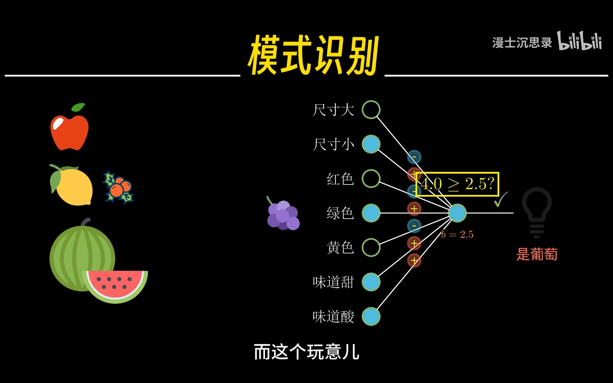
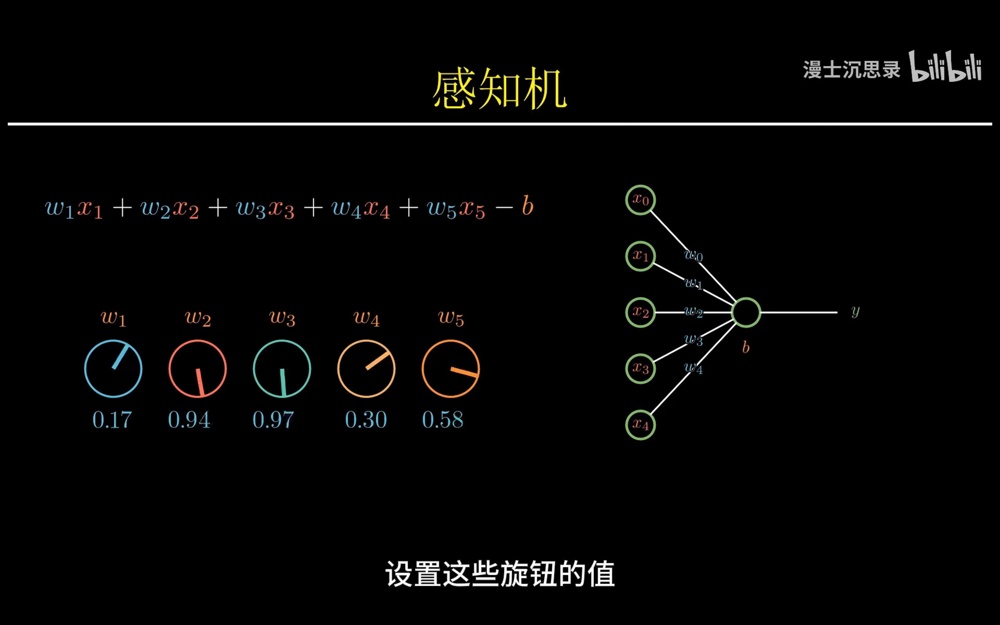
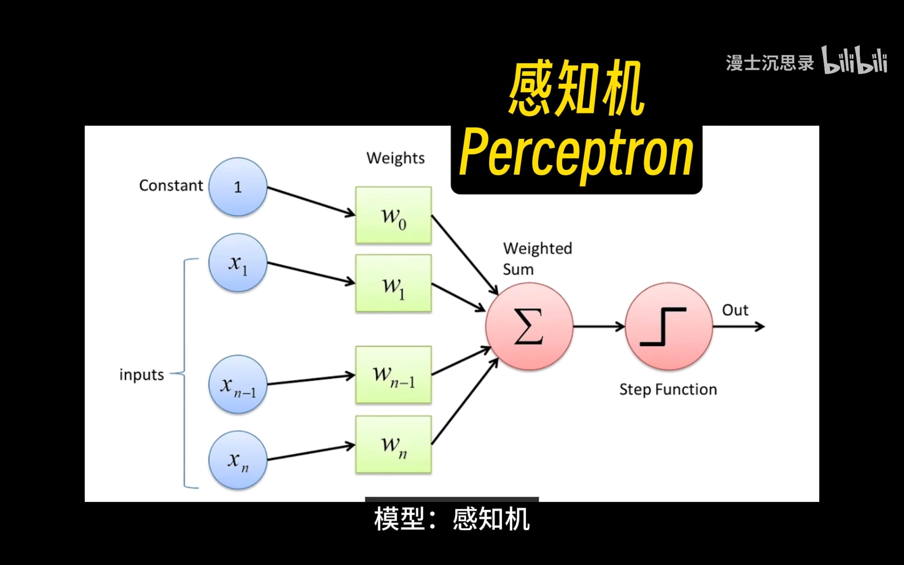
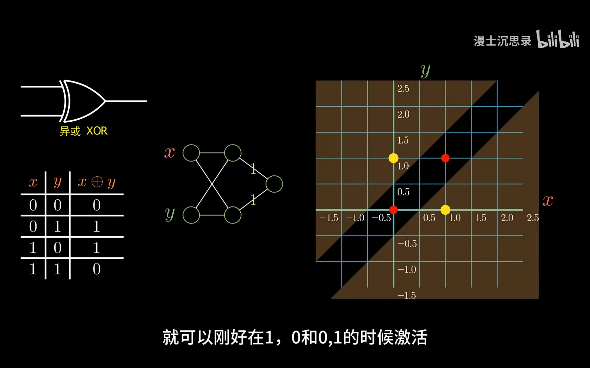
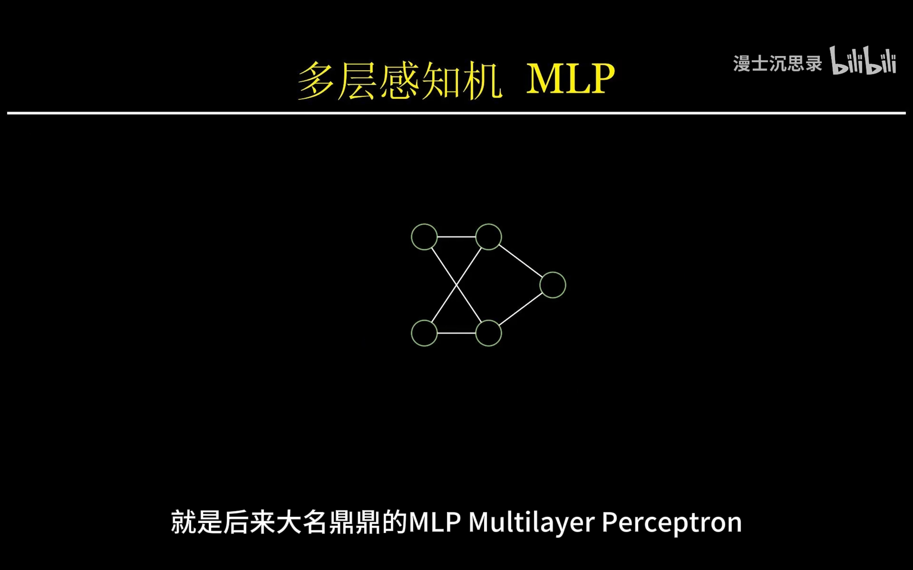
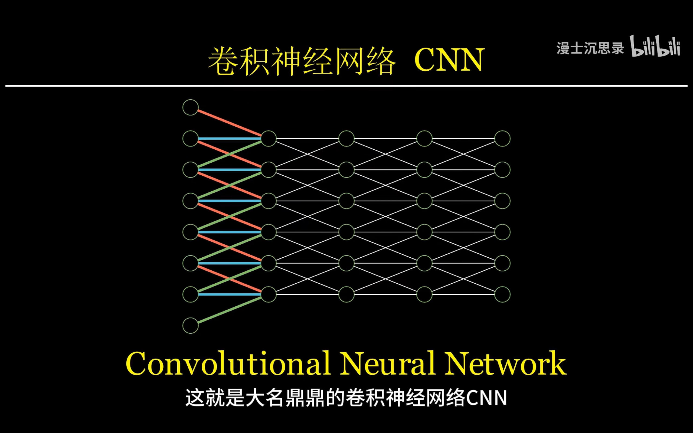

# 90分钟，一口气搞懂人工智能和神经网络

智能本质上就是针对不同情景给出针对性的输出反应

图灵测试

智能本质上是一个黑箱，可以找到输入和输出之间的对应关系

符号主义 vs. 机器学习（联结主义）

机器学习

- 哪来这种神奇黑箱？—— 模型结构
- 怎么奖励一个机器？—— 损失函数
- 机器怎么建立条件反射？—— 训练过程

联结主义Connectionism

感知机：模式识别算法模型

为了解决异或的问题，出现了多层感知机（MLP，Multilayer Preceptron）

动物的视觉，神经系统的神经元不需要和前一层的所有神经元全都稠密的连接，而只需要和局部的几个神经元连接。减少参数和运算量，提升神经网络的性能。卷积神经网络（CNN，Convolutional Neural Network）。

神经网络结构设计，大部分模型都在使用同一种算法来训练网络找到最好的参数——梯度下降。

拟合函数和损失函数不同

对每一个数据点，函数的预测和实际结果的偏差的平方加在一起，就得到了损失函数
损失函数就是在衡量一个模型预测的和真实的结果之间的偏差程度

梯度下降精神：每次减小一点点

计算梯度——反向传播（BP，back propagation）

