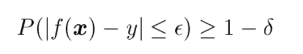
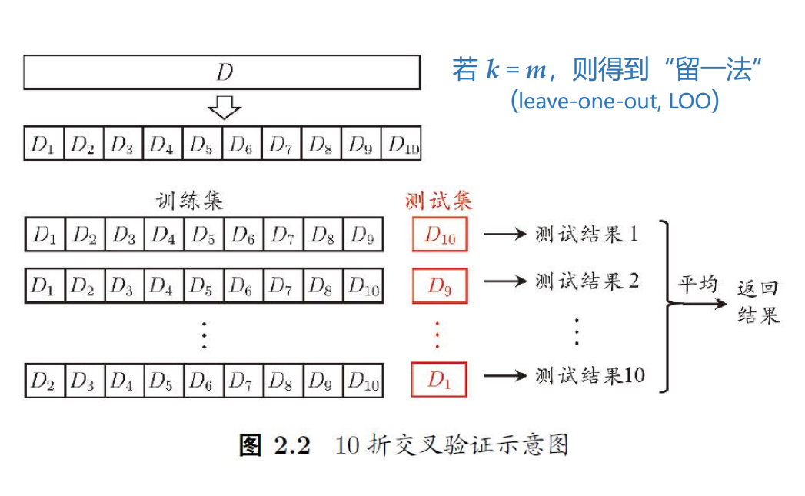
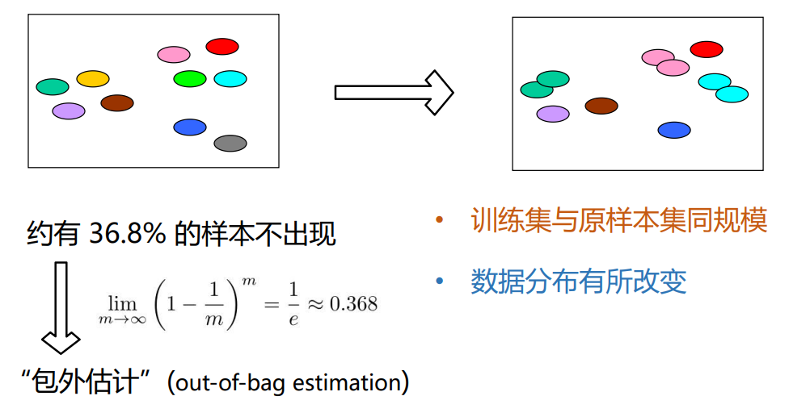
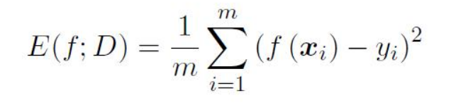
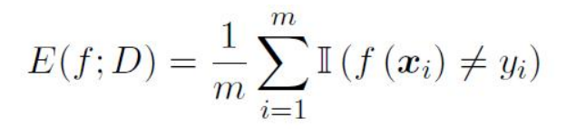
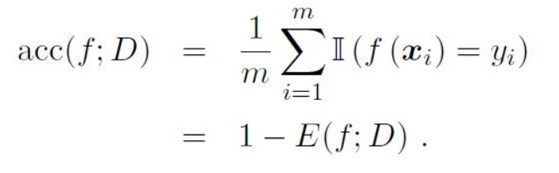
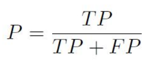
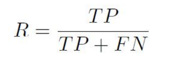
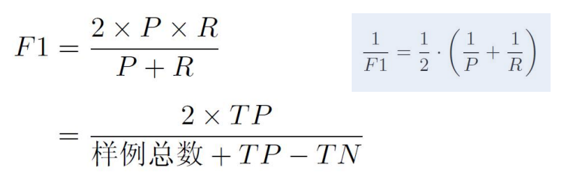
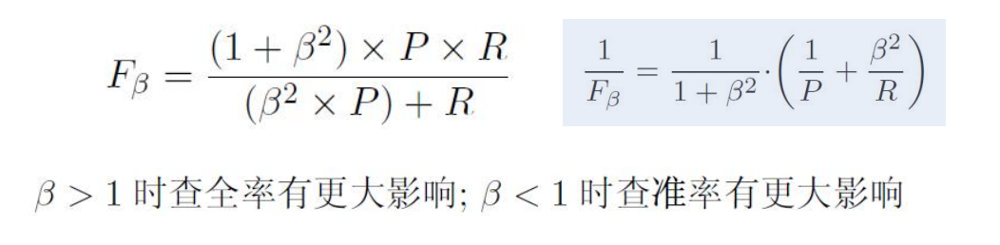

# 周志华西瓜书-机器学习

参考书籍：[**周志华**](http://cs.nju.edu.cn/zhouzh/) **著.** **机器学习, 北京: 清华大学出版社, 2016年1月.**

学堂在线平台：https://www.xuetangx.com/course/nju0802bt

### 1、绪论

#### 1-1 教材

1、初学机器学习的第一本书：

通读、速度；细节不懂处略过

了解机器学习的疆域和基本思想，理解基本概念

“观其大略”

2、阅读其他关于机器学习具体分支的读物（三月、半年）

3、再读、对“关键点”的理解：理解技术细冗后的本质，升华认识

“提纲挈领”

4、对机器学习多个分钟有所了解（1-3年）

5、再读、细思：“疏通经络”

书籍网址：https://cs.nju.edu.cn/zhouzh/zhouzh.files/publication/MLbook2016.htm

#### 1-2 课程定位

科学：是什么，为什么

技术：怎么做

工程：做得多快好省

应用：

本课程以科学和技术为主，涉及少量工程

#### 1-3 机器学习

经典定义：利用经验改善系统自身的性能[T. Mitchell 教科书, 1997]

经验 --> 数据

随着该领域的发展，目前主要研究智能数据分析的理论和方法，并已成为智能数据分析技术的源泉之一

#### 1-4 典型的机器学习过程

通过 给定数据和类别标记（label） 使用学习算法（learning algorithm）训练数据，生成模型（决策树，神经网络，支持向量机，Boosting，贝叶斯网，……），判断 新的数据样本 的类别标记（未知）

#### 1-5 机器学习理论

机器学习有坚实的理论基础

Leslie Valiant（莱斯利·维利昂特，2010年图灵奖）建立的

计算学习理论 Computational learning theory

最重要的理论模型：PAC（Probably Approximately Correct，概率近似正确）learning model [Valiant, 1984]

> 

#### 1-6 基本术语

训练数据

- 数据集；训练，测试；训练数据和测试数据应该分开
- 示例(instance)，样例(example)；示例是没有结果的，样例是有结果的
- 样本(sample)
- 属性()，特征()；属性值
- 属性空间，样本空间，输入空间
- 特征向量(feature vector)
- 标记空间，输出空间

模型：关于要判断的结果的规律

- 假设(hypothesis)
- 真相(ground-truth)
- 学习器(learner)

输出

- 分类，回归
- 二分类，多分类
- 正类，反类

学习任务

- 监督学习(supervised learning)：数据有期望结果；预测分类、回归
- 无监督学习(unsupervised learning)：数据无期望结果；离散数据做聚类，连续的数据做密度估计

未来数据

- 未见样本(unseen instance)
- 未知 “分布”
- 独立同分布(i.i.d.)
- 泛化(generalization)：对新数据的处理能力有多好，类似于推广

#### 1-7 归纳偏好(Inductive Bias)

机器学习算法在学习过程种对某种类型假设的偏好

任何一个有效的机器学习算法必有其偏好

一般原则：奥卡姆剃刀(Occam's razor)：若非必要，勿增实体（选择最简单的模型）

学习算法的归纳偏好是否与问题本身匹配，大多数时候直接决定了算法能否取得好的性能！

#### 1-8 NFL定理

> 没有免费的午餐！

NFL定理：一个算法La若存在某些问题上比另一个算法Lb好，必存在另一些问题Lb比La好

NFL定理的重要前提：所有“问题”出现的机会相同、或所有问题同等重要

脱离具体问题，空泛地谈论“什么学习算法更好”毫无意义！应该做到**具体问题，具体分析！**

最优方案往往来自：按需设计、度身定制

---

### 2、模型评估与选择

#### 2-1 泛化能力

泛化能力 评估 什么样的模型好

泛化能力强：能很好地适用于 unseen instance。例如，错误率低，精度高

然而，我们手上没有unseen instance，……

#### 2-2 过拟合和欠拟合

泛化误差 vs. 经验误差：

- 泛化误差：在“未来”样本上的训练

- 经验误差：在训练集上的误差，亦称“训练误差”

过拟合 vs. 欠拟合

- 训练过程中发现了一样特性，该特性恰好不是一般规律（过拟合 Overfitting）

- 一开始没学到，会犯错（欠拟合 Underfitting）

- 学到太多，学到不该学的（过拟合 Overfitting）

所有算法都在缓解Overfitting

1. 靠什么缓解Overfitting
2. 什么时候会失效

把握该算法什么时候用

#### 2-3 三大问题

模型选择（Model Selection）

三个关键问题：

- 如何获得测试结果？—— 评估方法
- 如何评估性能优劣？—— 性能度量
- 如何判断实质差别？—— 比较检验

#### 2-4 评估方法

 关键：怎么获得“测试集”（test set）？

测试集应该与训练集“互斥”

常见方法：

- 留出法（hold-out）
- 交叉验证法（cross validation）
- 自助法（bootstrap）

**留出法：**拥有的数据集中一部分作为训练集，另一部分作为测试集

注意：

- 保持数据分布一致性（例如：分层采样）
- 多次重复划分（例如：100次随机划分）
- 测试集不能太大、不能太小（例如：1/5 ~ 1/3）

**k-折交叉验证法：**

**自助法：**

基于“自助采样”（bootstrap sampling），亦称“有放回采样”、“可重复采样”

#### 2-5 调参与验证集

**“调参”与最终模型**

算法的参数：一般由人工设定，亦称“超参数”
模型的参数：一般由学习确定
调参过程相似：先产生若干模型，然后基于某种评估方法进行选择
参数调的好不好往往对最终性能有关键影响
算法参数确定后，要用“训练集+验证集”重新训练最终模型

区别：训练集 vs. 测试集 vs. 验证集（validation set）
验证集：训练集中专门留出来用来调参数的部分（调参数的过程是训练的一部分，所以调参数的数据应该从训练集中取，而不是测试集中取）

例如：多项式中有2次和3次，最高次数的参数由人工设定，则为“超参数”，多项式中的系数和常数（a、b、c）由学习确定，称为”参数“

#### 2-6 性能度量

性能度量（performance measure）是衡量模型泛化能力的评价标准，反映了任务需求
使用不同的性能度量往往会导致不同的评判结果

什么模型是”好”的，不仅取决于算法和数据，还取决于任务需求

- 回归（regression）任务常用均方误差：

  

**错误率 vs. 精度**

- 错误率：

  

- 精度：

  

**查准率 vs. 查全率**

| 真实情况 | 预测结果     |              |
| -------- | ------------ | ------------ |
|          | 正例         | 反例         |
| 正例     | TP（真正例） | FN（假反例） |
| 反例     | FP（假正例） | TN（真反例） |

- 查准率

  

- 查全率

  

查准率：100个西瓜，预测10个是好的，10个里面有多少个是好的

查全率：100个里面有20个是好的，只给了10个，查全率50%

**F1**

- F1度量：

- 若对查准率/查全率有不同偏好：

#### 2-7 比较检验

在某种度量下取得评估结果后，是否可以直接比较以评判优劣？
NO！因为：

- 测试性能不等于泛化性能
- 测试性能随着测试集的变化而变化
- 很多机器学习算法本身有一定的随机性

**机器学习 —— “概率近似正确”**

常用方法 —— 统计假设检验（hypothesis test）为学习器性能比较提供了重要依据

- 两学习器比较
  - 交叉验证t检验（基于成对t检验）
    - k折交叉验证；5×2交叉验证
  - McNemar检验（基于列联表，卡方检验）

- 多学习器比较
  - Friedman + Nemenyi
    - Friedman检验（基于序值，F检验；判断“是否都相同”）
    - Nemenyi后续检验（基于序值，进一步判断两两差别）

---

### 3、线性模型

#### 3-1 线性回归

线性模型（linear model）试图学得一个通过属性的线性组合来进行预测的函数
$$
f(x) = w_1x_1 + w_2x_2 + ... + w_dx_d + b
$$
向量形式：
$$
f(x) = w^T + b
$$
（简单、基本、可理解性好）

线性回归（Linear Regression）
$$
f(x_i) = wx_i + b 使得 f(x_i) ≈ y_i
$$
离散属性的处理：若有“序”（order），则连续化；否则，转化为k维向量

离散值连续化和连续值离散化

[x1; x2]表示列向量，[x1, x2]表示行向量

#### 3-2 最小二乘解

对一个对象求偏导让它为0，意味着对象不再发生变化的点

什么时候不变化了——一定是达到了极值、稳定值，对于线性变化来说极值点意味着再也不会变小了

令均方误差最小化，对模型进行求解——最小二乘法

最小二乘参数估计得到的线性回归模型满足 均方误差为0 的性质

最小二乘法的求解步骤： 

- (1) 均方误差对𝑤与𝑏求偏导；
- (2) 令偏导为0；
- (3) 求解线性方程组。

#### 3-3 多元线性回归

多元(Multi-variate)线性回归

当X^T^X满秩时，多元线性回归的最小二乘解唯一；
不满秩时则有多个解，此时需求助于归纳偏好，引入正则化(regularization)

#### 3-4 广义线性模型

一般形式：
$$
y = g^{-1}(w^Tx + b)
$$
g^-1^是单调可微的 联系函数（link function）

对数线性回归，用线性回归逼近对数的目标

对数线性回归是令广义线性模型中的联系函数为 对数函数 的特例

#### 3-5 对率回归

常用的替代函数通常是单调可微、任意阶可导

对数几率（log odds，logit），对数几率回归（logistic regression），简称对率回归

对率回归是分类学习算法：

- 无需事先假设数据分布
- 可得到”类别“的近似概率预测
- 可直接应用现有数值优化算法求取最优解

回归模型可以做分类，是因为有这个对率函数的联系函数

#### 3-6 对率回归求解

对率回归求解可使用“极大似然法” (maximum likelihood method)

MAX（P(真是+)P(预测为+) + P(真是-)P(预测为-)），取ln（对数）

两个很小的值相乘可能会发生下溢，取对数，乘法变加法，下溢问题解决

#### 3-7 线性判别分析

线性判别分析（Linear Discriminant Analysis）—— LDA

类内散度矩阵（within-class scatter matrix）

类间散度矩阵（between-class scatter matrix）

LDA的目标：最大化广义瑞利商 (generalized Rayleigh quotient)

学习梯度下降前的铺垫：矩阵转置公式与求导公式：（参考链接）

- https://zhuanlan.zhihu.com/p/525634088?utm_id=0
- https://blog.csdn.net/weixin_68226253/article/details/130609724
- https://blog.csdn.net/Lisa_Ren_123/article/details/81983785

拉格朗日乘子法 和 Sb定义看成方程组，则Sw*w = (μ0 - μ1)

w大小没有关系，关键是方向

#### 3-8 LDA的多类推广

全局散度矩阵St

类内散度矩阵Sw

类间散度矩阵Sb 
$$
S_t = S_b + S_w
$$

#### 3-9 多分类学习基本思路

拆解法：将一个多分类任务拆分为若干个二分类任务求解

最经典的拆分策略有三种：

- 一对一（One vs. One，简称OvO）
- 一对其余（One vs. Rest，简称OvR）
- 多对多（Many vs. Many，简称MvM）

#### 3-10 类别不平衡

类别不平衡（class-imbalance）

不同类别的样本比例相差很大；“小类”往往更重要

需要处理的情况是：“小类”价值更高，比大类更重要，需要注重处理

常见类别不平衡学习方法：

- 过采样（oversampling）；例如：SMOTE
- 欠采样（undersampling）；例如：EasyEnsemble
- 阈值移动（threshold-moving）

---

### 4、决策树

#### 4-1 决策树基本流程

决策树基于“树”结构进行决策

- 每个“内部结点”对应某个属性上的“测试”（test）
- 每个分支对应该测试的一种可能结果（即该属性的某个取值）
- 每个“叶节点”对应一个“预测结果”

学习过程：通过对训练样本的分析来确定“划分属性”（即内部结点所对应的属性）

预测过程：将测试示例从根结点开始，沿着划分属性所构成的“判定测试序列”下行，直到叶结点

策略：”分而治之“（divide-and-conquer）
自根至叶的递归过程
在每个中间结点寻找一个”划分“（split or test）属性

划分什么时候停止（停止条件）：

- (1) 当前结点包含的样本全属于同一类别，无需划分；

- (2) 当前属性集为空，或是所有样本在所有属性上取值相同，无法划分；
- (3) 当前结点包含的样本集合为空，不能划分.

决策树算法的核心：从属性集A中选择最优划分属性a~*~；

#### 4-2 信息增益划分

信息增益（Information Gain）

信息熵（entropy）是度量样本集合“纯度”最常用的一种指标，假定当前样本集合D中第k类样本所占的比例为p~K~则D的信息熵定义为
$$
Ent(D) = - 
Ent(D)的值越小，则D的纯度越高
$$
信息增益直接以信息熵为基础，计算当前划分对信息熵所造成的变化

信息增益 = 划分前的信息熵 - 划分后的信息熵

#### 4-3 其他属性划分准则

增益率（Gain Ratio）

启发式：先从候选划分属性中找出信息增益高于平均水平的，再从中选取增益率最高的

两种常用算法：ID3、C4.5

划分选择 vs. 剪枝：

- 研究表明: 划分选择的各种准则虽然对决策树的尺寸有较大影响，但对泛化性能的影响很有限
- 剪枝方法和程度对决策树泛化性能的影响更为显著

为什么？—— 剪枝 (pruning) 是决策树对付“过拟合”的主要手段！

#### 4-4 决策树的剪枝

pruning（剪枝）

为了尽可能正确分类训练样本，有可能造成分支过多 ——> 过拟合

可通过主动去掉一些分支来降低过拟合的风险

基本策略：

- 预剪枝（pre-pruning）：提前终止某些分支的生长
- 后剪枝（post-pruning）：生成一棵完全树，再“回头”剪枝

剪枝过程中需评估剪枝前后决策树的优劣（第2章）

#### 4-5 预剪枝与后剪枝

预剪枝 vs. 后剪枝

- 时间开销：
  - 预剪枝：测试时间开销降低，训练时间开销降低
  - 后剪枝：测试时间开销降低，训练时间开销增加
- 过/欠拟合风险：
  - 预剪枝：过拟合风险降低，欠拟合风险增加
  - 后剪枝：过拟合风险降低，欠拟合风险基本不变
- 泛化性能：后剪枝 通常优于 预剪枝

#### 4-6 缺失值的处理

现实应用中，经常会遇到属性值“缺失”（missing）现象

仅使用无缺失的样例？ --> 对数据的极大浪费

使用带缺失值的样例，需解决：

Q1：如何进行划分属性选择？

Q2：给定划分属性，若样本在属性上的值缺失，如何进行划分？

基本思路：样本赋权，权重划分

---

### 5、神经网络

#### 5-1 神经网路模型

“神经网络是由具有适应性的简单单元组成的广泛并行互连的网络，它的组织能够模拟生物神经系统对真实世界物体所作出的交互反应” —— [T.Kohonen, 1988, Neural Networks 创刊号]

神经网络是一个很大的学科领域，本课程仅讨论神经网络与机器学习的交集，即“神经网络学习”亦称“连接主义（connectionism）”学习

神经元的“激活函数”，Activation func（激活函数、响应函数、挤压函数）

多层前馈网络结构

- 多层网络：包含隐层的网络
- 前馈网络：神经元之间不存在同层连接也不存在跨层连接
- 隐层和输出层神经元亦称“功能单元”（Functional Unit）

#### 5-2 万有逼近能力

Universal Approximation

多层前馈网络有强大的表示能力（“万有逼近型”）

仅需一个包含足够多神经元的隐层，多层前馈神经网络就能以任意精度逼近任意复杂度的连续函数——[Hornki et al., 1998]

如何设置隐层神经元数是未决问题(Open Problem). 实际常用“试错法”

傅里叶变换 和 泰勒展开式 都具有万有逼近型；神经网络的数学基础比较薄弱（解已经存在，但要去找）

#### 5-3 BP算法推导

BP(BackPropagation：误差逆传播算法)

BP是一个迭代学习算法，在迭代的每一轮中采用广义感知机学习规则

BP算法基于梯度下降策略，以目标的负梯度方向对参数进行调整

#### 5-4 缓解过拟合

主要策略：

- 早停（early stopping）
  - 若训练误差连续a轮的变化小于b，则停止训练
  - 使用验证集：若训练误差降低、验证误差升高，则停止训练
- 正则化（regularization）
  - 在误差目标函数中增加一项描述网络复杂度

---

### 6、支持向量机

#### 6-1 支持向量机基本型

两个异类支持向量到超平面的距离之和称之为**间隔**

支持向量

#### 6-2 对偶问题与解的特性

解的特性

解的稀疏性：训练完成后，最终模型仅与支持向量有关；支持向量机（Support Vector Machine，SVM）因此而得名

#### 6-3 求解方法

为提高鲁棒性，通常使用所有支持向量求解的平均值

#### 6-4 特征空间映射

若不存在一个能正确划分两类样本的超平面, 怎么办? 将样本从原始空间映射到一个更高维的特征空间, 使样本在这个 特征空间内线性可分

如果原始空间是有限维(属性数有限)，那么一定存在一个 高维特征空间使样本线性可分

#### 6-5 核函数

> Mercer 定理：若一个对称函数所对应的核矩阵半正定, 则它就能作 为核函数来使用

任何一个核函数，都隐式地定义了一个RKHS (Reproducing Kernel Hilbert  Space, 再生核希尔伯特空间)

“核函数选择”成为决定支持向量机性能的关键！

#### 6-6 软间隔SVM

现实中很难确定合适的核函数，使训练样本在特征空间中线性可分

即便貌似线性可分，也很难断定是否是因过拟合造成的

引入软间隔 (Soft Margin), 允许在一些样本上不满足约束 

#### 6-7 正则化

正则化可理解为“罚函数法” 通过对不希望的结果施以惩罚，使得优化过程趋向于希望目标

从贝叶斯估计的角度，则可认为是提供了模型的先验概率

#### 6-8 如何使用SVM？

- 入门级—— 实现并使用各种版本SVM

- 专业级—— 尝试、组合核函数

- 专家级—— 根据问题而设计目标函数、 替代损失、进而…...

根据当前任务“度身定制”是关键

---

### 7、贝叶斯分类器

#### 7-1 贝叶斯决策论

贝叶斯决策论（Bayesian Decision Theory）：概率框架下实施决策的基本理论

#### 7-2 生成式和判别模型

判别式（Discriminative）模型

生成式（Generative）模型

#### 7-3 贝叶斯分类器与贝叶斯学习

贝叶斯分类器 ≠ 贝叶斯学习(Bayesian Learning)

#### 7-4 极大似然估计

先假设某种概率分布形式，再基于训练样例对参数进行估计

#### 7-5 朴素贝叶斯分类器

根本：假定每个feature独立

#### 7-6 拉普拉斯修正

拉普拉斯修正（Laplacian Correction）

若某个属性值在训练集中没有与某个类同时出现过，则直接计算会出现问题，因为概率连乘将“抹去”其他属性提供的信息

---

### 8、集成学习

#### 8-1 集成学习

集成学习（Ensemble Learning）：Using multiple learners to solve the problem

#### 8-2 好而不同

“多样性”（diversity）是关键：越精确，个体差异越大，得到的结果就越好

#### 8-3 两类常用集成学习方法

序列化方法 和 并行化方法

#### 8-4 Boosting

Boosting: A flowchart illustration

#### 8-5 Bagging

Bagging

#### 8-6 多样性度量

“多样性”(diversity) 是集成学习的关键

多样性度量 一般通过两分类器的预测结果列联表定义

---

### 9、聚类

#### 9-1 聚类

聚类 (Clustering)

在“无监督学习”任务中研究最多、应用最广

目标：将数据样本划分为若干个通常不相交的“簇”(cluster) 

既可以作为一个单独过程（用于找寻数据内在的分布结构）

也可作为分类等其他学习任务的前驱过程

#### 9-2 距离计算

对无序(non-ordinal)属性，可使用 VDM (Value Difference Metric)

对混合属性，可使用 MinkovDM

> 必须记住：聚类的“好坏”不存在绝对标准

#### 9-3 聚类方法概述

- 原型聚类
  - 亦称“基于原型的聚类”(prototype-based clustering)
  - 假设：聚类结构能通过一组原型刻画
  - 过程：先对原型初始化，然后对原型进行迭代更新求解
  - 代表：k均值聚类，学习向量量化(LVQ)，高斯混合聚类 

- 密度聚类 
  - 亦称“基于密度的聚类”(density-based clustering) 
  - 假设：聚类结构能通过样本分布的紧密程度确定
  - 过程：从样本密度的角度来考察样本之间的可连接性，并基于可连接样本不 断扩展聚类簇
  - 代表：DBSCAN, OPTICS, DENCLUE

- 层次聚类 (hierarchical clustering) 
  - 假设：能够产生不同粒度的聚类结果 
  - 过程：在不同层次对数据集进行划分，从而形成树形的聚类结构 
  - 代表：AGNES (自底向上)，DIANA (自顶向下)

---

### 补充

1、不太能看懂《西瓜书》的公式推导，有大神能推荐几本相关数学方面的书吗？知乎回答链接：https://www.zhihu.com/tardis/sogou/qus/419148526

2、学习梯度下降前的铺垫：已经还给高中老师了的矩阵转置公式与求导公式
https://zhuanlan.zhihu.com/p/525634088?utm_id=0

