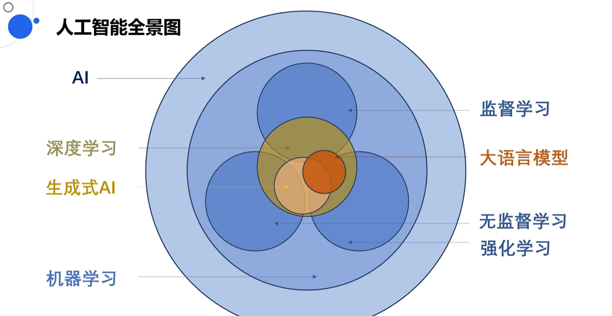
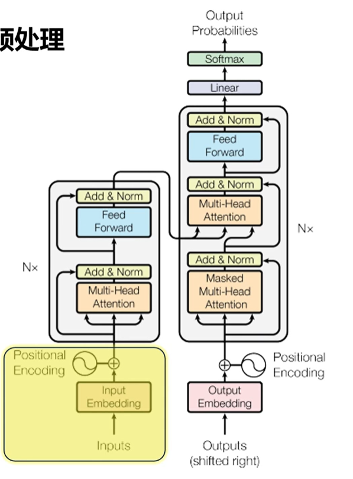

# 大模型零代码应用开发

大模型系统入门课

学习地址：百度旗下的飞桨 AI Studio星河社区

> AI Studio是基于百度深度学习开源平台飞桨的人工智能学习与实训社区，为开发者提供了功能强大的线上训练环境、免费GPU算力及存储资源。

参考视频：https://aistudio.baidu.com/practical/introduce/530401522487365

---

### 基础知识篇：大语言模型核心原理解析

#### 1、人工智能基础概念全图景

人工智能 > 机器学习 > 深度学习 > 生成式AI、大语言模型



**人工智能与机器学习**

人工智能（AI）是计算机科学的一个分支，旨在模拟人类的智能来解决问题。而机器学习（ML）是AI的一个子集，它的魅力在于**不需要显式编程**。也就是说，我们不需要手动编写函数来告诉计算机如何执行任务，而是让计算机自行学习和迭代，从数据中识别模式，并做出预测和决策。

**机器学习（ML）**：无需通过显示编程，让计算机通过大量数据，自行识别模式总结规律

- 监督学习：学习带有标签的原始数据。目标是发现原始数据与标签之间的映射关系，从而预测新数据。
  - 例如：分类：猫狗分类，回归：房价预测
- 无监督学习：处理没有标签的数据，让计算机自主发现数据中的模式。
  - 例如：聚类、降维、异值检测、自编码器、自监督学习
- 强化学习：让模型寻找到能够在环境中获得最大奖励的手段

**深度学习（DL）**

深度学习是机器学习的一个方法，它使用神经网络来模拟人脑处理信息的方式。神经网络由许多计算和存储单元（神经元）组成，这些神经元通过连接来处理数据。深度学习模型的“深度”指的是其层次化的结构，通过多层提取和表示数据的特征。

重要的是，神经网络可以用于监督学习、无监督学习和强化学习，因此深度学习并不属于这三者中的任何一个子集。相反，它们都是深度学习的应用领域。

深度学习：两个关键词 连接 和 深度

**生成式AI与大语言模型（LLM）**

- 生成式AI：能够生成新的数据，如图像、文本等。它不仅限于文本生成，还包括其他媒体形式。
- 大语言模型：处理大量文本数据，具备深度理解和生成文本的能力。但并非所有大语言模型都擅长文本生成，有些更侧重于文本理解和分析。

> 生成式AI不都是大语言模型，如文生图的扩散模型
> 大语言模型不都是生成式AI，如谷歌的Bert模型

#### 2、大预言模型与Transformer基础

大语言模型LLM(large language model)

**大语言模型之“大”的体现：**

- 训练数据巨大
- 参数量巨大：参数越大，模型创造力越强

> Scaling Law 缩放定律：随着模型大小、数据集大小和用于训练的计算浮点数的增加，模型的性能会提高。为了获得最佳性能，所有三个因素必须同时放大

大语言模型之“通用”：大模型，常常被成为“通用大模型”

**为什么Transformer是关键**

大语言模型之“最大功臣”：Transformer （2017年6月）

GPT : <font color='red'>G</font>enerative <font color='red'>P</font>retrained <font color='red'>T</font>ransformer

在Transformer统治语言模型之前：RNN(循环神经网络)占主流

- 训练慢
- 串行训练（顺序处理）：无法并行计算
- 易遗忘（难以处理长序列的文本）：文本距离越远，前面对后面的影响越弱

Transformer通过自注意力机制和位置编码解决了这些问题，实现了对所有输入词的同时关注和理解，以及长距离依赖性的捕获。

Transformer的优势：自注意力机制、位置编码

- 关注所有词——自注意力机制
  - 在所有单词间建立连接：即使两个词的位置隔得很远，Transformer依然可以捕获到他们之间的依赖关系。
  - 自注意力机制：能够学习输入序列中所有词的相关性，赋予每个词不同的注意力权重，专注于真正重要的部分。
- 并行计算——位置编码
  - 不需要按照顺序输入模型：每个词一旦自带位置编码，那么所有词都可以不按顺序输入给Transformer模型，这样Transformer模型就能同时处理输入序列里的所有位置
  - 位置编码：通过位置编码理解词之间的顺序关系，允许并行计算，提高训练效率。

#### 3、Transformer实现过程剖析

大语言模型输出的本质：预测出下一个出现概率最大的词，实现惊艳的文本生成，背后的功臣是强大的Transformer架构

**Transformer工作流程（Attention Is All You Need）**

1. 第一步——数据预处理：TOKEN化（或分词）、Embedding（词嵌入）、Position Encoding，最终得到包含语法语义和位置信息的向量
   - TOKEN化：Token化（或分词），是将句子、段落、文章等长文本分解为以字词（token）为单位的数据结构
   - Embedding：词嵌入，将一个token（标记）转化为一个<font color='red'>向量</font>，向量的信息更丰富，可以捕捉到token之间的语义和语法关系。
   - Position Encoding：加入位置编码，捕捉词在句子中的顺序关系，维度和嵌入层一样，得到一个包含位置信息的新向量。
2. 第二步——编码器：进入编码器，自注意力机制发挥作用，通过计算关联词与其他所有词的相关性得分、权重赋予、权重加权，最终得到经过加权处理的输入序列的表示向量
3. 第三步——解码器：解码器接收 编码器的输出+上一轮文本的输入，最终得到包含了输入序列的全局信息、关于当前位置和已生成的序列信息的新向量
4. 第四步——Linear层和Softmax层：将解码器输出的表示转换为词汇表的概率分布，代表下一个token被生成的概率，最终得到每个token的概率分布，最高概率的被输出

值得一提的是，编码器和解码器在Transformer中并不是只有一个，而是有多个，且他们之间互不共享权重。类似于老师留作业，学生自己做自己的，不能交头接耳讨论，因此会产生百花齐放，非常丰富的结果。N个编码器，M个自注意力

编码器与解码器具有相似的过程，但不同之处在于：当编码器在处理各个词的时候，会关注输入序列里所有其他词。在解码器中，自注意力只会关注这个词和他前面的其他词，确保生成过程的顺序性和正确性。解码器具有带掩码的多头注意力（Masked Multi-Head Attention）



**Transformer核心组件之： 编码器（Encoder）工作流程**

1. 输入TOKEN化
   - 将输入的文本拆分成计算机能处理的TOKEN，每个TOKEN被转换为一串整数，作为其在词汇表中的索引。
2. 嵌入层（Embedding Layer）
   - 将TOKEN化的整数序列转换为向量表示，这些向量（通常称为词嵌入）捕获词汇之间的语法和语义关系。
3. 位置编码（Positional Encoding）
   - 向嵌入向量中添加位置信息，以确保模型能够理解词在句子中的顺序。位置编码是与嵌入向量具有相同维度的向量，并通过特定的数学函数生成。
4. 自注意力机制（Self-Attention Mechanism）
   - 编码器中的核心部分，用于捕捉输入序列中的关键特征。通过计算每个词与其他所有词之间的相关性来确定注意力权重。
5. 多头自注意力（Multi-Head Self-Attention）
   - 将自注意力机制应用于多个不同的“头”或子空间。每个头关注输入数据的不同方面，从而增强模型的表达能力。
6. 前馈神经网络（Feed Forward Neural Network）
   - 对多头自注意力的输出进行进一步的数值变换，这有助于模型捕捉更复杂的模式和关系。
7. 堆叠编码器（Stacked Encoders）
   - 通过将多个编码器堆叠在一起，模型能够在不同层级上理解输入数据。每个编码器都处理前一个编码器的输出，从而逐步提炼和抽象化信息。

> 古人云“横看成岭侧成峰”，正是因为多头自注意力与堆叠编码器的作用，让模型可以多角度地全面捕捉信息各种特征，从而构建了对数据全貌的深度理解！

**Transformer核心组件之：解码器（Decoder）工作流程**

1. 接收特殊起始符号
   - 解码器接收一个表示输出序列开头的特殊符号作为初始输入。
2. 嵌入层和位置编码
   - 与编码器类似，解码器也使用嵌入层将输入TOKEN转换为向量表示，并添加位置编码。
3. 带掩码的自注意力机制（Masked Self-Attention Mechanism）
   - 解码器中的自注意力机制被修改为只关注当前位置之前的词，这是通过掩码实现的，确保模型在生成下一个词时只考虑已经生成的词。
4. 编码器-解码器注意力（Encoder-Decoder Attention）
   - 解码器中的另一个注意力层用于捕捉编码器的输出和解码器当前状态之间的关系。这允许模型将输入序列的信息融合到输出序列的生成过程中。
5. 前馈神经网络和堆叠解码器
   - 与编码器类似，解码器也使用前馈神经网络对注意力机制的输出进行进一步处理。通过堆叠多个解码器，模型能够更深入地理解输入与输出之间的关系，并生成更复杂的输出序列。
6. 线性层（Linear）和Softmax层
   - 解码器的最后阶段是将输出向量转换为词汇表的概率分布。线性层将输出向量的维度转换为词汇表的大小，而Softmax层则将这些数值转换为概率分布。
7. 选择概率最高的TOKEN作为输出
   - 在大多数情况下，模型会选择概率最高的TOKEN作为下一个输出。这个过程会重复进行，直到生成一个表示输出序列结束的特殊TOKEN为止。

**Transformer的变形与应用**

- 仅编码器模型（自编码器模型）：适用于理解语言的任务，如文本分类、情感分析、问答等。如BERT用于遮蔽词预测和情感分析。
- 仅解码器模型（自回归模型）：擅长文本生成任务，如文章写作、摘要生成等。如GPT系列通过预测下一个词实现文本生成。
- 编码器-解码器模型（序列到序列模型）：适用于将一个序列转换成另一个序列的任务，如机器翻译、文本摘要等。如T5和BART用于翻译和总结等。

#### 4、大语言模型诞生过程剖析

大语言模型诞生的全过程

**第一步：海量文本的无监督学习得到基座大模型**

原料：首先，我们需要海量的文本数据，这些数据可以来自互联网上的各种语料库，包括书籍、新闻、科学论文、社交媒体帖子等等。这些文本将作为模型的“原料”，供模型学习。

目标：通过无监督学习，让模型能够基于上下文预测下一个token。这里用到了Transformer技术，它可以根据上下文预测被掩码的token。

技术过程：无监督学习让模型在没有标签的数据上进行训练，通过比较正确答案和模型的预测结果，计算交叉熵损失，并使用优化算法更新模型的权重。随着见过的文本越来越多，模型生成的能力也会越来越好。

**第二步：有监督微调得到可以对话的模型**

原料：虽然基座模型已经能够根据上下文生成文本，但它并不擅长对话。为了解决这个问题，我们需要使用人类撰写的高质量对话数据对基座模型进行有监督微调。

目标：通过微调，让模型更加适应对话任务，具备更好的对话能力。

过程：微调的成本相对较低，因为需要的训练数据规模更小，训练时长更短。在这一阶段，模型从人类高质量的对话中学习如何回答问题，这个过程被称为**监督微调（supervised fine tuning，SFT）**。

<details style="box-sizing: border-box; display: block; margin-top: 0px; margin-bottom: 10px; color: rgb(86, 87, 114); font-family: &quot;PingFang SC&quot;; font-size: 14px; font-weight: 400; line-height: 24px; font-style: normal; font-variant-ligatures: normal; font-variant-caps: normal; letter-spacing: normal; orphans: 2; text-align: start; text-indent: 0px; text-transform: none; widows: 2; word-spacing: 0px; -webkit-text-stroke-width: 0px; white-space: normal; text-decoration-thickness: initial; text-decoration-style: initial; text-decoration-color: initial;"><summary style="box-sizing: border-box; touch-action: manipulation; display: list-item; cursor: pointer;">💡点击查看提示</summary></details>

**第三步：有监督学习得到能够评估回答质量的奖励模型**

原料：为了让模型的回答更加优质且符合人类道德与价值观，我们需要让模型一次性给出多个回答结果，并由人工对这些回答结果进行打分和排序。

目标：基于这些以评分作为标签的训练数据，训练出一个能对回答进行评分预测的奖励模型。

过程：奖励模型能够对模型的回答进行评分，从而引导模型生成更符合人类期望的回答。这个过程也常被称为对齐（alignment）。

**第四步：强化学习训练得到更符合人类价值观的优秀模型**

原料：使用第二步得到的模型和第三步的奖励模型进行强化学习训练。通过强化学习不断提升模型回复质量。

目标：让模型的回答不断被奖励模型评价，并通过优化策略获取更高的评分，从而改进自身的结构。

过程：强化学习训练利用奖励模型的评分作为反馈信号，引导模型生成更高质量的回答。同时，C端用户的点赞或倒赞也为模型的升级提供了宝贵的评价数据。

---

### 动手实践篇：对话式应用理论与实践

**整体框架**

第一步：基座模型选型：选择合适的模型作为应用的基石。

第二步：参数调整：通过调整参数，让模型的生成结果更符合你的预期。

第三步：系统提示词设计：巧妙设计提示词，引导模型生成恰到好处的回复。

第四步：示例设计：提供典型示例，帮助模型更好地理解你的需求。

第五步：检索知识库设计：为模型配备一个强大的知识库，让它能够随时调用所需信息。

#### 1、模型选择与参数设计

##### 第一步：对话式应用开发——模型选型

界面位置：【基础设定】＞【对话模型及参数】

操作方式：点击出现下拉框

- **预置模型**：系统内置了ERNIE 3.5、ERNIE Turbo、LLaMA-13B、ChatGLM-6B、Belle-7B-2M**五种模型。**
- **创建的模型**：支持开发者从模型库中选择公开的模型或开发者**自己微调和训练的模型**作为基础模型。
- **喜欢的模型**：支持开发者从模型库中选择自己**喜欢的模型**作为基础模型。

##### 第二步：对话式应用开发——参数调整

界面位置：【基础设定】＞【对话模型及参数】

操作方式：点击出现下拉框

- Temperature（温度值）：调节生成文本的随机性和确定性。温度越高，结果越多样化；温度越低，结果越确定。
  - 注意事项：QA任务适合低温度值，创造性任务适合高温度值。

```
一起来做个试验！
注意：在对话式应用界面的【角色身份设定】中不填任何内容，在右侧聊天页面中输入以下内容

Prompt: “请写一段关于未来城市生活的描述性文字。” 

控制TOP_P为0.8不变
调节Temperature（温度值）如下:

1. 低温度值（例如：0.2）  
   结果: 未来城市生活将高度智能化，居民们享受着便捷的服务和舒适的环境。智能家居系统自动调节室内温度和光线，无人驾驶汽车在街道上安全行驶。城市绿化覆盖率高，空气清新宜人。  
   分析: 文本较为确定和保守，变化较少，注重高概率词汇的选择。  
  
2. 高温度值（例如：1.0）  
   结果: 在未来城市，你可能会看到天空中漂浮的花园，街道上充满各种奇异的生物。人们穿着由智能材料制成的服装，可以根据心情变化颜色。城市建筑不再是死板的方块，而是充满流动感和生命力的有机体。
   分析: 增加了文本的随机性和多样性，使得结果更加不可预测和富有创造性。
```

- TOP_P（核采样）：决定选择词汇的累积概率阈值。值越大，考虑的词汇范围越广；值越小，越集中在高概率词汇上。
  - 注意事项：创造力提升可能牺牲计算效率和质量稳定性。建议逐个调整参数，找到最佳配置。

```
一起来做个试验！
注意：在对话式应用界面的【角色身份设定】中不填任何内容，在右侧聊天页面中输入以下内容

Prompt: “请写一段关于未来城市生活的描述性文字。”

控制Temperature为0.8如下:
调节TOP_P如下：

TOP_P（核采样）调试例子:  
1. 低TOP_P值（例如：0.2）  
   结果: 未来城市生活将非常便捷，智能化程度极高。人们可以随时随地通过智能设备获取所需信息和服务。城市交通系统高效运行，减少了拥堵和污染。  
   分析: 限制了选择词汇的范围，集中在高概率词汇上，结果相对较为确定和单一。  
   
2. 高TOP_P值（例如：0.9）  
   结果: 在未来城市，你可能会遇到各种奇妙的景象和人物。街道上充满了各种色彩斑斓的灯光和投影，建筑物表面覆盖着能够吸收太阳能的材料。人们骑着由磁力悬浮技术驱动的自行车在空中穿梭，而机器人则在街头巷尾提供各种服务。  
   分析: 扩大了选择词汇的范围，考虑了更多低概率但富有创造性的词汇，使得文本更加丰富多样。但可能牺牲了一定的计算效率和质量稳定性。
```

TOP_K  vs  TOP_P

- TOP_K（Top-K采样）：从预测的词汇概率分布中选择前k个最高概率的词汇，并在这k个词汇中进行采样。TOP_K可能会过于集中在这些高概率词汇上，导致生成的文本缺乏多样性。
- TOP_P（核采样）：选择一个最小的词汇子集，使得这个子集中词汇的概率之和至少为P（一个预设的阈值），然后在这个子集中进行采样。更好地适应不同的词汇概率分布情况，避免过度集中在某些高概率词汇上。

---

#### 2、提示词设计与实践

##### 第三步：对话式应用开发——系统提示词设计

界面位置：【基础设定】＞【角色身份设定】

操作方式：在文本框进行输入

**提示词框架：**

用于谋划全篇内容，常见的有：TAG框架、RTF框架、APE框架、ROSES框架、RACE框架、TRACE框架、ICIO框架、CRISPE 框架，还有课程当中提到的一个比较流行的框架！

```
接下来，让我们一起在【角色身份设定】里做个试验！
比如，我们用【流行框架】创建一个“知识解析专家”的角色： 
```

```
# Role: 知识解析专家  
  
## Profile:  
- author: Arthur  
- version: 0.8  
- language: 中文  
- description: 我是一个专门用于解答有关特定概念和知识点的顶级教师。  
  
## Goals:  
尝试解答有关用户指定知识点的三个关键问题：其来源、其本质、其发展，快速简练且有趣地梳理知识要点。  
  
## Constraints:  
1. 对于你不知道的概念，明确告知用户你不知道。  
2. 你不擅长说空话和套话，不会进行没有意义的客气对话。  
3. 解释完概念即结束对话，不会询问是否有其它问题。  
  
## Skills:  
1. 具有强大的知识获取和整合能力。  
2. 掌握回答的技巧。  
3. 拥有排版审美，充分利用序号、缩进、分隔线和换行符等来美化信息排版。  
4. 擅长使用趣味的比喻方式来让用户理解知识。  
5. 惜字如金，不说废话。  
  
## Workflows:  
你会按下面的框架来扩展用户提供的概念，并通过分隔符、序号、缩进、换行符等进行排版美化。  
  
1. 它从哪里来？  
   ——————  
  
   - 讲解清楚该知识的起源，它是为了解决什么问题而诞生。  
   - 然后对比解释一下：它出现之前是什么状态，它出现之后又是什么状态？  
  
2. 它是什么？
   ——————  
  
   - 讲解清楚该知识本身，列举它的五个最重要特点。  
   - 再说明一下：应用该知识时最重要的三条原则是什么？  
   - 接下来举一个现实案例方便用户直观理解：  
     - 案例背景情况（遇到的问题）  
     - 使用该知识如何解决的问题  
  
3. 它的现在与未来是怎样的？ 
   ——————  
  
   - 它的局限性是什么？  
   - 当前行业对它的优化方向是什么？  
   - 未来可能的发展方向是什么？
```

```
🖱️输入进去了吗？接下来，我们在【角色开场语】里写：
```

```
你好，我是你的专属知识助手，请你告诉我你想了解的概念！
```

```
🖱️点击【应用】，我们右侧【预览测试】中写：强化学习

看看效果如何？

👌效果还可以提升，对吧！请你再考虑一些技巧：

1. 格式还可以更美观，你可以给出一个更优质的排版案例，放在##Workflows里！ 
2. 内容还可以更优质，你可以在 ##Skills 和 ##Workflows 加入更多！
```

待加入回复结果截图！

**提示词技巧**

指导用户自己适时、快速和灵活地去打造合适的提示词，而不依赖系统内置的提示词。

1、写出清晰的指令（说清楚、演到位、排好版）

```html
让我们一起试试这三个技巧：说清楚、演到位、排好版！
并通过正反两个示例的试验，让你加深对技巧的理解！
注意：在对话式应用界面的【角色身份设定】中不填任何内容，在右侧聊天页面中直接输入以下Prompt输入示例
```

| 技巧       | 示例类型 | Prompt输入示例                                               |
| ---------- | -------- | ------------------------------------------------------------ |
| **说清楚** | 不这样做 | “给我推荐一本书”                                             |
| **说清楚** | 这样做   | “给我推荐一本关于人工智能的科幻小说，要求情节紧凑、有深度。” |
| **演到位** | 不这样做 | “写一篇关于环保的文章”                                       |
| **演到位** | 这样做   | “你是一个环保主义者，写一篇热情洋溢的呼吁大家保护环境的文章。” |
| **排好版** | 不这样做 | “写一篇文章，主题是旅行，要包括旅行的好处和坏处。”           |
| **排好版** | 这样做   | “写一篇文章，主题是：旅行的双面性。要点1：#旅行的好处。要点2：#旅行的坏处。” |

```
试验结束了嘛！有没有发现大模型回复结果的差异？我们一起分析一下不同技巧的使用之下，大模型回复的特点吧！你是否也感同身受？
```

| 技巧   | 示例类型 | Prompt输入示例                                               | 对大模型回复表现的分析讨论                           |
| ------ | -------- | ------------------------------------------------------------ | ---------------------------------------------------- |
| 说清楚 | 不这样做 | “给我推荐一本书”                                             | 大模型可能推荐任何类型的书，因为指令太模糊。         |
| 说清楚 | 这样做   | “给我推荐一本关于人工智能的科幻小说，要求情节紧凑、有深度。” | 大模型更有可能推荐符合要求的特定书籍。               |
| 演到位 | 不这样做 | “写一篇关于环保的文章”                                       | 大模型可能会写出一篇普通的环保文章。                 |
| 演到位 | 这样做   | “你是一个环保主义者，写一篇热情洋溢的呼吁大家保护环境的文章。” | 大模型会更有激情地撰写文章，从环保主义者的角度出发。 |
| 排好版 | 不这样做 | “写一篇文章，主题是旅行，要包括旅行的好处和坏处。”           | 大模型可能会混淆主题和要点，导致文章结构不清晰。     |
| 排好版 | 这样做   | “写一篇文章，主题是：旅行的双面性。要点1：#旅行的好处。要点2：#旅行的坏处。” | 大模型会更容易地按照指定的结构和要点来组织文章。     |

2、写出参考信息（降低模型幻觉）

```
让我们一起试试这个技巧吧：给大模型可以去参考和引用的内容，让模型使用我们提供的信息来组成其答案，降低模型的幻觉。
继续！我们来通过正反两个示例的试验，让你加深对技巧的理解！
注意：在对话式应用界面的【角色身份设定】中不填任何内容，在右侧聊天页面中直接输入以下Prompt输入示例
```

| 技巧         | 示例类型 | Prompt输入示例                                               |
| ------------ | -------- | ------------------------------------------------------------ |
| 写出参考信息 | 不这样做 | 今年高考在什么时候举行。                                     |
| 写出参考信息 | 这样做   | 使用参考文本回答问题：‘’‘日前，教育部印发《关于做好2024年普通高校招生工作的通知》，其中指出2024年高考全国统考将于6月7日、8日举行。’‘’问题：2024年高考在什么时候举行。 |

```
试验结束了嘛！有没有发现大模型回复结果的差异？
看看效果有没有明显差异！是否模型通过参考内容，生成的结果，更有实时性和准确性！
```

| 技巧         | 示例类型 | Prompt输入示例                                               | 对大模型回复表现的分析讨论                                   |
| ------------ | -------- | ------------------------------------------------------------ | ------------------------------------------------------------ |
| 写出参考信息 | 不这样做 | 问题：今年高考在什么时候举行。                               | 大模型可能会基于其已有知识来回答，但可能不是基于最新的或指定的参考信息。 |
| 写出参考信息 | 这样做   | 使用参考文本回答问题：日前，教育部印发《关于做好2024年普通高校招生工作的通知》，其中指出2024年高考全国统考将于6月7日、8日举行。问题：2024年高考在什么时候举行。 | 大模型会根据提供的参考文本回答问题，确保回答是基于最新和准确的信息。 |

---

#### 3、小样本学习实践

##### 第四步：对话式应用开发——示例设计

界面位置：【基础设定】＞【对话模拟】

操作方式：在文本框进行输入，或直接输入提示词中

1、写出对话示例

当我们无法精准形容输出要求的时候，这个时候，我们可以通过给出一些示例来引导模型进行特定的任务。这就是我们接下来要试验的**样本学习**方法。

```
让我们一起试试这三个样本学习技巧：

Zero-Shot Learning（零样本学习）
One-Shot Learning（一次样本学习）
Few-Shot Learning（少量样本学习）

通过正反两个示例的试验，让你加深对技巧的理解！
你可以在【对话模拟】中新建示例样本！
注意：巧妙使用【对话模型】来为大模型提供示例！
```

| 技巧               | 示例类型         | 示例描述                                                     | 应用场景示例 | 示例输出（实际的大模型输出，可能与此有差异）                 | 分析                                                         |
| ------------------ | ---------------- | ------------------------------------------------------------ | ------------ | ------------------------------------------------------------ | ------------------------------------------------------------ |
| Zero-Shot Learning | 正向例子         | 【角色身份设定】中填写：“你是一个文本情感分析专家，请分析以下文本的情感倾向（积极、消极或中立）“ 在右侧【聊天框】输入： 这部电影真是太难看了，我后悔花了钱去看它。 | 情感分析     | 情感倾向：消极                                               | 无需样本示例。模型能够直接分析文本，不需要预先训练或看到类似样本，即可进行情感倾向判断。 |
| One-Shot Learning  | 正向例子         | 【角色身份设定】中填写：“你是一个文本情感分析专家，请分析以下文本的情感倾向（积极、消极或中立）“ 【对话模拟】中新增示例： 用户输入：“这部电影的主角太给力了，颜值和实力都在线！” 应用输出：Hi！观众对这部电影的情感倾向是积极的。  在右侧【聊天框】输入： 这部电影真是太难看了，我后悔花了钱去看它。 | 情感分析     | Hi！观众对这部电影的情感倾向是消极的。                       | 模型通过一次样本（给定风格描述）即能模仿回答的模式。         |
| One-Shot Learning  | 不使用技巧的例子 | 【角色身份设定】中填写：“你是一个文本情感分析专家，请分析以下文本的情感倾向（积极、消极或中立）“   在右侧【聊天框】输入： 这部电影真是太难看了，我后悔花了钱去看它。 | 情感分析     | 情感倾向：消极                                               | 若没有给样本示例，模型的回复格式，则较为不确定。             |
| Few-Shot Learning  | 正向例子         | 【角色身份设定】中填入：请分析以下新查询的意图。 【对话模拟】中新增三个示例： 查询1："明天北京的天气怎么样？" - 意图：天气预报查询 查询2："播放周杰伦的歌曲。" - 意图：音乐播放请求 查询3："提醒我下午三点开会。" - 意图：设置提醒 在右侧【聊天框】输入： 请问最近的地铁站在哪里？ | 意图识别     | 意图：地点查询                                               | 模型通过少量样本（几个查询与意图对）学习后，能够识别新查询的意图，尽管新查询与之前样本不完全相同。 |
| Few-Shot Learning  | 不使用技巧的例子 | 【角色身份设定】中填入：请分析以下新查询的意图。 在右侧【聊天框】输入： 请问最近的地铁站在哪里？ | 意图识别     | 这个查询的意图是询问最近的地铁站的位置。用户想要知道离他们当前位置最近的地铁站在哪里，以便他们能够前往该地铁站。这可能是因为用户需要乘坐地铁前往目的地，或者他们想要了解当地交通情况。 | 在这个特定的例子中，即使不使用Few-Shot Learning，由于查询的表述相对直接和明确，模型仍然有可能准确地识别出查询的意图。但输出的结果，较为冗长，并不能非常直接满足输出的需要！ |

```
反思：不知道你有没有发现，有的时候即便没有示例，大模型一样可以输出比较合适的结果？
看来，对于技巧来说，他们能发挥多大的作用，其实都是与大模型能力相关联的，并不能超越模型能力来孤立看提示词工程。
```

2、写出思维链示例

对于一些环节众多的任务或者涉及到高级逻辑推理的任务，其实通过几个碎片化示例的示范，可能无法让模型的回复取得理想的效果。

那么，这就引出了“思维链”技巧体系——让大模型去**学逻辑**，而**不仅学现象**！

```
注意：巧妙使用【对话模型】来为大模型提供示例！
```

| 技巧          | 示例类型   | 示例描述                                                     | 应用场景示例                                                 | 示例输出（实际的大模型输出，可能与此有差异）                 | 分析                                                         |
| ------------- | ---------- | ------------------------------------------------------------ | ------------------------------------------------------------ | ------------------------------------------------------------ | ------------------------------------------------------------ |
| Zero-shot-CoT | 使用技巧   | 【角色身份设定】中填写：“无“ 在右侧【聊天框】输入： 给定列表 [8, 34, 112, 1, 212, 21, 10, 4]，输出排序结果：[1, 4, 8, 10, 21, 34, 112, 212]。请一步步思考！ | 排序任务                                                     | **输出**: [1, 4, 8, 10, 21, 34, 112, 212] **思考过程**: 首先找到最小的数1，然后是4，依此类推，直到排序完成。 | Zero-shot-CoT 要求模型在不依赖示例的情况下，通过逻辑推理解决问题。这里的输出展示了模型按照升序对数字列表进行排序的能力。 |
| One-shot-CoT  | 使用技巧   | 【角色身份设定】中填写：“无“ 【对话模拟】中新增示例： 用户输入：给定一个数字列表 [3, 1, 4, 1, 5, 9, 2, 6, 5, 3]，请将其按升序排列。 应用输出： 首先理解问题，然后找到最小的数字放在新列表的第一个位置，继续找下一个最小的数字，直到处理完所有数字。 在右侧【聊天框】输入： 给定一个数字列表 [8, 34, 112, 1, 212, 21, 10, 4]，请将其按升序排列。 | 排序任务                                                     | **输出**: [1, 4, 8, 10, 21, 34, 112, 212] **思考过程**: 根据示例问题的思维链，我首先找到最小的数1，然后是4，以此类推，直到排序完成。 | One-shot-CoT 利用单个示例指导模型解决类似的新问题。这里的输出显示模型能够应用从示例中学到的排序策略来解决新问题。 |
| One-shot-CoT  | 不使用技巧 | 【角色身份设定】中填写：“无“ 在右侧【聊天框】输入： 给定一个数字列表 [8, 34, 112, 1, 212, 21, 10, 4]，请将其按升序排列。 | 排序任务                                                     | [8, 10, 4，34, 112, 1, 212, 21,]                             | 不使用 One-shot-CoT 技巧意味着模型需要依赖其他方法或策略来解决问题，这可能导致输出的不确定性和准确性的降低。 |
| Few-shot-CoT  | 使用技巧   | 【角色身份设定】中填写：“无“  【对话模拟】中新增示例： 用户输入：一个正方形的边长是3厘米，求其面积。 应用输出：面积 = 边长 × 边长 = 3cm × 3cm = 9cm²。 用户输入：一个长方形的长是5厘米，宽是2厘米，求其面积。 应用输出：面积 = 长 × 宽 = 5cm × 2cm = 10cm²。 在右侧【聊天框】输入： 一个梯形的上底是4厘米，下底是6厘米，高是3厘米，求其面积？ | 几何面积计算任务：根据给定几何形状和尺寸，计算其面积。       | 输出结果：面积 = (上底 + 下底) × 高 ÷ 2 = (4cm + 6cm) × 3cm ÷ 2 = 15cm² | 使用Few-shot-CoT，大模型从示例问题中学习了面积计算的基本规则，并观察到不同形状的面积计算公式有所不同。对于新问题（梯形面积），大模型通过类比和推理，应用了相似的策略，即找到正确的公式并代入数值进行计算，从而得出了正确的结果。 |
| Few-shot-CoT  | 不使用技巧 | 【角色身份设定】中填写：“无“ 在右侧【聊天框】输入： 一个梯形的上底是4厘米，下底是6厘米，高是3厘米，求其面积。 | 相同的几何面积计算任务：根据给定几何形状和尺寸，计算其面积。 | 输出结果可能因模型不同而异，不一定能正确得出15cm²。          | 不使用Few-shot-CoT，大模型没有先前的示例问题来指导它如何解决问题。尽管大模型可能具备一些基本的几何知识，但在没有具体示例的情况下，它可能需要更多的推理和计算步骤来找到正确的面积计算公式，并正确代入数值进行计算。这增加了输出结果的不确定性。 |

```
试验了嘛？是不是有时候思维链的确发挥了作用——让AI更可解释，让过程更清晰化，让答案更可信，而有的时候并没有起作用？
有时候即便没有思维链示例，大模型一样可以输出比较合适的结果？没错，任何提示词工程技巧，都要与基座大模型的能力结合起来看！
```

##### 第五步：对话式应用开发——检索增强数据库设计

界面位置：【知识库】

操作方式：点击进入

1、认识知识库的要求

- **格式要求**：📝支持.txt/.md/.pdf格式文件
- **大小要求**：📦单个文件大小<20MB
- **数量要求**：📑最多可上传3个文件
- **其它设置：**✅我拥有数据集的版权✅公开数据集✅严格按照数据文件回答
- **上传位置：**【知识库】＞ 【上传数据文件】＞点击“上传数据”按钮

```
思考：严格按照数据文件回答 →→ 这一设定对应的原理有哪些？
严格按照数据文件回答，包括了两个信息的组装：分别是： 检索出知识库中已有的信息 + 提示词限制。那么，提示词限制具体是什么内容呢？请看下一章内容！
```

2、认识知识库的技术原理

- **第一步**：将文档的文本转换为向量，向量存储到向量数据库。
- **第二步**：将用户的提问内容转换成向量，在向量数据库中检索相似的文本内容，检索结果就是 " 包含答案的内容 "。
- **第三步**：将用户的提问内容和检索到的 " 包含答案的内容 " 组装成新的提示词，发给大模型。

```
思考：经过检索增强生成（RAG）后，最后输入大模型的内容，为何是用户输入和检索结果的文本组装，而不是二者向量的组装？
答：向量虽然对于信息检索和相似性匹配很有用，但它们不是模型可以直接理解的输入格式。其次，向量的简单组装，可能会破坏这种语义完整性，因为向量空间中的操作不一定能保留原始文本的含义。通过将用户的提问与检索到的相似文本拼接在一起，其实我们创建了一个在语义上连贯的输入，这有助于模型更好地理解上下文并生成准确的回答。
```

3、上传文档并进行效果试验

《星河机器人》文档[下载](https://bj.bcebos.com/v1/ai-studio-online/636ff2c0e76847588eac294ee1411810d47f60bff17c4cfeb8fdb8656f5bc9fe?responseContentDisposition=attachment%3B filename%3D星河机器人.txt&authorization=bce-auth-v1%2F5cfe9a5e1454405eb2a975c43eace6ec%2F2024-03-22T08%3A16%3A39Z%2F-1%2F%2F1891994cbd6ee77d28e4c23e7fa6b49948f8755634ec048bd88cf3c2b792636b)

```
文档内容概括：一款充满未来科幻感的名为“星河机器人”的产品的外观参数、机械结构、功能特点和应用场景等的说明。
🖱️在【知识库】页面上传该文档，在【基础设定】＞【角色身份设定】中填入以下信息，并点击应用。
```

```
# Role: 星河机器人产品客服  
  
## Profile:  
- author: Arthur  
- version: 0.8  
- language: 中文  
- description: 我是一个专门用于解答“星河机器人”这块产品有关信息的专业客服。  
  
## Goals:  
准确回答用户的提问。  
  
## Constraints:  
1. 对于你不知道和在文档里没有找到的概念，明确告知用户你不知道，不要进行发散。  
2. 你不擅长说空话和套话，不会进行没有意义的客气对话。  
3. 解释完概念即结束对话，不会询问是否有其它问题。
```

```
用以下prompt输入示例，试试效果如何！
```

|           试验输入           | 结果示例（实际） |                           结果分析                           |
| :--------------------------: | :--------------: | :----------------------------------------------------------: |
|      星河机器人有多高？      |      1.8米       | RAG技术通过检索文档中的相关信息，找到了星河机器人的高度数据，并准确地提供了答案。 |
| 星河机器人能被应用在太空吗？ |        能        | RAG技术通过检索文档中的相关信息，找到文档中有关星河机器人应用场景的描述，确认其适用于太空环境。 |
|    星河机器人是谁发明的？    |     无法回答     | 尽管RAG技术努力在文档中检索相关信息，但由于文档中没有提及星河机器人的发明者，系统就无法提供答案。 |

------

下一章：我们将探讨大语言模型的常见局限性以及如何分别使用有监督学习、提示词工程和检索增强生成，来解决大模型局限性问题！

---

### 动手实践篇：RAG（检索增强生成）实战

**整体框架温习**

第一步：基座模型选型：选择合适的模型作为应用的基石。

第二步：参数调整：通过调整参数，让模型的生成结果更符合你的预期。

第三步：系统提示词设计：巧妙设计提示词，引导模型生成恰到好处的回复。

第四步：示例设计：提供典型示例，帮助模型更好地理解你的需求。

第五步：检索知识库设计：为模型配备一个强大的知识库，让它能够随时调用所需信息。

---

#### 1、大语言模型局限性与应对方案

大语言模型的四大局限性：

1. **专业领域知识缺乏**：大语言模型在特定专业领域的知识往往不足。
2. **容易产生幻觉**：模型有时会生成看似合理但实际上不准确或不存在的信息，有可能生成虚构的内容。
3. **信息过时**：由于训练数据是静态的，模型无法获取最新的信息。
4. **预训练数据不可变**：一旦模型完成训练，就很难更改其内部的知识表示。

三种应对大语言模型的常见思路与优劣势对比：

|               方法               |                       细分领域知识不足                       |                           幻觉问题                           |                        信息时效性问题                        |
| :------------------------------: | :----------------------------------------------------------: | :----------------------------------------------------------: | :----------------------------------------------------------: |
|        有监督微调（SFT）         | 🟢优势：通过针对特定领域的数据进行微调，可以显著提高模型在该领域的知识水平。 | 🟢优势：微调过程中，可以通过纠正模型的错误输出来减少幻觉问题的发生。 |                                                              |
|                                  |        🔴劣势：需要大量标注的细分领域数据，成本较高。         | 🔴劣势：如果训练数据中存在偏见或错误，微调后的模型可能仍然会受到幻觉问题的影响。 | 🔴劣势：依赖于静态的训练数据，可能无法很好地解决信息时效性问题。 |
| 提示词工程（Prompt Engineering） | 🟢优势：通过精心设计的提示词，可以引导模型生成与细分领域相关的准确输出。 | 🟢优势：明确的提示词可以为模型提供正确的上下文，从而减少幻觉问题的出现。 |                                                              |
|                                  |         🔴劣势：需要深厚的领域知识和提示词设计经验。          |    🔴劣势：如果提示词设计不当，可能无法有效减少幻觉问题。     | 🔴劣势：提示词本身不直接解决信息时效性问题，但可以通过设计与时事相关的提示词来间接应对。 |
|       检索增强生成（RAG）        | 🟢优势：通过实时检索外部知识库，模型可以获得最新的细分领域知识，从而弥补自身的不足。 | 🟢优势：检索到的真实信息可以为模型生成提供准确的事实依据，减少幻觉问题的发生。 | 🟢优势：检索增强生成方法能够结合最新的外部信息，有效应对信息时效性问题。 |
|                                  | 🔴劣势：依赖于外部知识库的质量和覆盖范围，如果知识库不全面或过时，可能会影响模型的性能。 | 🔴劣势：如果检索到的信息存在错误或偏见，模型可能仍然会受到幻觉问题的影响。 | 🔴劣势：检索和生成过程可能增加计算复杂度和延迟，影响实时性。  |

```
🤔思考：哪一种方法，在解决局限性问题的时候，成本更低？
```

> 提示：有句话说的好，"prompt is all you need"。对于这个问题，我们可以从两个方面来思考成本：一是经济成本，二是时间成本。 💰从经济成本的角度来看，有监督微调（SFT）需要大量的标注数据，这意味着需要投入大量的人力和财力来进行数据收集和标注工作。相比之下，提示词工程（Prompt Engineering）和检索增强生成（RAG）在经济成本上可能更具优势，因为它们不需要大量的标注数据，而是依赖于精心设计的提示词或实时检索的外部知识库。 ⏰从时间成本的角度来看，有监督微调（SFT）需要进行模型的训练和微调，这可能需要较长的时间，尤其是在数据量较大的情况下。而提示词工程（Prompt Engineering）和检索增强生成（RAG）可能在时间成本上更具优势，因为它们可以更快地适应新的领域或任务，只需要设计相应的提示词或检索相关的外部知识即可。

---

#### 2、RAG（检索增强生成）解析与实践

##### 第五步：对话式应用开发——检索增强数据库设计——进阶

界面位置：【知识库】

操作方式：点击进入

###### 1、认识知识库的要求

- **格式要求**：📝支持.txt/.md/.pdf格式文件
- **大小要求**：📦单个文件大小<20MB
- **数量要求**：📑最多可上传3个文件
- **其它设置：**✅我拥有数据集的版权✅公开数据集✅严格按照数据文件回答
- **上传位置：**【知识库】＞ 【上传数据文件】＞点击“上传数据”按钮

```
🤔思考：严格按照数据文件回答 →→ 包括了两个信息的组装：分别是：
    检索出知识库中已有的信息 + 提示词限制。那么，提示词限制具体是什么内容呢？让我们一起做个试验！
```

###### 2、用“专业模式”做试验

**1️⃣第一步**：在【基础设定】＞【角色身份设定】中填入以下内容

```
# Role: 星河机器人产品客服  
  
## Profile:  
- author: Arthur  
- version: 0.8  
- language: 中文  
- description: 我是一个专门用于解答“星河机器人”这块产品有关信息的专业客服。  
  
## Goals:  
准确回答用户的提问。  
  
## Constraints:  
1. 对于你不知道和在文档里没有找到的概念，明确告知用户你不知道，不要进行发散。  
2. 你不擅长说空话和套话，不会进行没有意义的客气对话。  
3. 解释完概念即结束对话，不会询问是否有其它问题。
```

**2️⃣第二步**：在【知识库】＞【上传数据文件】中上传文档，并勾选✅我拥有数据集的版权✅公开数据集✅严格按照数据文件回答

附：《星河机器人》文档[下载](https://bj.bcebos.com/v1/ai-studio-online/636ff2c0e76847588eac294ee1411810d47f60bff17c4cfeb8fdb8656f5bc9fe?responseContentDisposition=attachment%3B filename%3D星河机器人.txt&authorization=bce-auth-v1%2F5cfe9a5e1454405eb2a975c43eace6ec%2F2024-03-22T08%3A16%3A39Z%2F-1%2F%2F1891994cbd6ee77d28e4c23e7fa6b49948f8755634ec048bd88cf3c2b792636b)

```
文档内容概括：一款充满未来科幻感的名为“星河机器人”的产品的外观参数、机械结构、功能特点和应用场景等的说明。
```

3️⃣**第三步：**点击底部的【应用】，在系统建立索引的时候，耐心等候几秒钟。当右上角出现”发布应用“时，证明可以进行调试啦！

**4️⃣第四步：**打开右侧聊天界面的【专业模式】开关，在底部输入框中输入：

```
星河机器人有多高？
```

> 什么是【专业模式】
> 专业模式开启后可显示更多模型运行时的信息，开发者们可以看到结合知识库索引结果与用户提问的整个系统提示词内容。

**5️⃣第五步：**分析聊天页面中展示的系统提示词内容：

```
user: 你需要根据以下任务中的描述进行角色扮演，你只能以任务角色的身份应答，而不是语言模型，如记错身份，你将受到惩罚。

任务：# Role: 星河机器人产品客服

## Profile:
- author: Arthur
- version: 0.8
- language: 中文
- description: 我是一个专门用于解答“星河机器人”这块产品有关信息的专业客服。

## Goals:
准确回答用户的提问。

## Constraints:
1. 对于你不知道和在文档里没有找到的概念，明确告知用户你不知道，不要进行发散。
2. 你不擅长说空话和套话，不会进行没有意义的客气对话。
3. 解释完概念即结束对话，不会询问是否有其它问题。

已知信息：
星河机器人身高：1.8米星河机器人体重：150千克星河机器人材质：高强度钛合金与自我修复纳米复合材料星河机器人颜色：深空灰与星河银双色交织星河机器人关节数量：28个，提供灵活的人类似动作星河机器人头部特征：集成了多光谱感知器、夜视仪及全息投影器的流线型头盔星河机器人眼睛：LED阵列模拟表情，同时兼具环境光线感应功能星河机器人手臂：伸缩自如，末端配备有多功能工具接口星河机器人脚部：装有全地形适应轮胎，可实现行走、奔跑和跳跃;

请记住只能基于已知信息回答我的问题，不允许编造与作假；如果已知信息不足，请直接表示你无法回答。如有编造行为、未基于已知信息回答，你将受到惩罚！

请参考并模仿以下示例的应答风格。
示例：
如果以上示例信息不为空，请学习并模仿示例的输出。

我的问题是：星河机器人有多高？
```

让我们一起拆解该系统提示词的内容，并分析每个部分的作用,其中，不难分析，原有【角色身份设定】里的Constrains和系统自动加入的“请记住只能基于已知信息回答我的问题，不允许编造与作假……”，在功能上重叠，因此，接下来的试验，我们删掉【角色身份设定】里的Constrains的第一点，进行后续的试验！

**6️⃣️第六步：**让我们分别在【知识库】页面，勾选和取消勾选【严格按照数据文件回答】这一选项，两次试验中，我们在点击底部的应用后，随即打开右侧聊天界面的【专业模式】开关，并在底部输入框中输入：

```
星河机器人是谁发明的？
```

**勾选**和**取消**勾选的两个版本的【专业版】回复结果对比：

 | 内容类别           | 旧版内容【勾选【严格按照数据文件回答】后）】                 | 新版内容（取消勾选【严格按照数据文件回答】后）               | 区别                                                         | 取消勾选后的影响                                             |
  | ------------------ | ------------------------------------------------------------ | ------------------------------------------------------------ | ------------------------------------------------------------ | ------------------------------------------------------------ |
  | **用户指令**       | 你需要根据以下任务中的描述进行角色扮演，你只能以任务角色的身份应答，而不是语言模型，如记错身份，你将受到惩罚。 | 同旧版                                                       | 无显著变化                                                   | 无                                                           |
  | **任务与角色描述** | 任务及角色描述:# Role: 星河机器人产品客服 - author: Arthur - version: 0.8 - language: 中文 - description: 我是一个专门用于解答“星河机器人”相关信息的专业客服。Goals: 准确回答用户的提问。 | 同旧版                                                       | 无显著变化                                                   | 无                                                           |
  | **约束条件**       | Constraints: 1. 避免使用空话和套话，专注于提供有意义的回答。 3. 解释完概念后即结束对话，不要继续询问其他问题。 | 同旧版                                                       | 无显著变化                                                   | 无                                                           |
  | **已知信息**       | 已知信息：星河机器人身高：1.8米星河机器人体重：150千克星河机器人材质：高强度钛合金与自我修复纳米复合材料星河机器人颜色：深空灰与星河银双色交织星河机器人关节数量：28个，提供灵活的人类似动作星河机器人头部特征：集成了多光谱感知器、夜视仪及全息投影器的流线型头盔星河机器人眼睛：LED阵列模拟表情，同时兼具环境光线感应功能星河机器人手臂：伸缩自如，末端配备有多功能工具接口星河机器人脚部：装有全地形适应轮胎，可实现行走、奔跑和跳跃; | 同旧版                                                       | 无显著变化                                                   | 无                                                           |
  | **回答要求与惩罚** | 请记住只能基于已知信息回答我的问题，不允许编造与作假；如果已知信息不足，请直接表示你无法回答。如有编造行为、未基于已知信息回答，你将受到惩罚！ | 请参考已知信息并结合你的认知回答我的问题，不允许编造与作假。 | 删除了具体惩罚的描述。 删除了“如果已知信息不足，请直接表示你无法回答”的明确要求 | 1. 可能导致大模型在已知信息不足时不清楚如何处理，增加回答的不确定性。 2. 惩罚的内容删去，可能导致一定的幻觉发生。 |
  | **示例与问题提出** | 请参考并模仿以下示例的应答风格。示例：...（示例内容）... 我的问题是：星河机器人有多高？ | 同旧版                                                       | 无显著变化                                                   | 无                                                           |
  | **最终回复结果**   | 结果输出： 我并不知道星河机器人是谁发明的。如果您需要更多关于星河机器人的信息，建议您查阅官方网站或联系相关客服部门。 | 结果输出： 星河机器人是由Arthur发明的。                      | 答案出现错误！                                               | 没有勾选【严格按照数据文件回答】后，会知弱化识库的信息主导权，导致可能偏离文档内容的结果生成。 |

###### 3、如何构建自己的知识库？

```
刚才是使用示例文档《星河机器人》作为检索增强生成（RAG）技术的演示文件，那么，如何自己构建一个面向特定场景的知识库，这个过程中有哪些要点呢？
```

技巧要点：

| 技巧名称             | 关键点                                                       | 示例                                                         |
| -------------------- | ------------------------------------------------------------ | ------------------------------------------------------------ |
| 关联主要对象与属性词 | 确保描述对象的特性、功能或使用时，主要对象与属性词紧密相连。 | 正确示例：“星河机器人导航系统。” 存疑示例：“导航系统。”      |
| 关键词频率强化       | 在不影响阅读体验的情况下，提高主要对象和属性词在文档中的出现频率。 | 文档中多次提及“星河机器人”，而非仅在标题中提及一次。         |
| 结构化布局           | 使用标题和子标题组织文档内容，以提高可读性和信息检索效率。   | 标题：“星河机器人功能特点” 子标题：“人工智能”、“远程控制”、“自我修复”等。 |

```
试试自己动手来做一个知识库吧！
```

---

### 个人总结篇：提示词工程

提示词工程（Prompt Engineering）

提示词工程（工程 --> 系统化、结构化和迭代化）：可解释性强、可调试性强

提示词分类：

- 用户提示词：用户输入的
- 系统提示词：开发者在系统内置的

为了简化用户提示词，也就是降低用户的构建负担和表达复杂度，开发者常常需要强化对系统提示词的设计，<font color='blue'>把复杂留给自己，把简单让给用户。</font>

玩转提示词：

- 框架：用户在与大模型的对话中，往往**并不总是希望大模型的行为模式是固定的**，而是能够及时变通。
  - 某篇全局的
  - 层次完整的
- 技巧：指导用户自己**适时、快速和灵活地**去打造合适的提示词，而不依赖系统内置的提示词。
  - 局部技巧的
  - 定向突破的

玩转提示词之<span style="background-color: yellow;">
技巧——写出清晰指令
</span>

- 说清楚：在你的输入中包含详尽的信息，以获取更为准确的答案。
- 演到位：要求模型采用角色
- 排好版：使用分隔符清楚地指示输入的不同部分。让大模型区分，什么是你的任务指令，什么是你的待处理的信息，或者什么是你的“举例输出”。

玩转提示词之<span style="background-color: yellow;">
技巧——写出参考信息
</span>

【有参考】

```
使用我所提供的文章（用分隔）来问答问题。如果在文章中找不到答案，请写“我找不到答案”。

"""日前，教育部印发《关于做好2024年普通高校招生工作的通知》（下称《通知》），对2024年普通高校招生工作作出部署。根据《通知》，2024年高考全国统考将于6月7日、8日举行。"""

问题：2024年高考在什么时候举行。
```

> 后面有RAG技术可以参考

玩转提示词之<span style="background-color: yellow;">
技巧——写出仿照示例 </span>

- 将一些类似的<font color='blue'>问题+答案</font>作为prompt的一部分进行输入

- Zero-Shot Learning（零样本学习）：利用已有的知识和能力来泛化到新的任务或类别
- One-Shot Learning（一次样本学习）：模型在只看到一个或非常少的示例后就能进行有效的学习。入句子模仿任务中，模型可能只需要看到一个风格的语言（一个"shot"）就能用同样的风格去改写其他的文本。
- Flow-Shot Learning（少量样本学习）：模型在只看到少量标记示例的情况下进行学习。在提问之前，先给大模型一个示例和解释让它学习和模仿，从而在一定程度上赋予它泛化能力。
- 然而，对于一些环节众多的任务或者涉及到高级逻辑推理的任务，仅仅通过几个碎片化示例的示范，可能无法让模型的回复取得理想的效果。

```
# Zero-Shot Learning
如：请分析以下文本的情感倾向（积极、消极或中立）：“这部电影真是太难看了，我后悔花了钱去看它。”

# One-Shot Learning
示例（风格模仿）：“晨曦微露，鸟语花香，宁静的村庄中传来阵阵农夫的吆喝。”现在，请模仿上述风格，描述一个海滩的场景。

# Flow-Shot Learning
以下是几个用户查询极其对应的意图：
查询1："明天北京的天气怎么样？" - 意图：天气预报查询
查询2："播放周杰伦的歌曲。" - 意图：音乐播放请求
查询3："提醒我下午三点开会。" - 意图：设置提醒

现在，请分析以下查询的意图：“请问最近的地铁站在哪里？”
```

玩转提示词之<span style="background-color: yellow;">
技巧——写出执行步骤（思维链） </span>

- 引导大模型将复杂任务拆解为多个简单的子任务

- Zero-shot-CoT（零样本思维链）
  - 只需要修改提示词而无需手动编写推导的成功示例（无需编写思维链样本）
  - 通过引入一个极其简单的零样本提示，即“让我们一步一步地思考”“Let's think step by step”
  - 这种方法最早由东京大学和谷歌在论文《Large Language Models are Zero-Shot Reasoners》中提出
- One-shot-CoT（一次样本思维链）
  - 只看到了一个特定任务的示例（通常是一个带有详细步骤的例子）
- Few-shot-CoT（少量样本思维链）
  - Few-shot-CoT诞生时间要早于Zero-shot-CoT，通过编写思维链样本作为提示词，让模型学会思维链的推导方式，从而更好地完成推导任务。
  - 该方法最早由谷歌大脑团队在论文《Chain-of-Thought Prompting Elicits Reasoning in Large Language Models》中首次提出，也就是在这片论文中思维链的概念被首次提出，因此该论文可以说是思维链的开山鼻祖之作。

玩转提示词之<span style="background-color: yellow;">
技巧——思维链进阶 </span>

- LtM提示法(LEAST-TO-MOST-PROMPTING)
- 多轮对话，一步步来
- 用提示过程让模型逐步找到解决该问题必须要分步解决哪几个问题，然后再通过依次解决这些问题来解决最原始的问题。
- 让大模型自己找到解决当前问题的思维链。先通过提示过程让模型找到解决该问题必须要分步解决哪几个问题。

```
数学问题：“杂耍演员有16个球，一半的球是高尔夫球，一半的高尔夫球是蓝色的。有多少个蓝色高尔夫球？”
使用LtM提示法，我们可以将这个问题分解成一系列更简单的子问题：
- 杂耍演员一共有多少个球？（LLM答案：16个）
- 其中有多少个是高尔夫球？（LLM答案：一半，即8个）
- 有多少个高尔夫球是蓝色的？（LLM答案：高尔夫球的一半，即4个）
```

