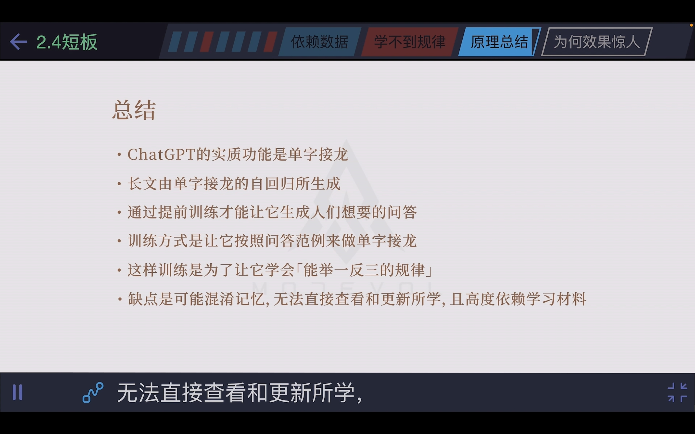
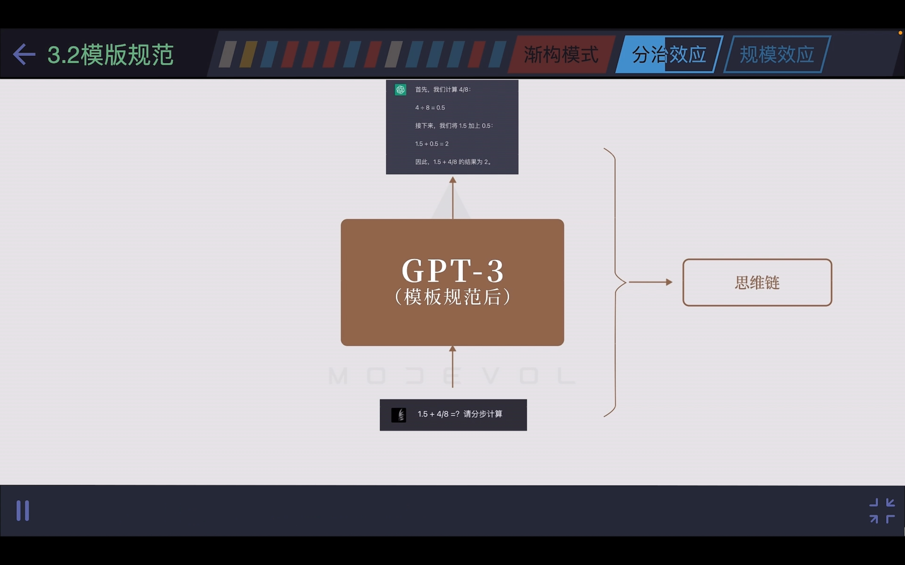
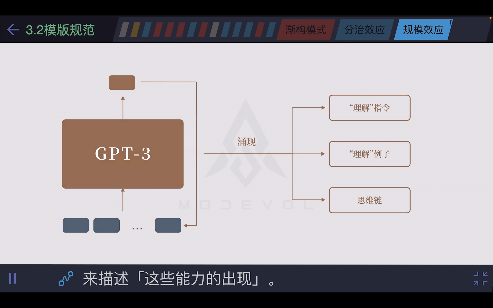
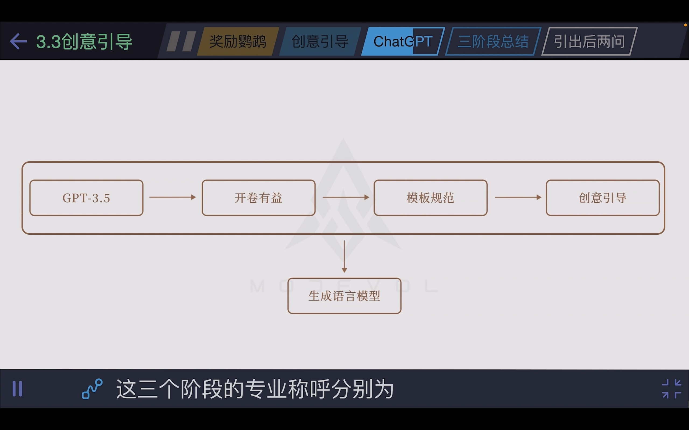
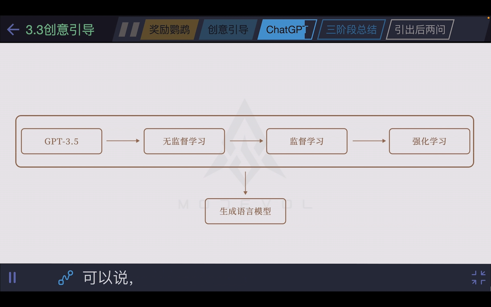
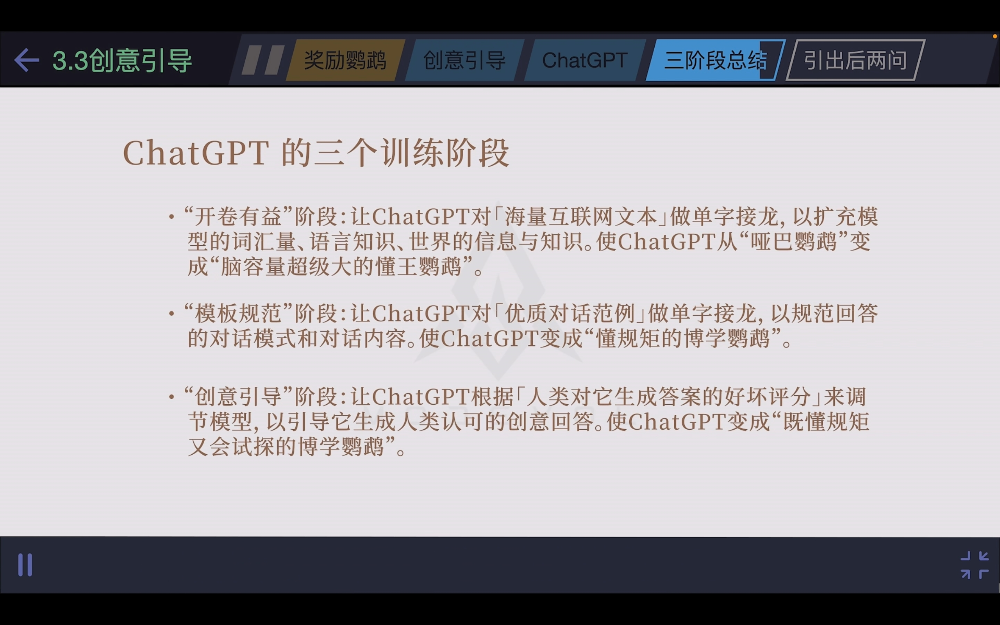
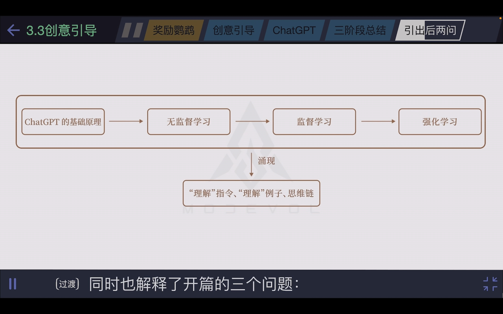
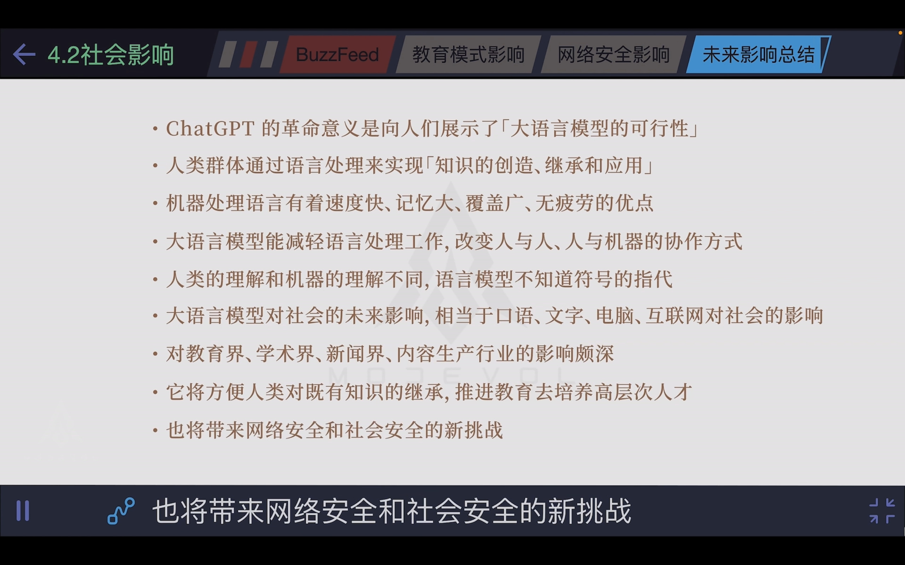

提示词（Prompt）

提示词工程（Prompt Engineering）

#### 常用技巧（基本原则，格式，角色扮演）

1、清晰、明确、避免模糊的词语

2、用###或者“”“将指令和待处理的内容分开（增加可读性，对大模型来说）

3、指定输出的格式（例如JSON格式）

4、The "Act as ..." 角色扮演（让大模型扮演一个角色）

5、告诉大预言模型用户是什么角色（Tell GPT who you are?）

参考网址：

https://github.com/f/awesome-chatgpt-prompts

https://github.com/PlexPt/awesome-chatgpt-prompts-zh

#### Few-Shot少样本提示 + CoT思维链

zero-shot prompting 零样本提示

Chain-of-Thought(CoT) Prompting

#### 让GPT联网 + 基于Embedding的语义搜索（ChatPDF效果）

Search API + GPT

Embedding（嵌入）Search + GPT

#### 利用ReAct实现ChatGPT插件（AutoGPT基础）

## ChatGPT Prompt Engineering for Developers

## 大语言模型科普

【【渐构】万字科普GPT4为何会颠覆现有工作流；为何你要关注微软Copilot、文心一言等大模型】 https://www.bilibili.com/video/BV1MY4y1R7EN/?share_source=copy_web&vd_source=769ad23db0f196e2d0701d2edd5e74a2

通过让GPT逐步思考的方式，来提高应对解答复杂问题的准确度，即为“思维链”

