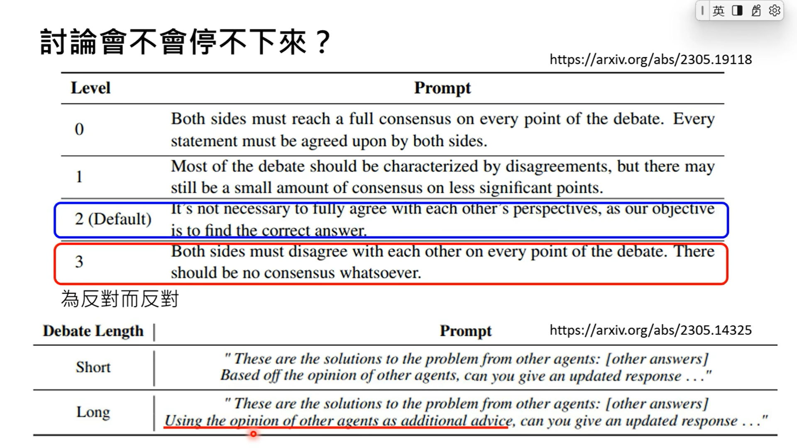
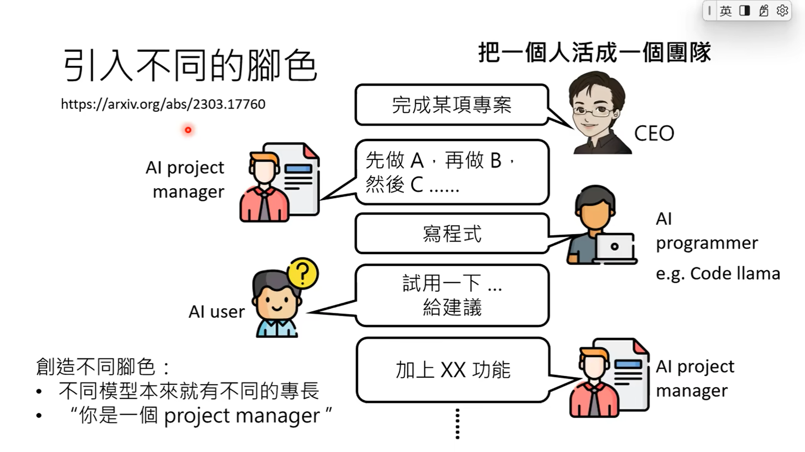
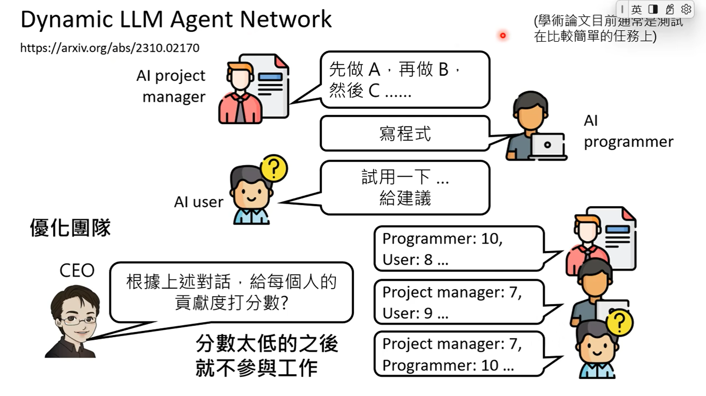
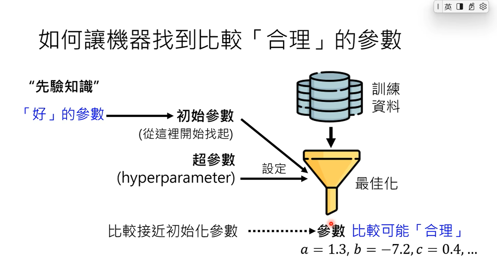
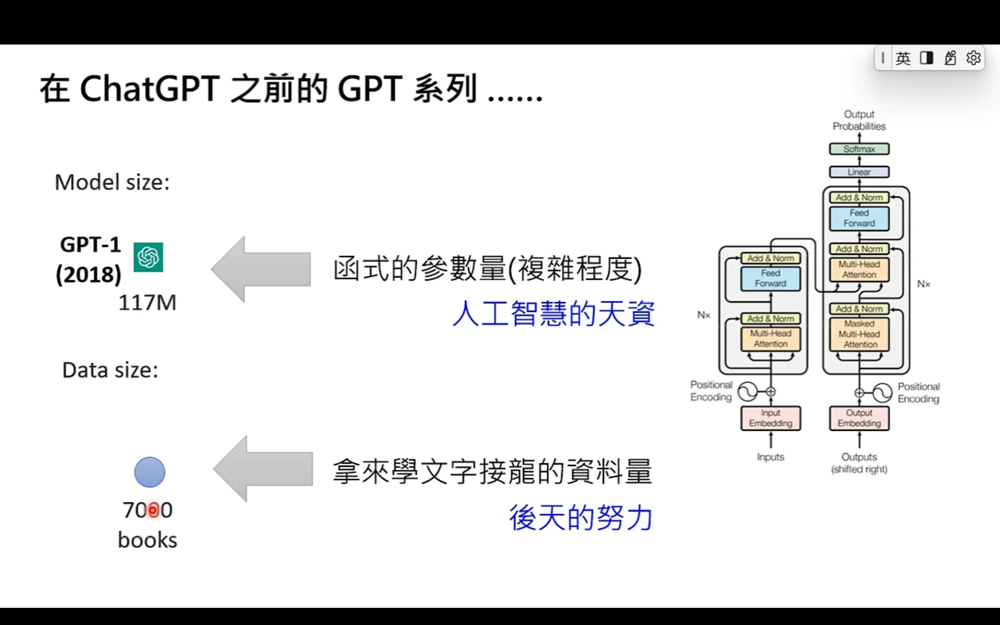
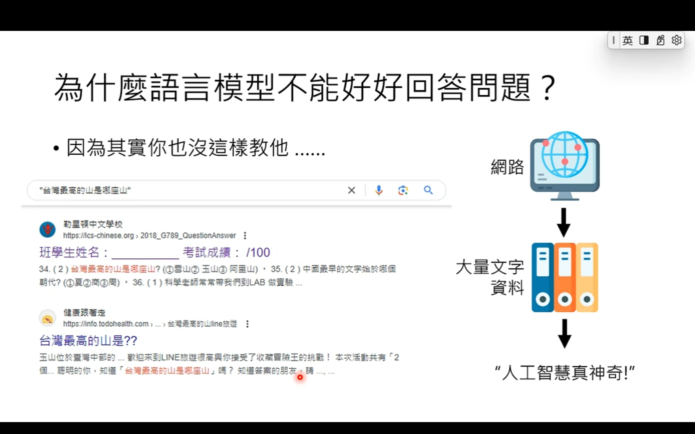
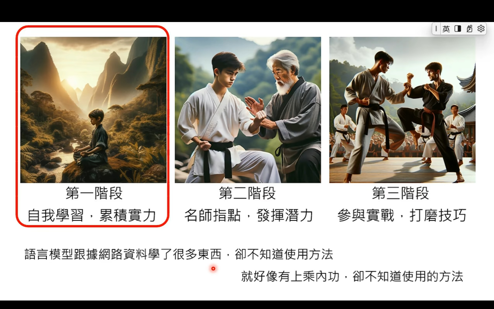
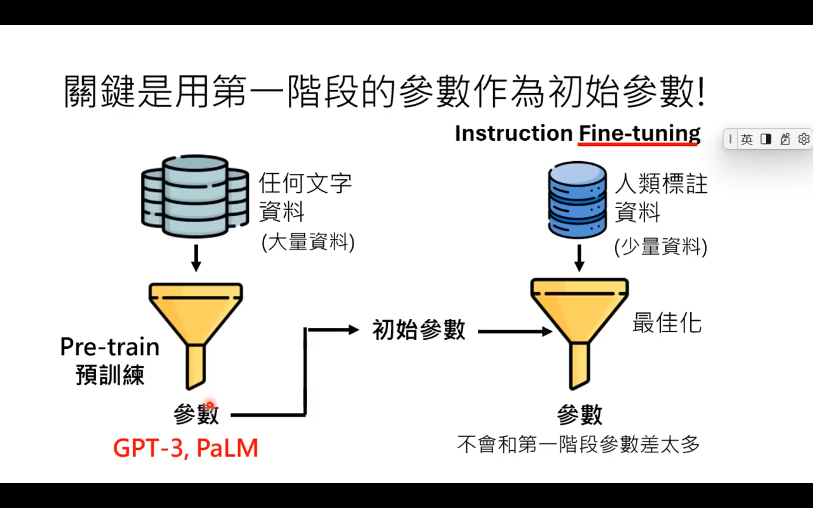

# 李宏毅-生成式人工智能导论

## 第1讲：生成式AI是什么

ChatGPT

- G：Generative 生成
- P：Pre-trained 预训练
- T：Transformer

深度学习（Deep Learning）是一种机器学习技术

类神经网络（Neural Network）跟人类大脑没有什么联系，不是模仿人类大脑学习；本质上只是一个有大量参数的函式

语言模型的本质是在做文字接龙，将问题与合理的回答一步步拼接上

复杂的物品 通过 较小的单位依然某种固定的顺序依序生成，叫做 Autoregressive Generation

## 第2讲：今日的生成式人工智能厉害在哪里？从[工具]变为[工具人]

人工智能（目标）让机器展现「智慧」

不要问ChatGPT能为你做什么（你认为ChatGPT是[工具]，只有某些固定功能）；
要问你想要ChatGPT帮你做什么（只要你下对指示，ChatGPT就能帮助你）（可能）

## 第3讲：训练不了人工智能？你可以训练你自己（上）

在不训练模型的情况下强化语言模型的方法

- 1、神奇咒语（不一定对所有模型都有用）
  - Chain of Thought（CoT）：叫模型思考，e.g. Let's think step by step.
  - 请模型解释一下自己的答案：Answer by starting with "Analysis"
  - 对模型情绪勒索：This is very important to my career.
- 2、提供额外咨询，提供范例
- 3、把任务分多步骤来解：拆解任务，让语言模型检查自己的错误

## 第4讲：训练不了人工智能？你可以训练你自己（中）

拆解任务，复杂任务拆解成简单任务。（Chain of Thought，CoT）思维链

大语言模型会检查自己的错误（语言模型自我反省的能力），但是 反省的过程中没有任何模型被训练，函式是固定的。
例如：问语言模型介绍一下玫瑰花节，语言模型会介绍，自我反省后知道没有玫瑰花节；但是二次询问之后还是会继续介绍玫瑰花节（反省的能力只是固定的函式）

为什么同一个问题每次答案都不同？

- 语言模型回答问题时，会进行文字接龙，输出的是机率分布（每一个字接在后面的几率是不同的），所以每次问相同的问题，但是答案不尽相同

- 做数学问题时，会做多次，把最常出现的答案当作是最终答案（Self-Consistency）

可以将多个方法进行组合——Tree of Thoughts（ToT）

大语言模型不能够作为搜索引擎来使用
语言模型本质上就是做文字接龙，背后并没有资料库，所以可能会对提出的问题进行胡乱回答，生成与事实不符合的答案
可以将专业问题（复杂问题）与使用网络或者资料库提供的额外咨询一起提供给语言模型，做出的文字接龙更有可能生成想要的答案——Retrieval Augmented Generation（RAG）

RAG（检索增强生成）并没有提供额外的训练

语言模型是如何使用工具的？—— https://youtu.be/ZID220t_Mpl?feature=shared

## 第5讲：训练不了人工智能？你可以训练你自己（下）

模型合作：

- 让合适的模型做合适的事情

- 让模型彼此讨论：Demo——“我提供一个可能的答案，供你参考（你不需要完全同意我的看法）”

- 可以引入不同的语言模型扮演不同的角色，比如：AI project manager，AI programmer（e.g. Code llama)，AI user

创造不同角色

- 不同模型本来就有不同的专长
- “你是一个project manager”

可以对团队进行优化

MetaGPT：https://arxiv.org/abs/2308.00352

ChatDev：https://github.com/OpenBMB/ChatDev

## 第6讲：大语言模型修炼史——第一阶段-自我学习，积累实力

训练成功，但是测试失败——Overfitting

机器学习时只管找到的参数有没有[符合]训练资料，不管有没有道理

函式的参数量（复杂程度）—— 人工智慧的天资
拿来学文字接龙的资料量——后天的努力

拿GPT3来举例，有时候问它问题，它不会回答，甚至会反问你更多的问题

## 第7讲 大语言模型修炼史——第二阶段-名师指点，发挥潜力

兼谈对ChatGPT做逆向工程与LLaMA时代的开始

## 第8讲 大语言模型修炼史——第三阶段-参与实战，打磨技巧

Reinforcement Learning from Human Feedback，RLH

## 第9讲 以大型语言模型打造的AI Agent

## 第10讲 今日的语言模型是如何做文字接龙的 —— 浅谈Transformer

